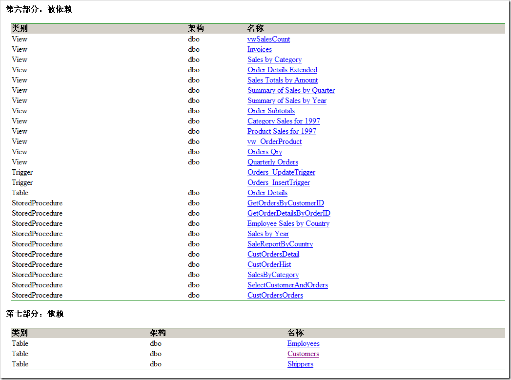
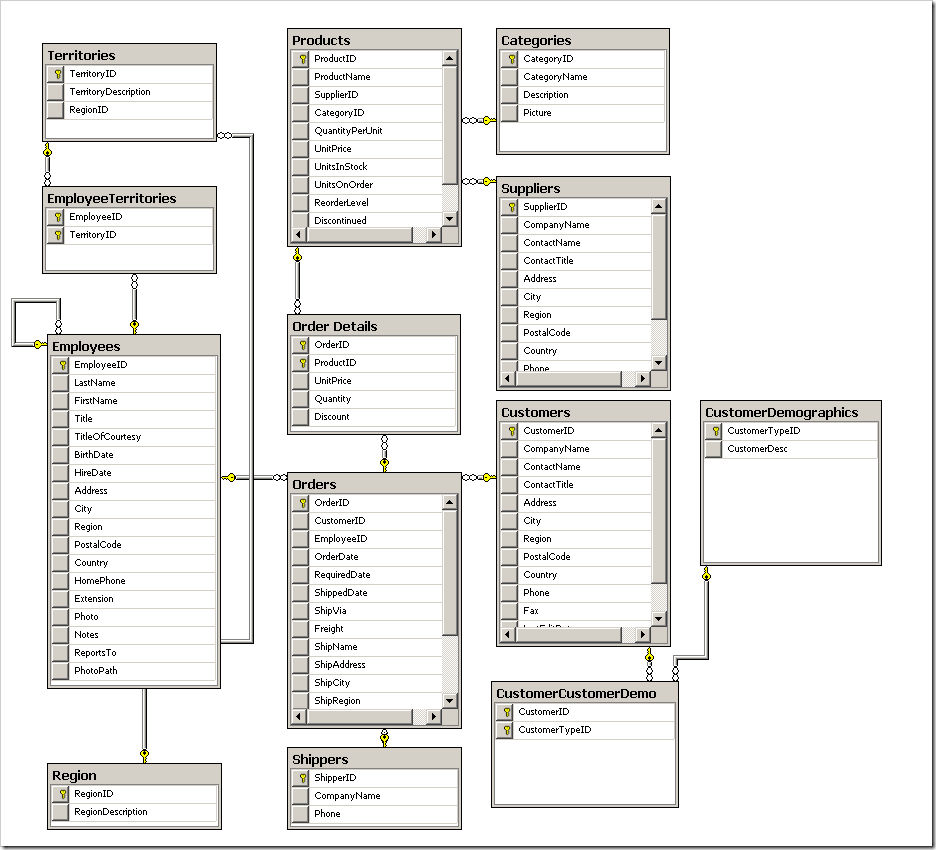

# SQL Server 数据库文档生成工具开源项目【合作邀请】 
> 原文发表于 2009-08-09, 地址: http://www.cnblogs.com/chenxizhang/archive/2009/08/09/1542363.html 

这是我之前编写的数据库文档生成工具的核心部分。我将它进行了一定的简化，希望对大家有用。

该项目的开源首页在 <http://sqldocumentationx.codeplex.com/> 

  

该工具支持的版本是：SQL Server 2000、2005、2008  

这个工具要求如下运行环境  

1. Windows XP或者更高版本  

2. .NET Framework 2.0 sp1  

【备注】该工具最后生成的报告样式是通过样式表控制的，如果有朋友对样式表很有心得，请直接修改Style目录中的四个文件，并欢迎和我联系。  

 

该项目主要使用的技术是： 

1. SQL Server SMO（这是SQL Server的对象模型） 

2. XML, XSLT （所有输出的文档都是XML的，每个数据库对象有一个对应的文件），而在浏览器中显示时是用XSLT进行转换的） 

3. LINQ（使用LINQ,尤其是LINQ TO XML，大大简化了编程） 

  

我想要邀请以下方面有专长的朋友加入该项目，一起合作把该项目做得更好一些 

**1. 对XSLT和CSS比较熟悉的朋友** 

我目前做的这套XSLT和CSS很简单，我也觉得不是很美观。想看看有没有其他的朋友可以帮忙这方面的工作。 

2. 该工具还有一个想要实现的功能（**根据对象的依赖性绘制依赖关系图**），目前没有突破。**如果有这方面有思路的朋友加入，则我很欢迎**。 

该工具可以为每个对象分析依赖关系，这对于数据库管理来说是很重要的。目前依赖关系是能够分析出来的，显示出来大致如下面 

 

依赖的数据我们已经有了，我想根据这个数据来绘制一个关系图。类似下面这样 

 

  

**如果有兴趣加入的朋友，请通过**[**ares@xizhang.com**](mailto:ares@xizhang.com)**和我联系，谢谢** 

  

**大家对于该项目的意见和期待，也可以在本文章后面留言**

 本文由作者：[陈希章](http://www.xizhang.com/) 于 2009/8/9 18:56:32 发布在：[博客园](http://www.cnblogs.com/chenxizhang/),转载请注明出处  

