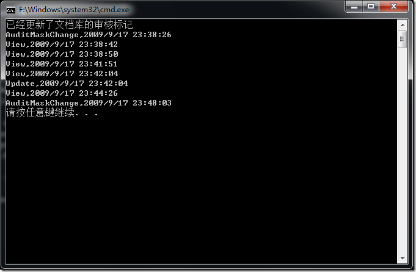
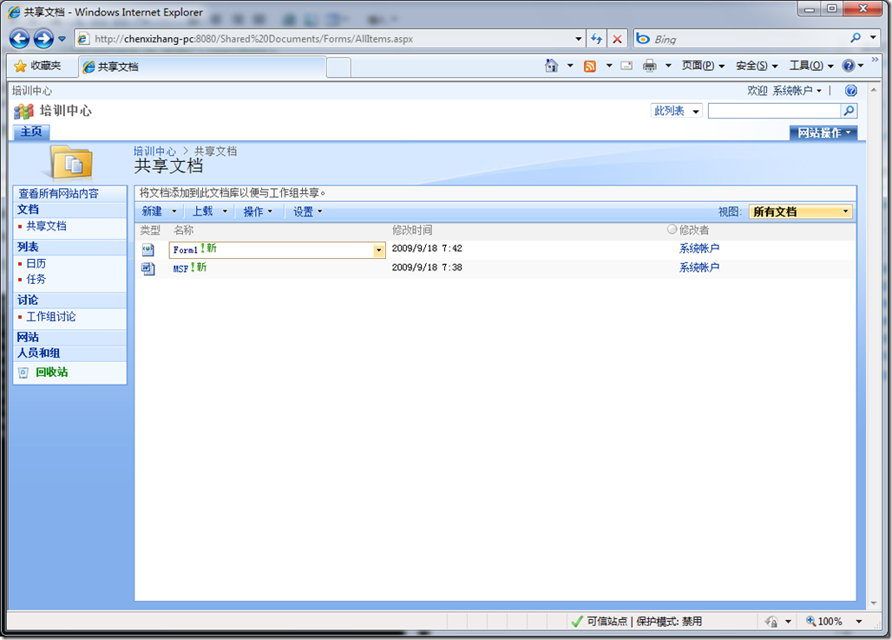

# SharePoint : 谁说WSS不支持审核 
> 原文发表于 2009-09-18, 地址: http://www.cnblogs.com/chenxizhang/archive/2009/09/18/1568940.html 

近日，某人跟我说，WSS 不支持审核，所以对于文档库的点击行为很难进行统计。

 这个问题其实是不对的，虽然WSS没有像MOSS那样提供图形化界面设置审核，但内核是支持审核的。大家要注意不要被表面现象迷惑而武断下结论

 简单地说，WSS的审核功能必须通过自定义代码来启用和查询

 1. 启用审核功能

 SPWeb web = new SPSite("<http://chenxizhang-pc:8080").OpenWeb();>  
SPList list = web.Lists["共享文档"]; SPAudit audit = list.Audit;  
audit.AuditFlags = SPAuditMaskType.All;  
audit.Update();  
Console.WriteLine("已经更新了文档库的审核标记"); 2. 查询审核日志

 SPWeb web = new SPSite("<http://chenxizhang-pc:8080").OpenWeb();>  
SPList list = web.Lists["共享文档"]; SPAudit audit = list.Audit; foreach (SPAuditEntry item in audit.GetEntries())  
{  
    Console.WriteLine("{0},{1}", item.Event, item.Occurred.ToString());  
}  

 

