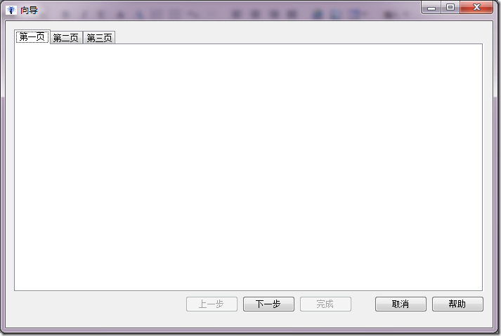
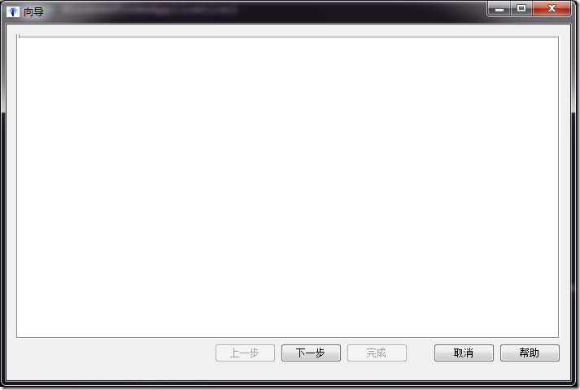
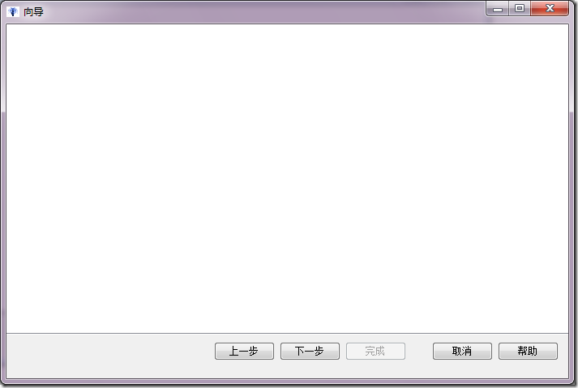

# .NET : 隐藏TabControl的标签栏 
> 原文发表于 2009-10-03, 地址: http://www.cnblogs.com/chenxizhang/archive/2009/10/03/1577679.html 

在给应用程序添加一个向导的做法有很多，但其中比较简便易行的是使用TabControl。如下图所示

  

 但有一个小小的美中不足，就是：作为向导而言，我们可能不希望它显示上面的那几个标签。

 有什么方法来解决呢？同样，有很多方法来解决该问题，下面是最简便易行的

 tabControl1.SizeMode = TabSizeMode.Fixed;  
tabControl1.ItemSize = new Size(0, 1);  

 如果注意看的话，左上角确实有一点点凸出来。一般情况下这也没有什么大不了的，呵呵

  

 还有一个更加简单的做法，就是设计好之后，将这个控件的位置向上移动，正好让标签栏看不到（被挡住）

 

