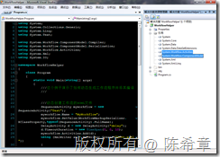
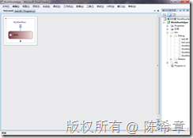
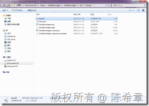
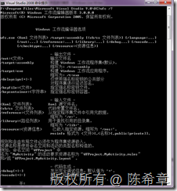
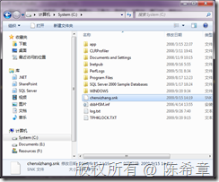
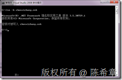
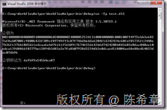

# .NET : 动态生成工作流定义文件并且进行编译 
> 原文发表于 2009-10-03, 地址: http://www.cnblogs.com/chenxizhang/archive/2009/10/03/1577683.html 

最近在折腾一个动态工作流系统的事情。工作流（尤其是结合SharePoint设计的工作流）已经够麻烦了，现在还要搭上动态化这一条，多少英雄豪杰都为之前仆后继啊 我也进行过一些研究，基本思路还是有的，但真正要做出来还有很多细节。虽然通过一些曲折的办法,可以做出类似于Visual Studio中提供的那个工作流设计器界面，但其实真正做工作流的时候，用户并不喜欢那种界面。说白了，那个界面虽然很好（我个人认为它很好），但却主要是给开发人员用的。   所以，要想有所突破，就得用人民群众喜闻乐见的方式让他们去画流程，然后我们动态来编译工作流代码和程序。这些细节这里且按下不表   首先要确保引用了以下两个程序集  

  

 在代码文件的顶部添加如下的using语句

 using System.Workflow.ComponentModel.Compiler;//这是编译时会用到的  
using System.Workflow.ComponentModel.Serialization;//这个是保存XOML会用到的  
using System.Workflow.Activities;  
using System.Xml;  
using System.IO; **1. 如何动态生成一个XOML文件**
---------------------

 ///动态创建工作流的XOML文件  
SequenceActivity myworkflow = new SequenceActivity("Test");  
myworkflow.Name = "**MyWorkflow**";  
myworkflow.SetValue(WorkflowMarkupSerializer.XClassProperty,typeof(SequenceActivity).FullName);  
DelayActivity d = new DelayActivity("delay");  
d.TimeoutDuration = new TimeSpan(0, 0, 10);  
myworkflow.Activities.Add(d);  
using (XmlWriter xw = XmlWriter.Create("Test.xoml"))  
{  
    WorkflowMarkupSerializer s = new WorkflowMarkupSerializer();  
    s.Serialize(xw, myworkflow);      
} ///以上代码虽然可以生成一个xoml，但却不能进行编译，所以还需要我们强制添加下面的一个attribute XmlDocument doc = new XmlDocument();  
doc.Load("Test.xoml"); XmlAttribute attrib = doc.CreateAttribute("x", "Class", "<http://schemas.microsoft.com/winfx/2006/xaml");>  
attrib.Value = typeof(Program).Namespace + ".**MyWorkflow**"; //注意这个名称 doc.DocumentElement.Attributes.Append(attrib);  
doc.Save("Test.xoml");  

 这样最后得到的一个XOML文件如下

 <?xml version="1.0" encoding="utf-8"?>  
<SequenceActivity x:Name="MyWorkflow" xmlns:x="<http://schemas.microsoft.com/winfx/2006/xaml"> xmlns="<http://schemas.microsoft.com/winfx/2006/xaml/workflow"> x:Class="WorkflowHelper.MyWorkflow">  
  <DelayActivity TimeoutDuration="00:00:10" x:Name="delay" />  
</SequenceActivity> 这个文件在Visual Studio中打开的效果如下

  

  

 **2. 如何进行编译成dll**
-----------------

 WorkflowCompiler compiler = new WorkflowCompiler();  
WorkflowCompilerParameters p = new WorkflowCompilerParameters();  
p.OutputAssembly = "test.dll";  
WorkflowCompilerResults r = compiler.Compile(p, "test.xoml");  
foreach (var item in r.Errors)  
{  
    Console.WriteLine(item);  
} 最后，就可以得到一个test.dll

  

 其实这个WorkflowCompiler有一个对应的SDK工具：WFC.exe。也就是说，用WFC也是可以完成编译的，请参考下面的截图

  

 **3. 如何对这个dll进行签名**
-------------------

 通常一个设计好的工作流模板需要注册到GAC，而注册到GAC的前提又是要签名，那么我们在编译的时候能不能签名呢？

 假设我们在c盘下面有一个已经做好的签名文件：chenxizhang.snk

  

 这个snk文件，可以通过下面的方式创建 sn –k chenxizhang.snk

  

  

 WorkflowCompiler compiler = new WorkflowCompiler();  
           WorkflowCompilerParameters p = new WorkflowCompilerParameters();  
           p.OutputAssembly = "test.dll"; **p.CompilerOptions = "/keyfile:"+@"c:\chenxizhang.snk";**             WorkflowCompilerResults r = compiler.Compile(p, "test.xoml");  
           foreach (var item in r.Errors)  
           {  
               Console.WriteLine(item);  
           }  

 这样编译出来的dll就拥有了强名称了。通过下面的方式可以查看到其公钥信息

 

