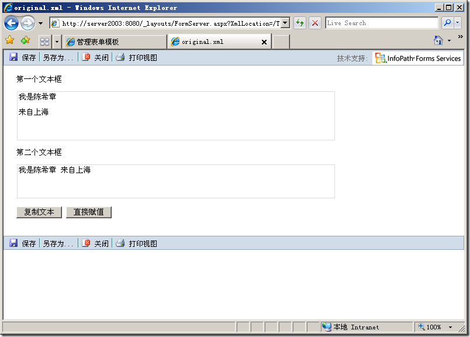

# Infopath : 如何通过代码复制格式文本框的值 
> 原文发表于 2009-10-18, 地址: http://www.cnblogs.com/chenxizhang/archive/2009/10/18/1585355.html 

昨天被人问到这样的一个问题：在Infopath表单中，有两个格式文本框，希望通过代码的方式来复制其内容。但复制过去之后，第二个文本框不能实现换行。下面是截图

  

 之前的代码是下面这样的：

 this.CreateNavigator().SelectSingleNode("/my:myFields/my:NewText", NamespaceManager).SetValue(  
               CreateNavigator().SelectSingleNode("/my:myFields/my:OriginalText", NamespaceManager).Value);  

 其实，上面的代码在针对一些标准的文本框或者下拉框的话，是没有任何问题的。但针对格式文本框，则有问题。为什么这么说呢？因为格式文本框里面不仅仅有文本，还有格式。例如换行，粗体，颜色等等。

 那么一个格式文本框，到底如何表示这些东西的呢？其实是一个XML片段

 <html xmlns="<http://www.w3.org/1999/xhtml">>  
  
我是陈希章
  
  
 
  
  
来自上海
  
  
 
  
  
 
  
  
 
  
</html>  

 它用了div来实现换行，为什么呢？因为div默认的display为block，该效果类似

 那么，应该如何修改代码来实现我们复制格式文本框的目的呢？

 this.CreateNavigator().SelectSingleNode("/my:myFields/my:NewText", NamespaceManager).InnerXml =  
    CreateNavigator().SelectSingleNode("/my:myFields/my:OriginalText", NamespaceManager).InnerXml;   

