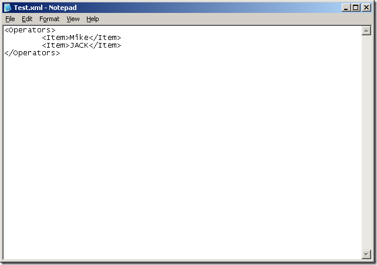
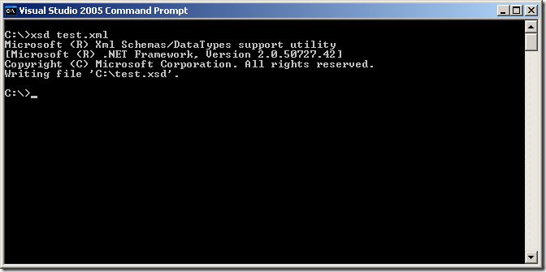
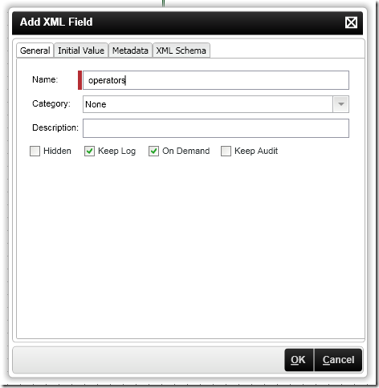
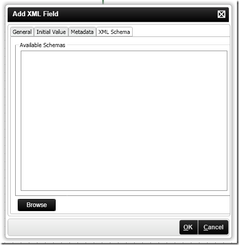
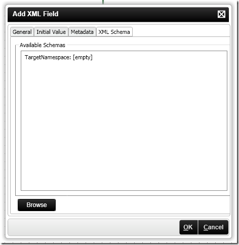
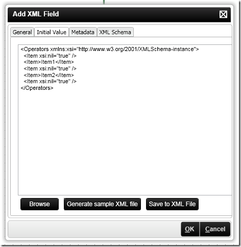
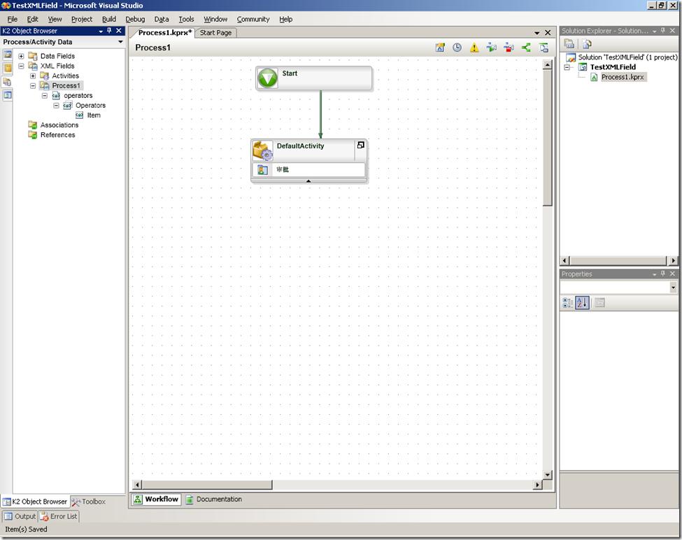
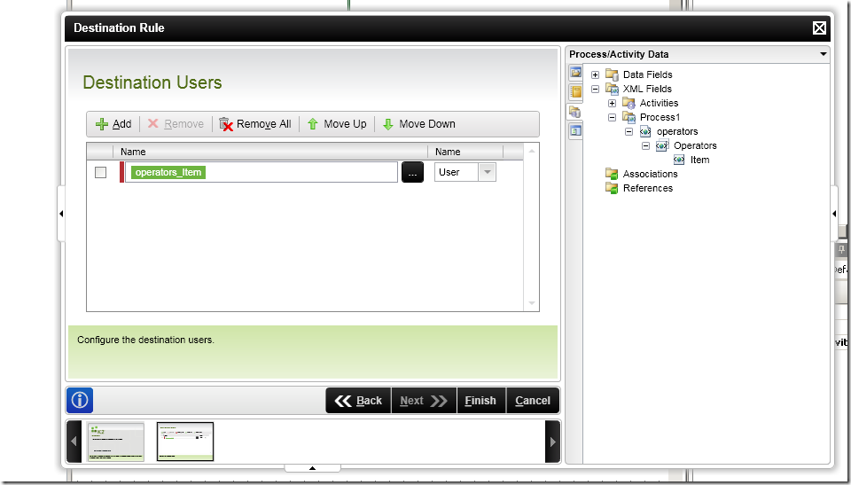

# 如何在K2流程设计中使用XMLField 
> 原文发表于 2009-10-19, 地址: http://www.cnblogs.com/chenxizhang/archive/2009/10/19/1586211.html 

在使用K2工作流设计器的时候，有时候为了表示一些复杂数据，我们可以通过XMLField来解决。下面演示一个例子，用一个XMLField保存了某个Client Event的目标用户，并且将其设置为该Client Event的Destination User

  

 1. 准备XML文件和XSD文件。我们可以准备一个很简单的XML文件如下，命名为test.xml

  

 使用XSD.exe生成架构文件

  

 2. 根据这个架构文件创建一个XMLField

  

  

 点击“Browse”按钮，定位到刚才生成的那个XSD文件

  

  

 点击“Generate sample XML File”按钮

  

  

 3. 在Destination Rule上面设置

  

 4. 如何在代码中读取XMLField (其实就是XML内容）

 //Get the XML Field string  
string xml = K2.ProcessInstance.XmlFields[“OpportunityApproval”].Value.ToString();  
//Load up the XML  
XmlDocument doc = new XmlDocument();  
doc.LoadXml(xml);  
//Create a name space manager for InfoPath  
XmlNamespaceManager nsMgr = new XmlNamespaceManager(doc.NameTable);  
nsMgr.AddNamespace(“my”, doc.DocumentElement.GetNamespaceOfPrefix(“my”));  
//Now set some values  
doc.SelectSingleNode(“//my:Action “, nsMgr).InnerText = “”;  
//Now set the value back into the XML Field  
K2.ProcessInstance.XmlFields[“OpportunityApproval”].Value = doc.OuterXml; 

