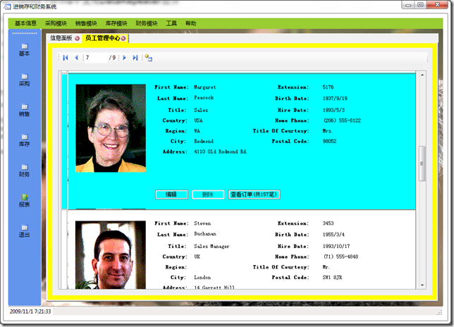

# .NET :  如何在Windows Forms中使用DataRepeater控件 
> 原文发表于 2009-11-01, 地址: http://www.cnblogs.com/chenxizhang/archive/2009/11/01/1593804.html 

DataRepeater控件是Visual Basic Team推出的一套控件包中的一部分，也可以说是一份礼物吧，呵呵。它使得在Win Forms程序中进行数据展示更加灵活。

 下面有一个视频，可以作为入门

 How Do I: Use the DataRepeater Control?

 [http://msdn.microsoft.com/en-us/vbasic/cc411420.aspx](http://msdn.microsoft.com/en-us/vbasic/cc411420.aspx "http://msdn.microsoft.com/en-us/vbasic/cc411420.aspx")

  

 下面是我用在项目中的一个简单例子

  

  

 我自己总结，里面有一个关键点就是不同的Item之间如何进行样式方面的显示

 private void Data\_DrawItem(object sender, Microsoft.VisualBasic.PowerPacks.DataRepeaterItemEventArgs e)  
{  
    //处理交错行的显示问题  
    if (e.DataRepeaterItem.ItemIndex % 2 == 0)  
        e.DataRepeaterItem.BackColor = Color.White;  
    else  
        e.DataRepeaterItem.BackColor = Color.Cyan;  
} 

