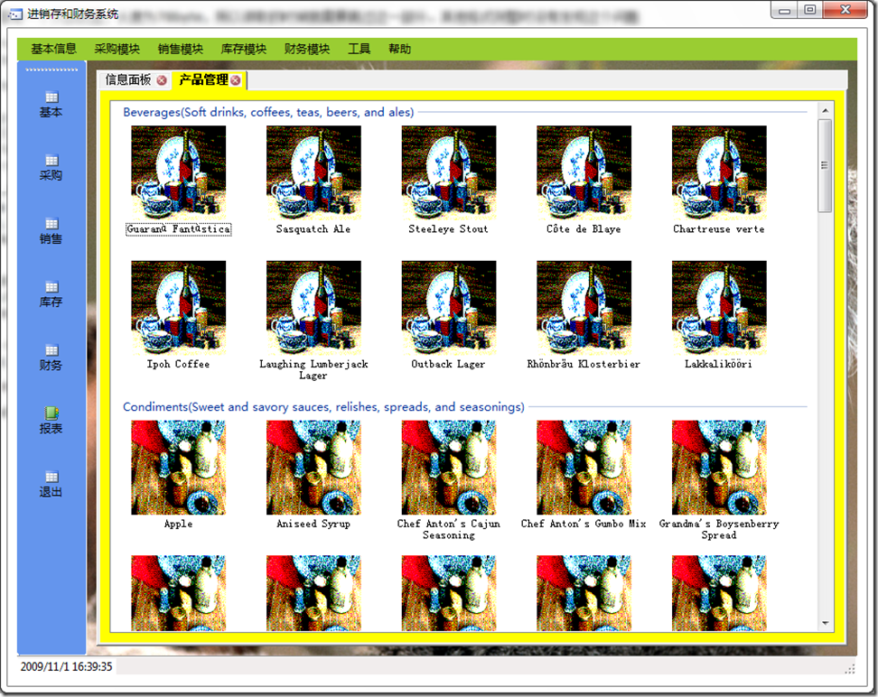

# .NET : 如何读取数据库中的bmp图片数据 
> 原文发表于 2009-11-01, 地址: http://www.cnblogs.com/chenxizhang/archive/2009/11/01/1593988.html 

因为bmp格式的图片，前面有一个头部数据，长度为78byte，所以读取的时候就需要跳过这一部分。其他格式则暂时没有发现这个问题

 dbDataContext db = Program.DataContext();  
var categorys = db.Categories; foreach (var item in categorys)  
{  
    ListViewGroup group = new ListViewGroup(  
        string.Format("{0}({1})",  
            item.CategoryName,item.Description),  
        HorizontalAlignment.Left);     byte[] buffer = item.Picture.ToArray();  
    **MemoryStream ms = new MemoryStream(buffer.Length-78);**    ms.Write(buffer, 78, buffer.Length-78);  
    imageList1.Images.Add(Image.FromStream(ms));  
    ms.Close();     listView1.Groups.Add(group);  
    var products = item.Products;  
    foreach (var p in products)  
    {  
        ListViewItem lv = new ListViewItem(p.ProductName);  
        lv.Group = group;         lv.ImageIndex = imageList1.Images.Count - 1;         listView1.Items.Add(lv);  
    }  
} 下面是一个示范点效果 

