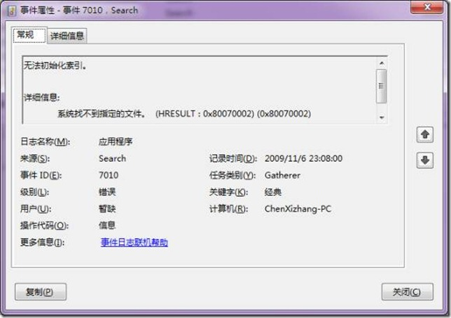

# 如何解决win7中搜索服务无法启动的问题 
> 原文发表于 2009-11-06, 地址: http://www.cnblogs.com/chenxizhang/archive/2009/11/06/1597741.html 

这几天我发现Outlook启动时特别慢，开始也没有在意。但今天在开OneNote的时候，它提示我说Windows Search服务没有启动。检查事件日志，果然有一堆错误啊。

 

 [![clip_image001[5]](./images/1597741-clip_image001%5B5%5D_thumb.jpg "clip_image001[5]")](http://images.cnblogs.com/cnblogs_com/chenxizhang/WindowsLiveWriter/win7_1505B/clip_image001%5B5%5D.jpg)

 [![clip_image001[7]](./images/1597741-clip_image001%5B7%5D_thumb.jpg "clip_image001[7]")](http://images.cnblogs.com/cnblogs_com/chenxizhang/WindowsLiveWriter/win7_1505B/clip_image001%5B7%5D.jpg)

 [![clip_image001[9]](./images/1597741-clip_image001%5B9%5D_thumb.jpg "clip_image001[9]")](http://images.cnblogs.com/cnblogs_com/chenxizhang/WindowsLiveWriter/win7_1505B/clip_image001%5B9%5D.jpg)

 于是尝试手工启动，也是无法成功启动

 

 于是乎又是到处找资料，最后找到下面一个介绍，按照步骤做了之后，重新启动该服务，就成功了。然后再开Outlook，那久违的速度又回来了。鼓掌…

 1. Stop Indexing service "cmd: net stop wsearch" and check in  
TaskManager's process list that SearchIndexer.exe was really stopped.  
2. Delete %SystemDrive%\ProgramData\Microsoft\Search\Data  
\Applications\Windows (Vista) or %AllUsersProfile%\Application Data  
\Microsoft\Search\Data\Applications\Windows (XP) folder with all its  
files and subfolders.  
3. Delete the following registry keys:  
- "HKLM\Software\Microsoft\Windows Search\Applications\windows"  
- "HKLM\Software\Microsoft\Windows Search\CatalogName\windows"  
- "HKLM\Software\Microsoft\Windows Search\Databases\windows"  
- "HKLM\Software\Microsoft\Windows Search\Gather\windows"  
- "HKLM\Software\Microsoft\Windows Search\Gathering manager  
\Applications\windows"  
- "HKLM\Software\Microsoft\Windows Search\UsnNotifier\windows"  
You'll have to change reg key ownership and change permission  
first.  
**4. In registry in key "HKLM\Software\Microsoft\Windows Search"  
switch "SetupCompletedSuccessfully" subkey to "0"** - you'll have to  
change reg key ownership and change permission first.  
5. Start Indexing service back "cmd: net start wsearch"  
6. Wait until "SetupCompletedSuccessfully" subkey switch back to 1.  
If it's still "0" after 5 minutes, it means the setup is failed again. 备注：上述操作说明来自下面这个链接：[http://social.msdn.microsoft.com/forums/en-US/windowsdesktopsearchhelp/thread/edf81ed3-c747-48b7-807e-46bf58c0476f/](http://social.msdn.microsoft.com/forums/en-US/windowsdesktopsearchhelp/thread/edf81ed3-c747-48b7-807e-46bf58c0476f/ "http://social.msdn.microsoft.com/forums/en-US/windowsdesktopsearchhelp/thread/edf81ed3-c747-48b7-807e-46bf58c0476f/")

