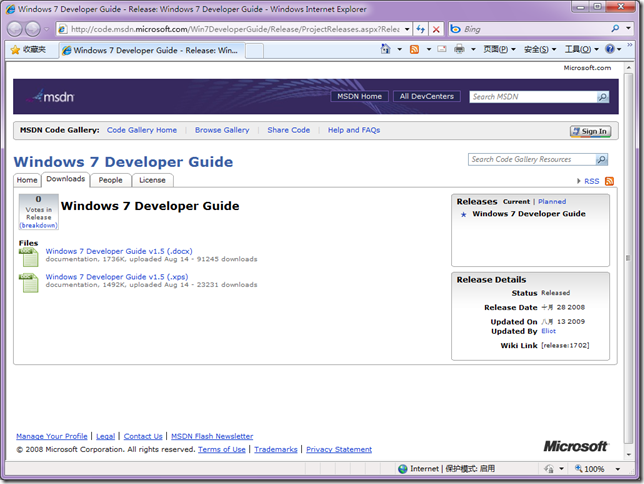
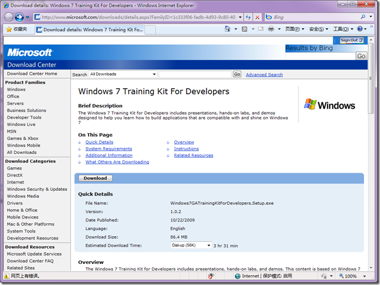
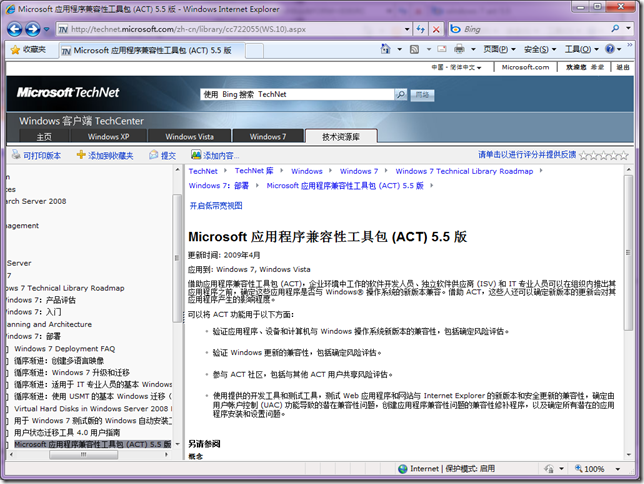
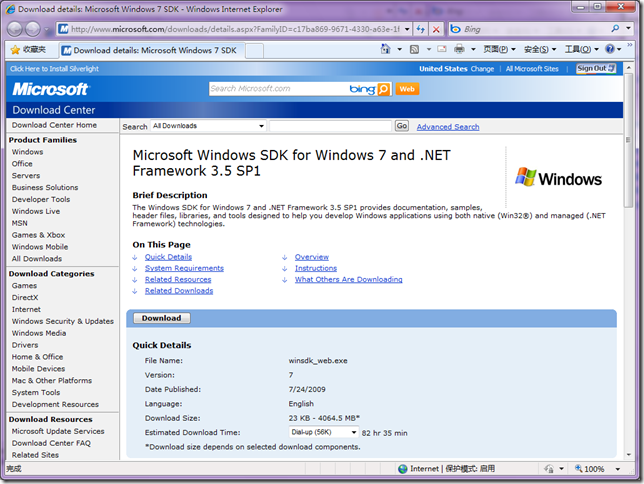

# Windows 7 : 开发人员资源 
> 原文发表于 2009-11-07, 地址: http://www.cnblogs.com/chenxizhang/archive/2009/11/07/1598172.html 

我整理了几个跟Windows 7开发有关的资源，供大家参考

 1. 开发者指南 [http://code.msdn.microsoft.com/Win7DeveloperGuide/Release/ProjectReleases.aspx?ReleaseId=1702](http://code.msdn.microsoft.com/Win7DeveloperGuide/Release/ProjectReleases.aspx?ReleaseId=1702 "http://code.msdn.microsoft.com/Win7DeveloperGuide/Release/ProjectReleases.aspx?ReleaseId=1702")

  

 2. 培训工具包  [http://www.microsoft.com/downloads/details.aspx?FamilyID=1c333f06-fadb-4d93-9c80-402621c600e7&displaylang=en](http://www.microsoft.com/downloads/details.aspx?FamilyID=1c333f06-fadb-4d93-9c80-402621c600e7&displaylang=en "http://www.microsoft.com/downloads/details.aspx?FamilyID=1c333f06-fadb-4d93-9c80-402621c600e7&displaylang=en")

  

 3. 兼容性工具包 [http://technet.microsoft.com/zh-cn/library/cc722055(WS.10).aspx](http://technet.microsoft.com/zh-cn/library/cc722055(WS.10).aspx "http://technet.microsoft.com/zh-cn/library/cc722055(WS.10).aspx")

  

   4. Windows 7 SDK  [http://www.microsoft.com/downloads/details.aspx?FamilyID=c17ba869-9671-4330-a63e-1fd44e0e2505&displaylang=en](http://www.microsoft.com/downloads/details.aspx?FamilyID=c17ba869-9671-4330-a63e-1fd44e0e2505&displaylang=en "http://www.microsoft.com/downloads/details.aspx?FamilyID=c17ba869-9671-4330-a63e-1fd44e0e2505&displaylang=en")

 

