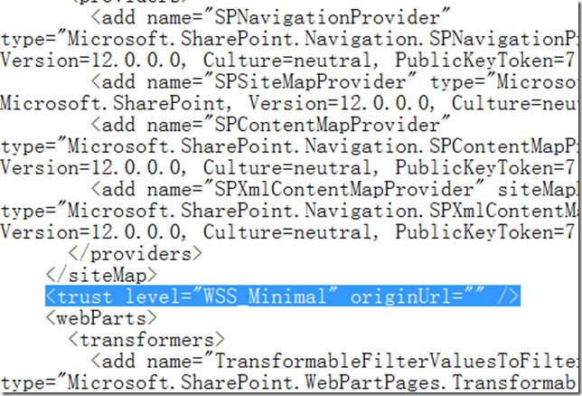

# .NET : 什么是AllowPartiallyTrustedCallers 
> 原文发表于 2009-11-09, 地址: http://www.cnblogs.com/chenxizhang/archive/2009/11/09/1599243.html 

AllowPartiallyTrustedCallersAttribute 只有被具有强名称的程序集在程序集级别上应用时才是有效的。有关如何在程序集级别上应用属性的更多信息，请参见 应用属性。 在默认情况下，如果一个具有强名称的程序集未在程序集级别上显式应用此属性来允许部分受信任的代码使用它，则只有被安全策略授予完全信任的其他程序集才可以调用此程序集。这一限制通过以下方式实施：将 FullTrust 的 [LinkDemand](ms-help://ms.msdnqtr.v90.chs/e5d5104c-2357-2280-2983-d5f9ad3b7390.htm) 放在程序集中每个公共可访问类上的每个公共或受保护的方法上。 如果希望程序集被部分受信任的代码调用，则可以通过使用 AllowPartiallyTrustedCallersAttribute 来声明这一意图。该属性应在程序集级别上声明
--------------------------------------------------------------------------------------

 例如，此声明在 C# 中为 [assembly:AllowPartiallyTrustedCallers]，在 Visual Basic 中为 <assembly:AllowPartiallyTrustedCallers>   为什么要探讨这个问题呢？尤其是在SharePoint开发的场合下，我们部署一些程序集一般会有两个选择：部署到GAC或者部署到网站的bin目录下。部署到GAC没有任何问题，因为在GAC中的程序集默认就是FullTrust的。但如果你是部署到bin目录（有些朋友说这样方便些），那么你这个程序集要调用其他程序集，假设这个程序集是经过签名的，那么如果该程序集没有声明AllowPartiallyTrustedCallers的话，你的调用可能会失败。为什么呢？   这是因为SharePoint默认情况下，并没有给bin目录下面的程序集FullTrust的权限级别，而是Minimal。如下面所示。   

