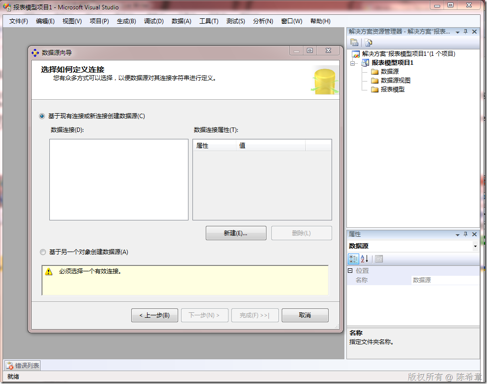
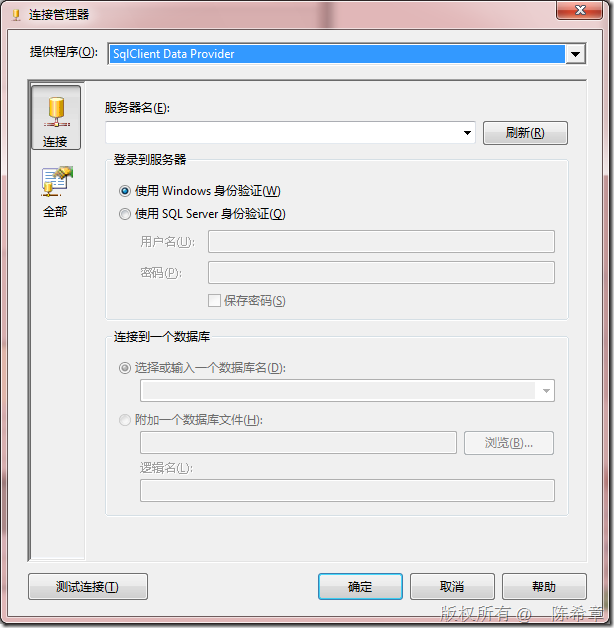
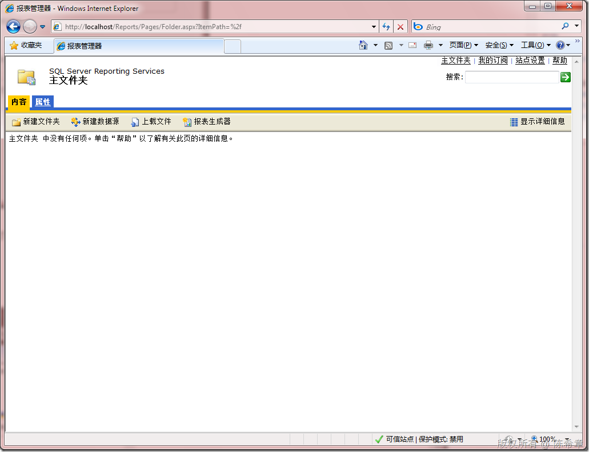
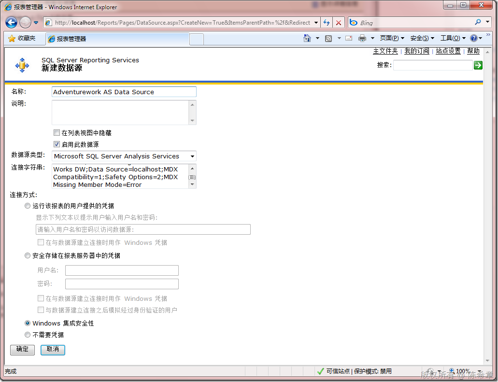
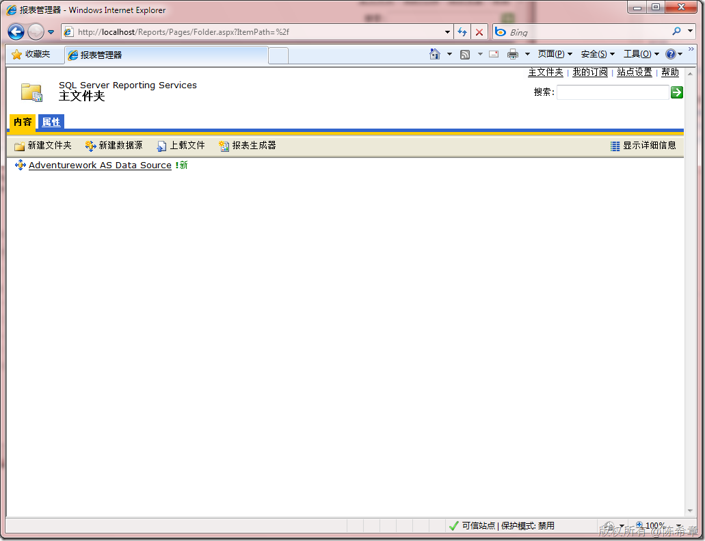
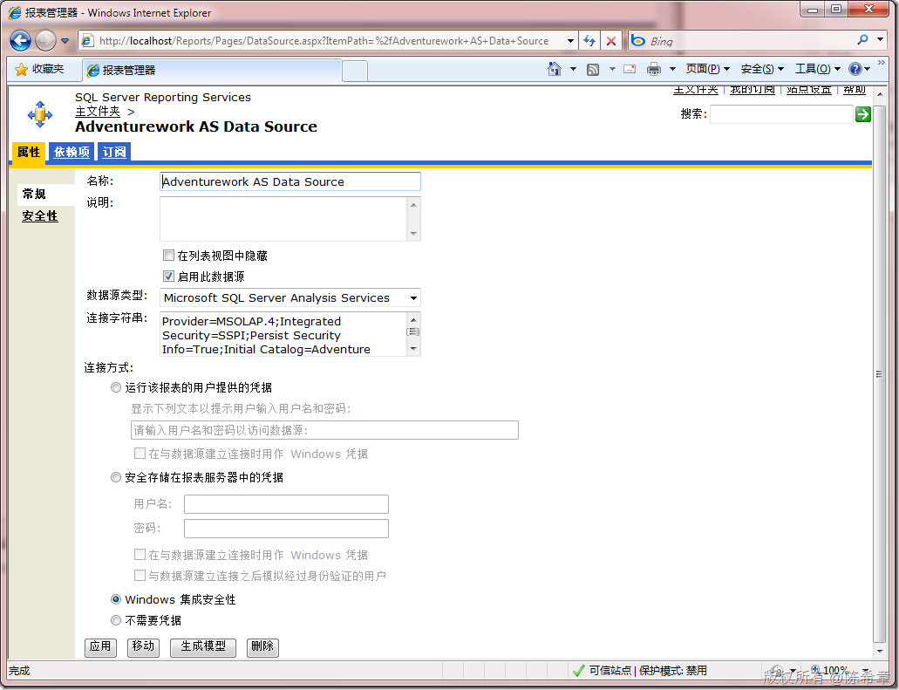
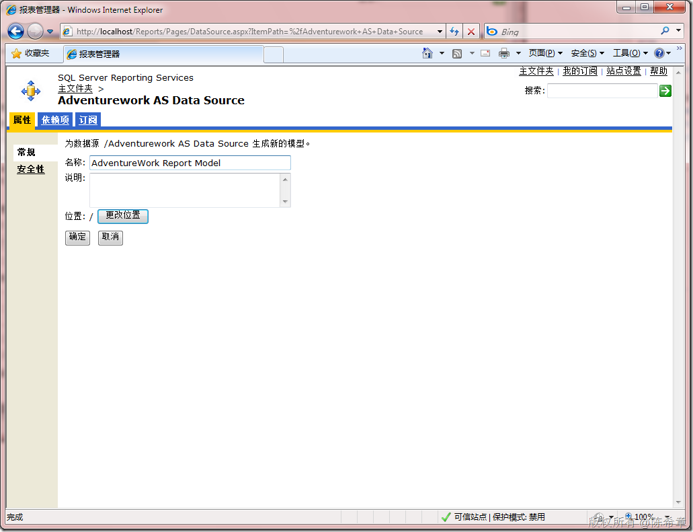
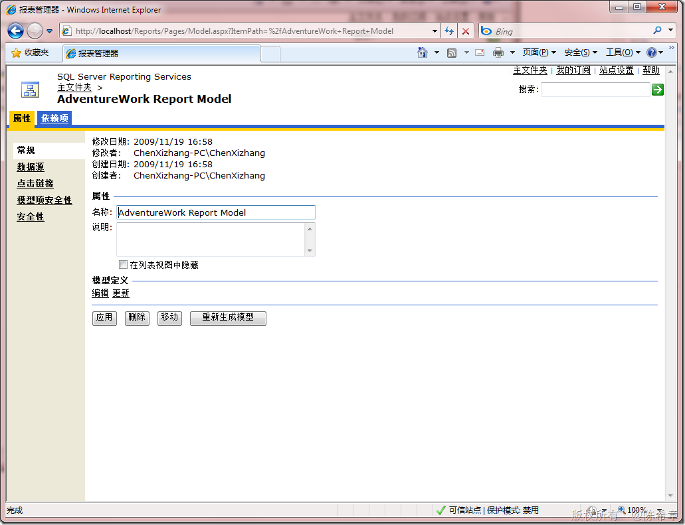
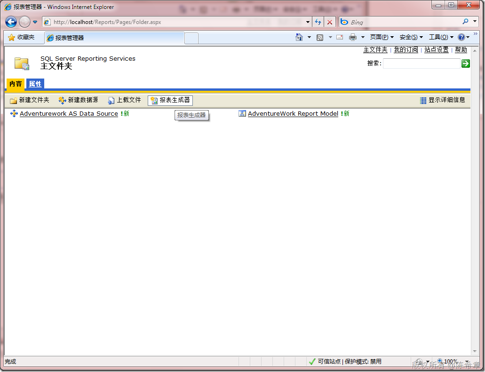
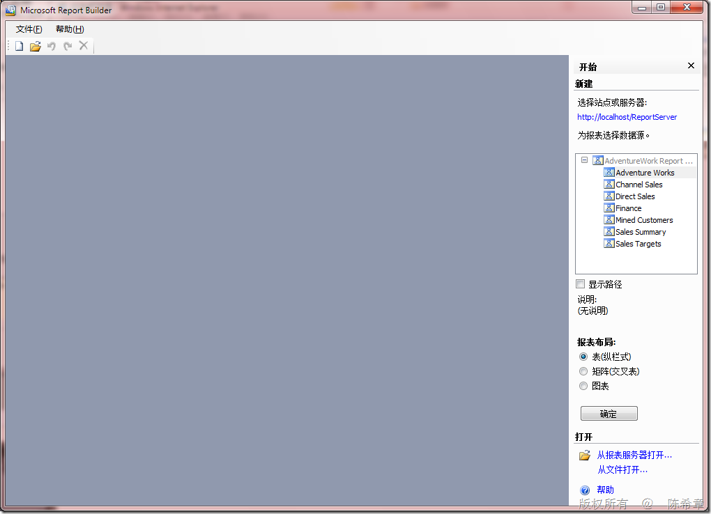

# SQL Server BI : 如何为SSAS Cube生成报表模型 
> 原文发表于 2009-11-19, 地址: http://www.cnblogs.com/chenxizhang/archive/2009/11/19/1606222.html 

在我们给客户做的商业智能（BI) 解决方案中，我们会将数据通过ETL的设计，从OLTP数据库中传输到数据仓库中，然后再针对数据仓库的数据创建分析模型（包括了OLAP模型和Data Mining模型），最后我们会针对OLAP模型设计各种报表

 但我这篇文章并不是为了讲解上述过程，而是讲解一下如何为OLAP模型（主要指Cube的部分）生成报表模型，这样最终用户就可以自己通过Reporting Service所提供的ReportBuilder工具来制作自己的报表了。

 之所以要写这个文章，是因为有很多朋友来问我，为什么在BI Studio中新建了一个“报表模型项目”，但在添加数据源的地方却无法添加SSAS的数据源，如下图所示

  

 我们确实发现，在新建连接的那个界面中，无法添加SSAS的连接。如下图所示

  

  

 那么，我们应该怎么做呢？我们可以通过下面的方式来实现这样的需求。

 首先，我们启动报表管理器

  

 点击“新建数据源”，并且选择“Microsoft SQL Server Analysis Services”，并输入下面这样的连接字符串

 Provider=MSOLAP.4;Integrated Security=SSPI;Persist Security Info=True;Initial Catalog=Adventure Works DW;Data Source=localhost;MDX Compatibility=1;Safety Options=2;MDX Missing Member Mode=Error

  

 点击“确定”

  

 点击“Adventurework AS Data Source”

  

 点击“生成模型”

  

 点击“确定”

  

 这样我们就生成了一个报表模型，那么怎么使用这个模型呢？回到主文件夹之后，我们可以通过点击“报表生成器”

  

 打开Report Builder之后，就能看到它已经选择了我们的报表模型，如下图所示

  

 接下去的操作，就与普通的报表模型没有什么差别了。这里不再赘述

