# .NET :  开发ActiveX控件 
> 原文发表于 2009-11-27, 地址: http://www.cnblogs.com/chenxizhang/archive/2009/11/27/1612233.html 

### 我估计有些朋友不清楚ActiveX控件，但这篇博客不是来解释这些概念的。如果你对ActiveX的概念不清楚，请参考这里： [http://baike.baidu.com/view/28141.htm](http://baike.baidu.com/view/28141.htm "http://baike.baidu.com/view/28141.htm")

  

 这篇博客也不是讨论ActiveX是否有必要用的，因为这历来也是有些争议的。anyway, 我们这里只是探讨一下如何在.NET中也编写ActiveX控件，我用一个实例记录一下该过程

  

 1. 创建一个类库项目，设置 Comvisible为true，设置AllowPartiallyTrustedCallers

 [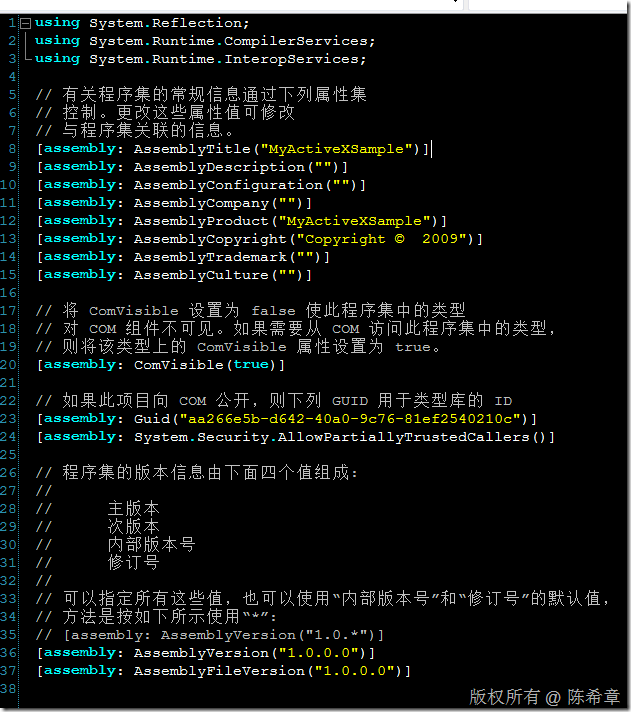](http://images.cnblogs.com/cnblogs_com/chenxizhang/WindowsLiveWriter/7de467755ccf.NETActiveX_FF67/image_2.png) 

 为class也添加一个guid,注意这个要与assembly的那个不一样

 [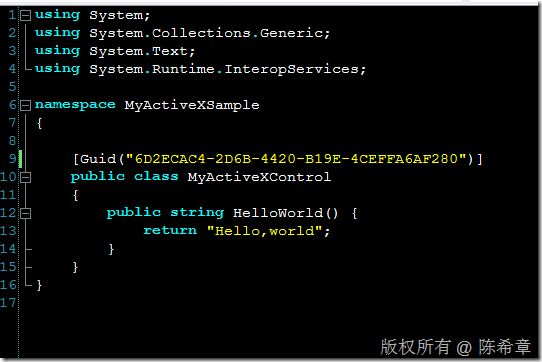](http://images.cnblogs.com/cnblogs_com/chenxizhang/WindowsLiveWriter/7de467755ccf.NETActiveX_FF67/image_4.png) 

 设置该项目的一个属性: 为COM互操作注册

 [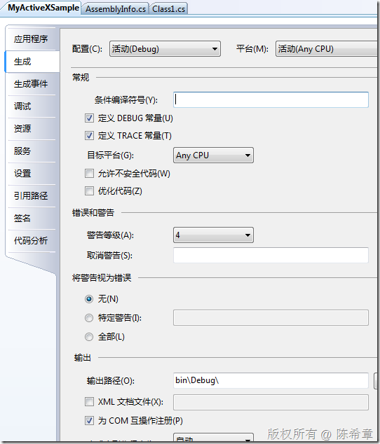](http://images.cnblogs.com/cnblogs_com/chenxizhang/WindowsLiveWriter/7de467755ccf.NETActiveX_FF67/image_6.png) 

 编译该项目，此时会自动在本机注册

  

 2. 新建一个网页来使用该控件

 [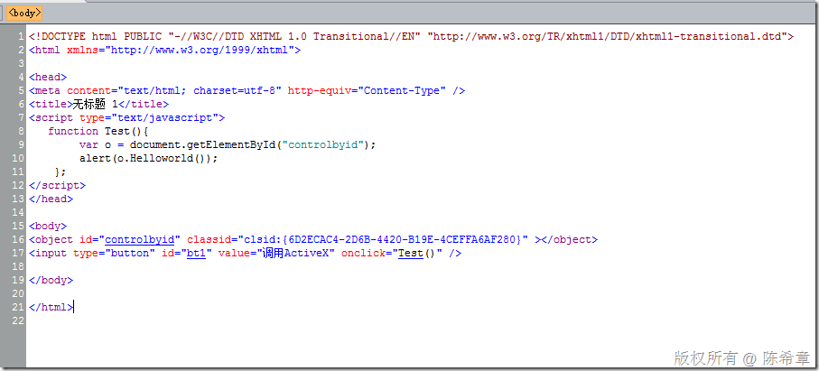](http://images.cnblogs.com/cnblogs_com/chenxizhang/WindowsLiveWriter/7de467755ccf.NETActiveX_FF67/image_8.png) 

 在浏览器中打开该网页，此时会出现一个警告。正如你经常会看到的那样

 [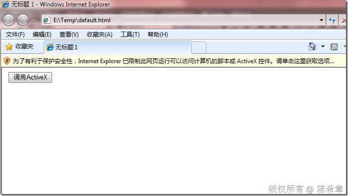](http://images.cnblogs.com/cnblogs_com/chenxizhang/WindowsLiveWriter/7de467755ccf.NETActiveX_FF67/image_10.png) 

 点击右键，然后“允许阻止的内容”

 [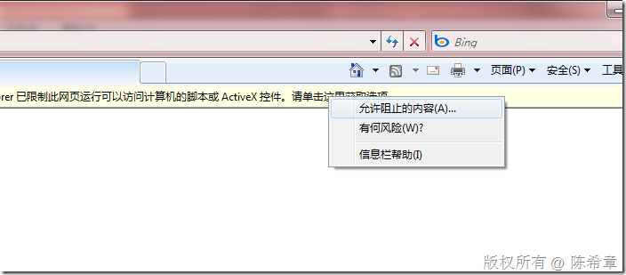](http://images.cnblogs.com/cnblogs_com/chenxizhang/WindowsLiveWriter/7de467755ccf.NETActiveX_FF67/image_12.png) 

 点击页面上的“调用ActiveX”按钮，会出现下面的提示

 [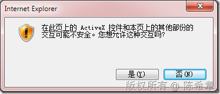](http://images.cnblogs.com/cnblogs_com/chenxizhang/WindowsLiveWriter/7de467755ccf.NETActiveX_FF67/image_14.png) 

 点击“是”之后，就会调用我们写好的方法，显示出来“Hello,world”的文本

 [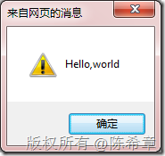](http://images.cnblogs.com/cnblogs_com/chenxizhang/WindowsLiveWriter/7de467755ccf.NETActiveX_FF67/image_16.png) 

  

 看起来不错对吧？你可能会问，怎么要这么麻烦来弹出一个Hello,World呢？这当然是一个演示。ActiveX控件典型的使用场合做一些复杂的客户端操作，例如文件批量上传等等。

 我下面稍微修改一下控件

 [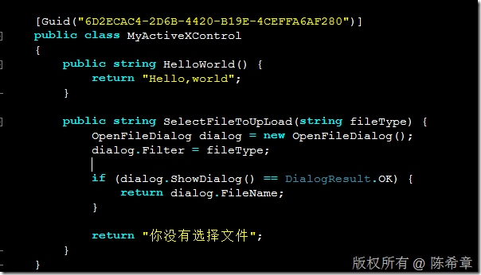](http://images.cnblogs.com/cnblogs_com/chenxizhang/WindowsLiveWriter/7de467755ccf.NETActiveX_FF67/image_20.png) 

 重新编译该项目之后，修改网页文件

 [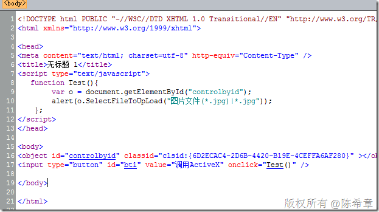](http://images.cnblogs.com/cnblogs_com/chenxizhang/WindowsLiveWriter/7de467755ccf.NETActiveX_FF67/image_22.png) 

 在浏览器中再次打开该网页，点击按钮之后，会弹出选择文件的对话框

 [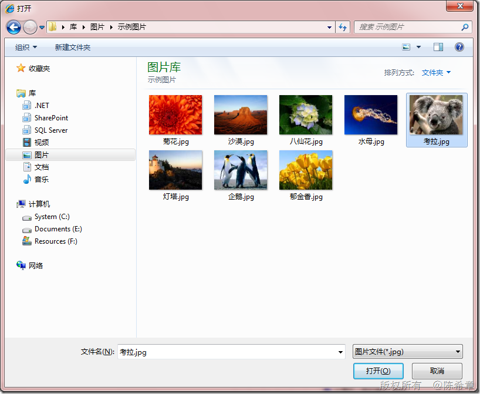](http://images.cnblogs.com/cnblogs_com/chenxizhang/WindowsLiveWriter/7de467755ccf.NETActiveX_FF67/image_24.png) 

 选择文件之后，单击“打开”

 [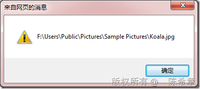](http://images.cnblogs.com/cnblogs_com/chenxizhang/WindowsLiveWriter/7de467755ccf.NETActiveX_FF67/image_26.png) 

 从这里可以看出来，ActiveX控件是在本地运行的，所以他可以做的事情很多。也正因为如此，它就势必也就存在安全方面的隐患。

  

 3. 如何让浏览器信任我们的控件

 上面的页面工作得很好，但是我们也看到了两次警告。这是不错的设计，因为要保护客户端的安全嘛。但如果在公司内部开发了一套ActiveX控件，每次都需要用户这样去用的话，显然也是不合适的。

 那么，如何让IE识别我们的控件是安全的呢？

 首先定义一个IObjecdSafety接口。这其实是一个COM接口，关于该接口，可以参考资料：[http://msdn.microsoft.com/en-us/library/aa768224(VS.85).aspx](http://msdn.microsoft.com/en-us/library/aa768224(VS.85).aspx "http://msdn.microsoft.com/en-us/library/aa768224(VS.85).aspx")

 [ComImport, Guid("CB5BDC81-93C1-11CF-8F20-00805F2CD064")]  
[InterfaceType(ComInterfaceType.InterfaceIsIUnknown)]  
public interface IObjectSafety  
{     [PreserveSig]  
    void GetInterfacceSafyOptions(  
        int riid,  
        out int pdwSupportedOptions,  
        out int pdwEnabledOptions);     [PreserveSig]  
    void SetInterfaceSafetyOptions(  
        int riid,  
        int dwOptionsSetMask,  
        int dwEnabledOptions); }             并且让我们的类型实现该接口

 [Guid("6D2ECAC4-2D6B-4420-B19E-4CEFFA6AF280")]  
public class MyActiveXControl:IObjectSafety  
{  
    public string HelloWorld() {  
        return "Hello,world";  
    }     public string SelectFileToUpLoad(string fileType) {  
        OpenFileDialog dialog = new OpenFileDialog();  
        dialog.Filter = fileType;         if (dialog.ShowDialog() == DialogResult.OK) {  
            return dialog.FileName;  
        }         return "你没有选择文件";  
    }     #region IObjectSafety 成员     public void GetInterfacceSafyOptions(int riid, out int pdwSupportedOptions, out int pdwEnabledOptions)  
    {  
        pdwEnabledOptions = 2;  
        pdwSupportedOptions = 1;  
    }     public void SetInterfaceSafetyOptions(int riid, int dwOptionsSetMask, int dwEnabledOptions)  
    {  
        throw new NotImplementedException();  
    }     #endregion  
}   再次运行页面，会发现下面这个提示**没有了**  但是，下面这个警告还是有的  出现这样的警告其实关系不大，提醒一下用户也是有好处的。 如果一定不想看到，那么可以尝试修改安全设置【但不建议这么做】 [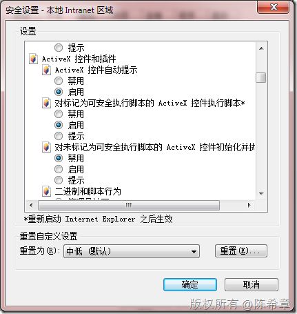](http://images.cnblogs.com/cnblogs_com/chenxizhang/WindowsLiveWriter/7de467755ccf.NETActiveX_FF67/image_28.png) 4. 如何在客户端安装呢？ 首先制作一个安装包程序 [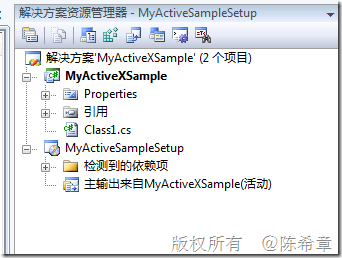](http://images.cnblogs.com/cnblogs_com/chenxizhang/WindowsLiveWriter/7de467755ccf.NETActiveX_FF67/image_30.png) [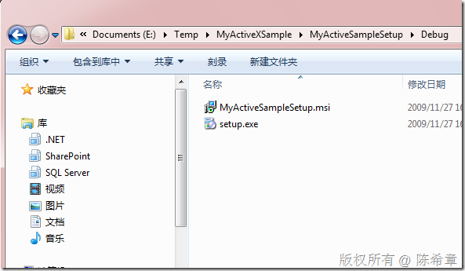](http://images.cnblogs.com/cnblogs_com/chenxizhang/WindowsLiveWriter/7de467755ccf.NETActiveX_FF67/image_32.png) 接下来我们需要为这个安装程序签名。如果要真的有效，则需要向一下证书机构申请真正的证书，当然是要交上$若干。我们这里用一个测试用的证书 先制作一个证书 [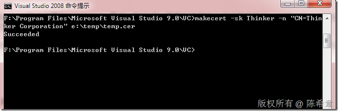](http://images.cnblogs.com/cnblogs_com/chenxizhang/WindowsLiveWriter/7de467755ccf.NETActiveX_FF67/image_34.png) 安装该证书，双击文件 [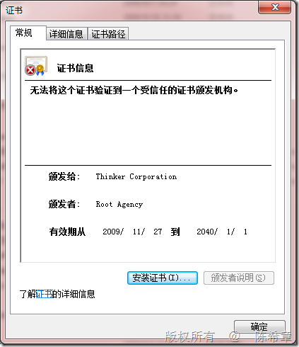](http://images.cnblogs.com/cnblogs_com/chenxizhang/WindowsLiveWriter/7de467755ccf.NETActiveX_FF67/image_52.png) 点击“安装证书” [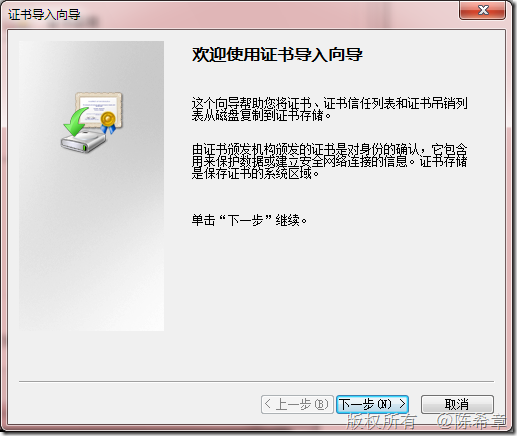](http://images.cnblogs.com/cnblogs_com/chenxizhang/WindowsLiveWriter/7de467755ccf.NETActiveX_FF67/image_54.png) [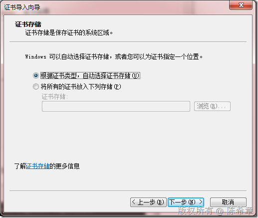](http://images.cnblogs.com/cnblogs_com/chenxizhang/WindowsLiveWriter/7de467755ccf.NETActiveX_FF67/image_56.png) [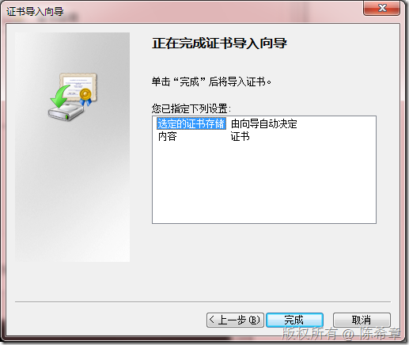](http://images.cnblogs.com/cnblogs_com/chenxizhang/WindowsLiveWriter/7de467755ccf.NETActiveX_FF67/image_58.png) [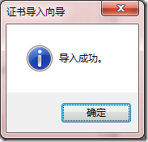](http://images.cnblogs.com/cnblogs_com/chenxizhang/WindowsLiveWriter/7de467755ccf.NETActiveX_FF67/image_60.png)   [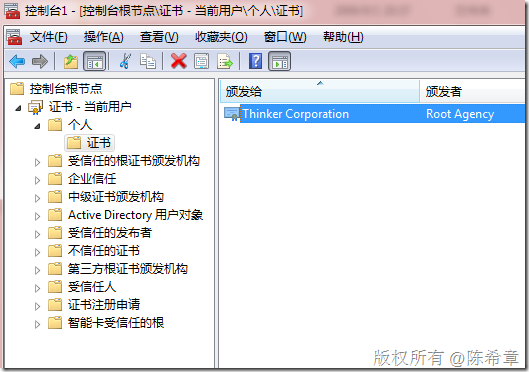](http://images.cnblogs.com/cnblogs_com/chenxizhang/WindowsLiveWriter/7de467755ccf.NETActiveX_FF67/image_62.png)   然后利用这个证书给setup.exe签名 [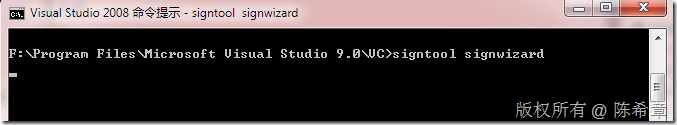](http://images.cnblogs.com/cnblogs_com/chenxizhang/WindowsLiveWriter/7de467755ccf.NETActiveX_FF67/image_36.png)       [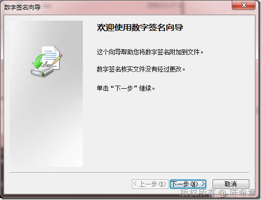](http://images.cnblogs.com/cnblogs_com/chenxizhang/WindowsLiveWriter/7de467755ccf.NETActiveX_FF67/image_38.png) 

 [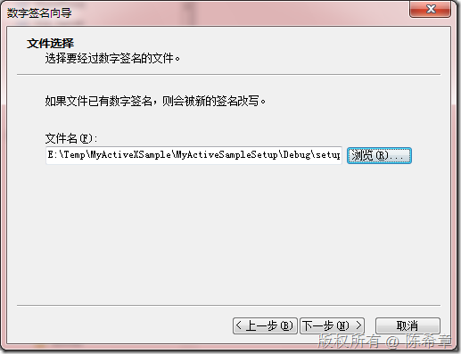](http://images.cnblogs.com/cnblogs_com/chenxizhang/WindowsLiveWriter/7de467755ccf.NETActiveX_FF67/image_40.png) 

 [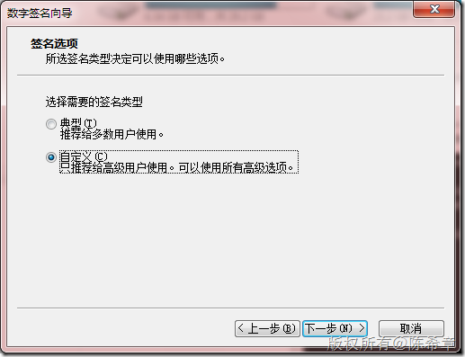](http://images.cnblogs.com/cnblogs_com/chenxizhang/WindowsLiveWriter/7de467755ccf.NETActiveX_FF67/image_44.png) 

 [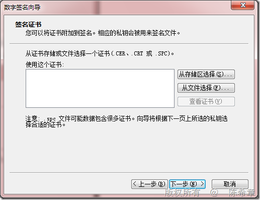](http://images.cnblogs.com/cnblogs_com/chenxizhang/WindowsLiveWriter/7de467755ccf.NETActiveX_FF67/image_46.png)   
“从文件选择”

   [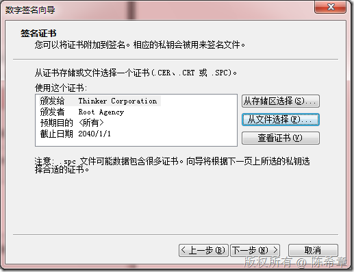](http://images.cnblogs.com/cnblogs_com/chenxizhang/WindowsLiveWriter/7de467755ccf.NETActiveX_FF67/image_50.png) 

 [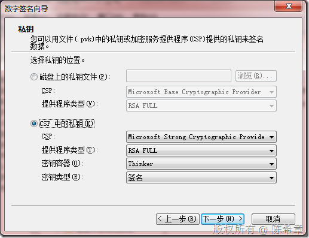](http://images.cnblogs.com/cnblogs_com/chenxizhang/WindowsLiveWriter/7de467755ccf.NETActiveX_FF67/image_64.png) 

 [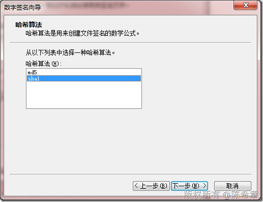](http://images.cnblogs.com/cnblogs_com/chenxizhang/WindowsLiveWriter/7de467755ccf.NETActiveX_FF67/image_66.png) 

          [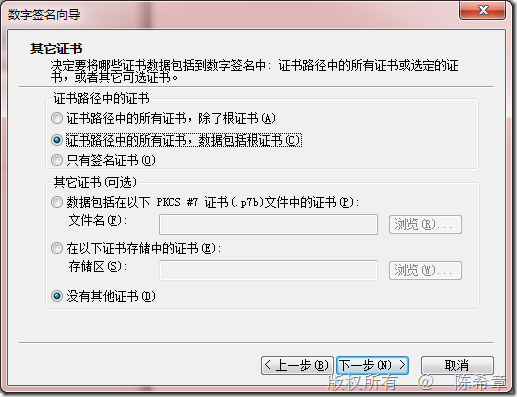](http://images.cnblogs.com/cnblogs_com/chenxizhang/WindowsLiveWriter/7de467755ccf.NETActiveX_FF67/image_68.png) 

 [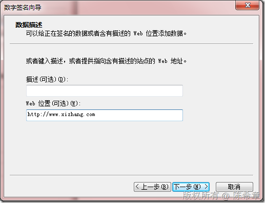](http://images.cnblogs.com/cnblogs_com/chenxizhang/WindowsLiveWriter/7de467755ccf.NETActiveX_FF67/image_70.png) 

 [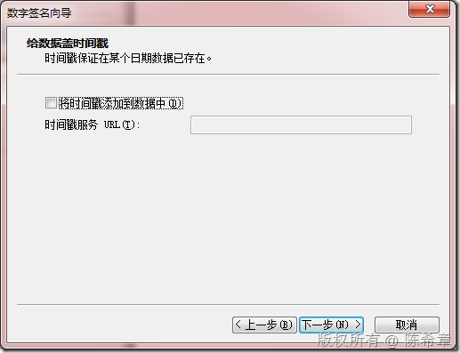](http://images.cnblogs.com/cnblogs_com/chenxizhang/WindowsLiveWriter/7de467755ccf.NETActiveX_FF67/image_72.png) 

 [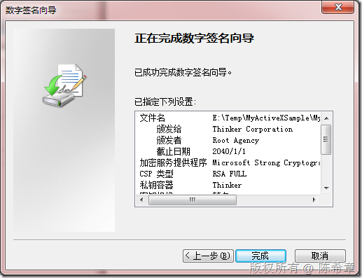](http://images.cnblogs.com/cnblogs_com/chenxizhang/WindowsLiveWriter/7de467755ccf.NETActiveX_FF67/image_74.png) 

 [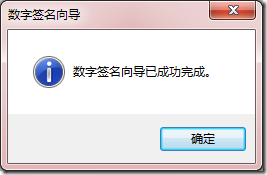](http://images.cnblogs.com/cnblogs_com/chenxizhang/WindowsLiveWriter/7de467755ccf.NETActiveX_FF67/image_76.png) 

    

  

 最后修改一下页面

 [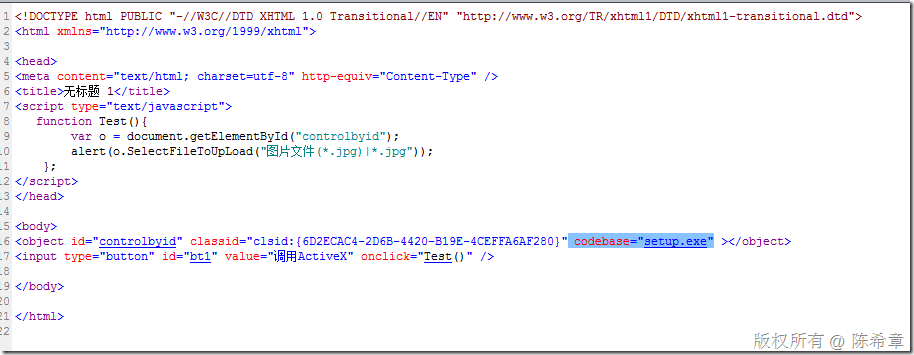](http://images.cnblogs.com/cnblogs_com/chenxizhang/WindowsLiveWriter/7de467755ccf.NETActiveX_FF67/image_78.png) 

 最后，请打开下面的地址进行测试 ，首先也会有一个警告提示说该ActiveX已经被阻止了。

 [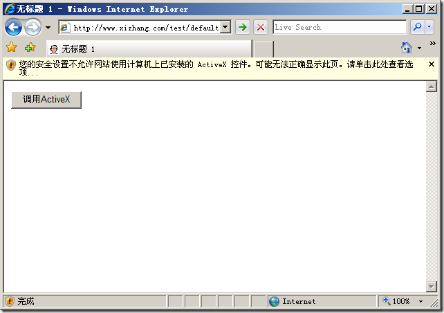](http://images.cnblogs.com/cnblogs_com/chenxizhang/WindowsLiveWriter/7de467755ccf.NETActiveX_FF67/image_84.png) 

 我测试的结果是即便加入到信任站点也不行。我想原因估计是我们的证书是一个测试用的。

  

 所以，可行的方式可能是将安装包单独提供下载**（需要提供那个msi安装包给用户安装即可）**

  

 只要安装好了之后，以后访问该网页就不会提示了

 [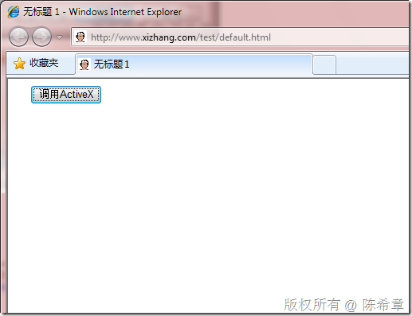](http://images.cnblogs.com/cnblogs_com/chenxizhang/WindowsLiveWriter/7de467755ccf.NETActiveX_FF67/image_80.png)

