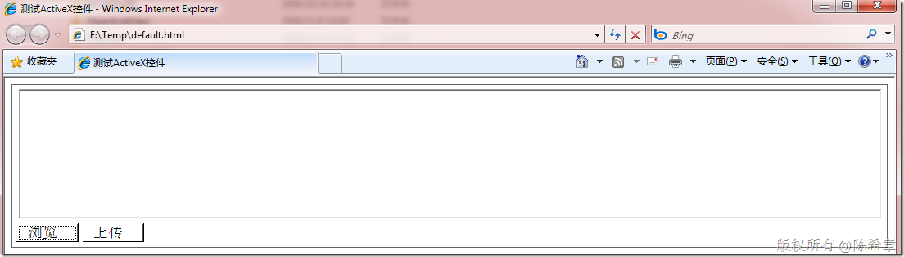
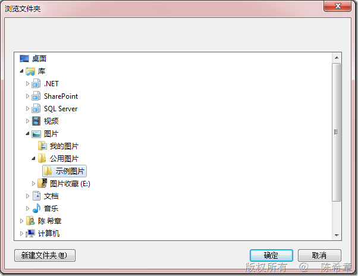
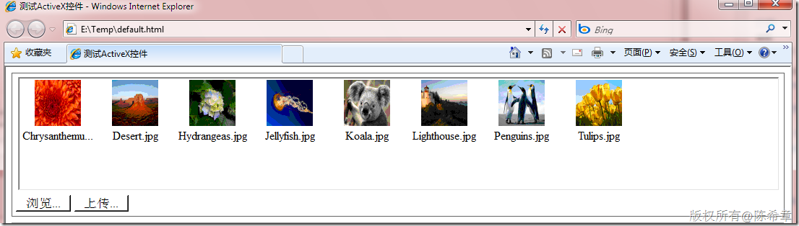
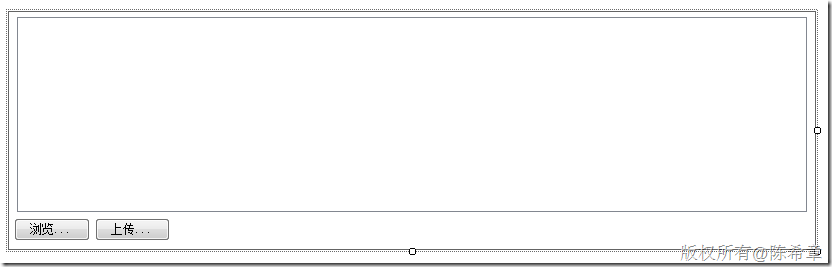

# 使用ActiveX控件实现批量文件上传 
> 原文发表于 2009-11-27, 地址: http://www.cnblogs.com/chenxizhang/archive/2009/11/27/1612343.html 


接上面两篇，我把这个ActiveX控件实际地完善了一下，实现了一个简单的批量上传的功能。大致效果看起来如下

 [](http://images.cnblogs.com/cnblogs_com/chenxizhang/WindowsLiveWriter/ActiveX_13BE1/image_2.png) 

 点击浏览按钮，会弹出一个对话框，让我们选择一个文件夹

 [](http://images.cnblogs.com/cnblogs_com/chenxizhang/WindowsLiveWriter/ActiveX_13BE1/image_4.png) 

 选择某个文件夹之后，点击“确定”，此时会把该目录下面的图片文件读取出来一个列表。如下面所示

 [](http://images.cnblogs.com/cnblogs_com/chenxizhang/WindowsLiveWriter/ActiveX_13BE1/image_6.png) 

  

 那么大致是怎么实现的呢？

 首先，让我们的那个类型继承　System.Windows.Forms.UserControl类型

 其次，在这个UserControl上面设计一些子控件

 [](http://images.cnblogs.com/cnblogs_com/chenxizhang/WindowsLiveWriter/ActiveX_13BE1/image_8.png) 

 我们在拖拽控件的时候，设计器会帮助生成一个方法：InitializeComponent，类似下面这样


```
        private void InitializeComponent()
        {
            this.components = new System.ComponentModel.Container();
            this.listView1 = new System.Windows.Forms.ListView();
            this.imageList1 = new System.Windows.Forms.ImageList(this.components);
            this.btBrowser = new System.Windows.Forms.Button();
            this.btUpload = new System.Windows.Forms.Button();
            this.SuspendLayout();
            // 
            // listView1
            // 
            this.listView1.Anchor = ((System.Windows.Forms.AnchorStyles)((((System.Windows.Forms.AnchorStyles.Top | System.Windows.Forms.AnchorStyles.Bottom)
                        | System.Windows.Forms.AnchorStyles.Left)
                        | System.Windows.Forms.AnchorStyles.Right)));
            this.listView1.LargeImageList = this.imageList1;
            this.listView1.Location = new System.Drawing.Point(8, 5);
            this.listView1.Name = "listView1";
            this.listView1.Size = new System.Drawing.Size(790, 195);
            this.listView1.TabIndex = 0;
            this.listView1.UseCompatibleStateImageBehavior = false;
            // 
            // imageList1
            // 
            this.imageList1.ColorDepth = System.Windows.Forms.ColorDepth.Depth8Bit;
            this.imageList1.ImageSize = new System.Drawing.Size(64, 64);
            this.imageList1.TransparentColor = System.Drawing.Color.Transparent;
            // 
            // btBrowser
            // 
            this.btBrowser.Anchor = ((System.Windows.Forms.AnchorStyles)((System.Windows.Forms.AnchorStyles.Bottom | System.Windows.Forms.AnchorStyles.Left)));
            this.btBrowser.Location = new System.Drawing.Point(5, 206);
            this.btBrowser.Name = "btBrowser";
            this.btBrowser.Size = new System.Drawing.Size(76, 23);
            this.btBrowser.TabIndex = 1;
            this.btBrowser.Text = "浏览...";
            this.btBrowser.UseVisualStyleBackColor = true;
            this.btBrowser.Click += new System.EventHandler(this.btBrowser\_Click);
            // 
            // btUpload
            // 
            this.btUpload.Anchor = ((System.Windows.Forms.AnchorStyles)((System.Windows.Forms.AnchorStyles.Bottom | System.Windows.Forms.AnchorStyles.Left)));
            this.btUpload.Location = new System.Drawing.Point(86, 206);
            this.btUpload.Name = "btUpload";
            this.btUpload.Size = new System.Drawing.Size(75, 23);
            this.btUpload.TabIndex = 2;
            this.btUpload.Text = "上传...";
            this.btUpload.UseVisualStyleBackColor = true;
            // 
            // MyActiveXControl
            // 
            this.BackColor = System.Drawing.Color.White;
            this.BorderStyle = System.Windows.Forms.BorderStyle.FixedSingle;
            this.Controls.Add(this.btUpload);
            this.Controls.Add(this.btBrowser);
            this.Controls.Add(this.listView1);
            this.Name = "MyActiveXControl";
            this.Padding = new System.Windows.Forms.Padding(5);
            this.Size = new System.Drawing.Size(806, 237);
            this.ResumeLayout(false);

        }
```

.csharpcode, .csharpcode pre
{
 font-size: small;
 color: black;
 font-family: consolas, "Courier New", courier, monospace;
 background-color: #ffffff;
 /*white-space: pre;*/
}
.csharpcode pre { margin: 0em; }
.csharpcode .rem { color: #008000; }
.csharpcode .kwrd { color: #0000ff; }
.csharpcode .str { color: #006080; }
.csharpcode .op { color: #0000c0; }
.csharpcode .preproc { color: #cc6633; }
.csharpcode .asp { background-color: #ffff00; }
.csharpcode .html { color: #800000; }
.csharpcode .attr { color: #ff0000; }
.csharpcode .alt 
{
 background-color: #f4f4f4;
 width: 100%;
 margin: 0em;
}
.csharpcode .lnum { color: #606060; }

接下来编写代码，与windows Forms里面编程没有任何区别。为按钮绑定事件处理程序等等


这里要注意的是，需要手工地添加一个构造函数，在构造函数中调用InitializeComponent


```
        public MyActiveXControl() {
            InitializeComponent();
        }
```


.csharpcode, .csharpcode pre
{
 font-size: small;
 color: black;
 font-family: consolas, "Courier New", courier, monospace;
 background-color: #ffffff;
 /*white-space: pre;*/
}
.csharpcode pre { margin: 0em; }
.csharpcode .rem { color: #008000; }
.csharpcode .kwrd { color: #0000ff; }
.csharpcode .str { color: #006080; }
.csharpcode .op { color: #0000c0; }
.csharpcode .preproc { color: #cc6633; }
.csharpcode .asp { background-color: #ffff00; }
.csharpcode .html { color: #800000; }
.csharpcode .attr { color: #ff0000; }
.csharpcode .alt 
{
 background-color: #f4f4f4;
 width: 100%;
 margin: 0em;
}
.csharpcode .lnum { color: #606060; }


至于选择文件夹的代码，大致如下


```
        private void btBrowser\_Click(object sender, EventArgs e)
        {
            FolderBrowserDialog dialog = new FolderBrowserDialog();
            dialog.SelectedPath = Environment.GetFolderPath(Environment.SpecialFolder.MyPictures);
            if (dialog.ShowDialog() == DialogResult.OK)
            {
                listView1.Items.Clear();


                DirectoryInfo dir = new DirectoryInfo(dialog.SelectedPath);

                foreach (FileInfo file in dir.GetFiles("*.jpg"))
                {
                    ListViewItem item = new ListViewItem(file.Name);
                    imageList1.Images.Add(Image.FromFile(file.FullName));
                    item.ImageIndex = imageList1.Images.Count - 1;
                    listView1.Items.Add(item);
                }
            }

        }
```

.csharpcode, .csharpcode pre
{
 font-size: small;
 color: black;
 font-family: consolas, "Courier New", courier, monospace;
 background-color: #ffffff;
 /*white-space: pre;*/
}
.csharpcode pre { margin: 0em; }
.csharpcode .rem { color: #008000; }
.csharpcode .kwrd { color: #0000ff; }
.csharpcode .str { color: #006080; }
.csharpcode .op { color: #0000c0; }
.csharpcode .preproc { color: #cc6633; }
.csharpcode .asp { background-color: #ffff00; }
.csharpcode .html { color: #800000; }
.csharpcode .attr { color: #ff0000; }
.csharpcode .alt 
{
 background-color: #f4f4f4;
 width: 100%;
 margin: 0em;
}
.csharpcode .lnum { color: #606060; }
