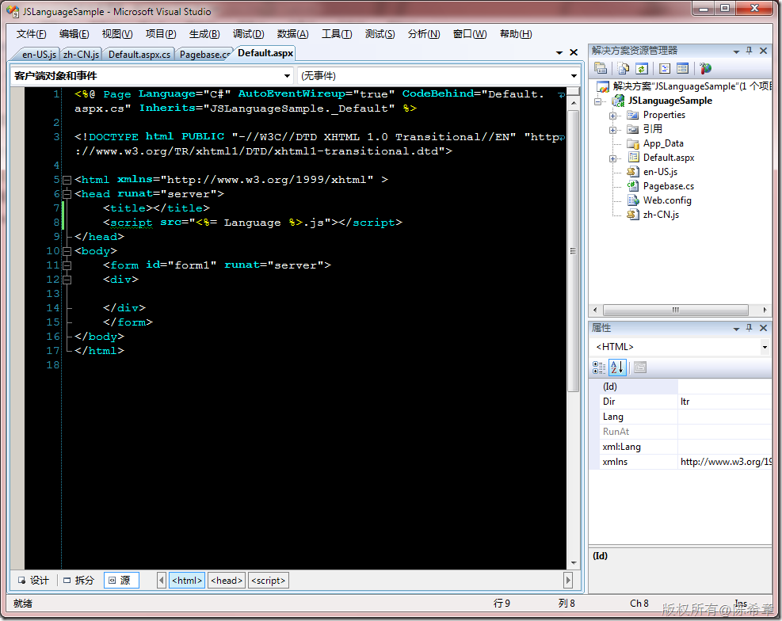
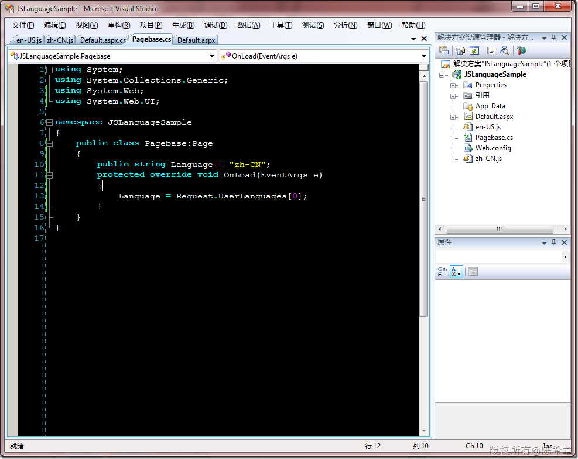
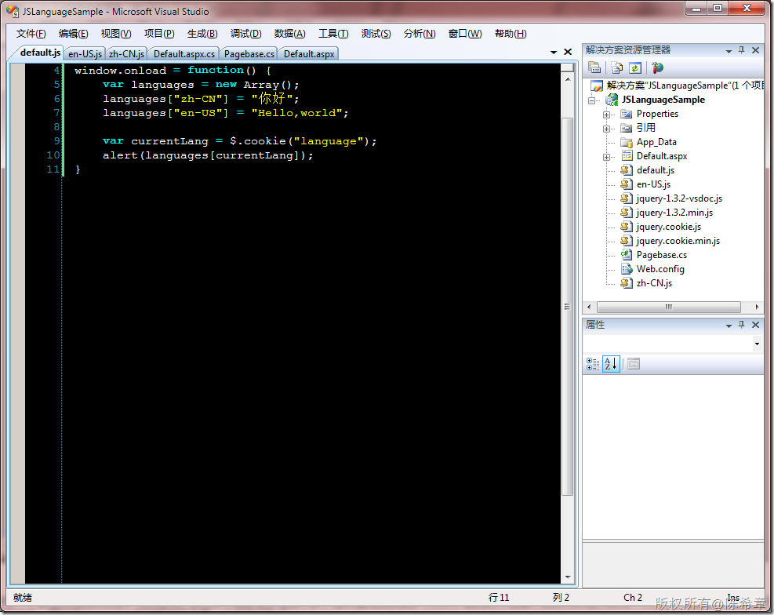
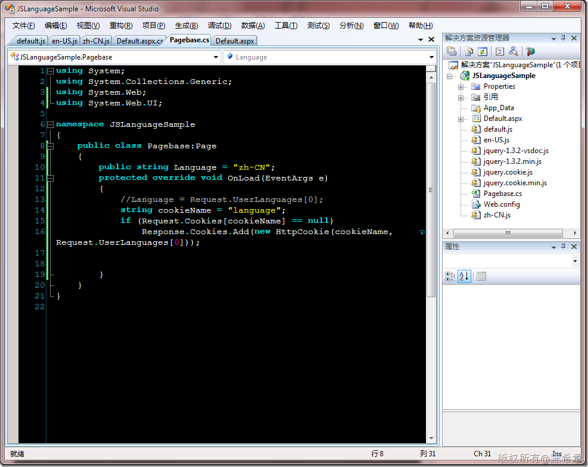
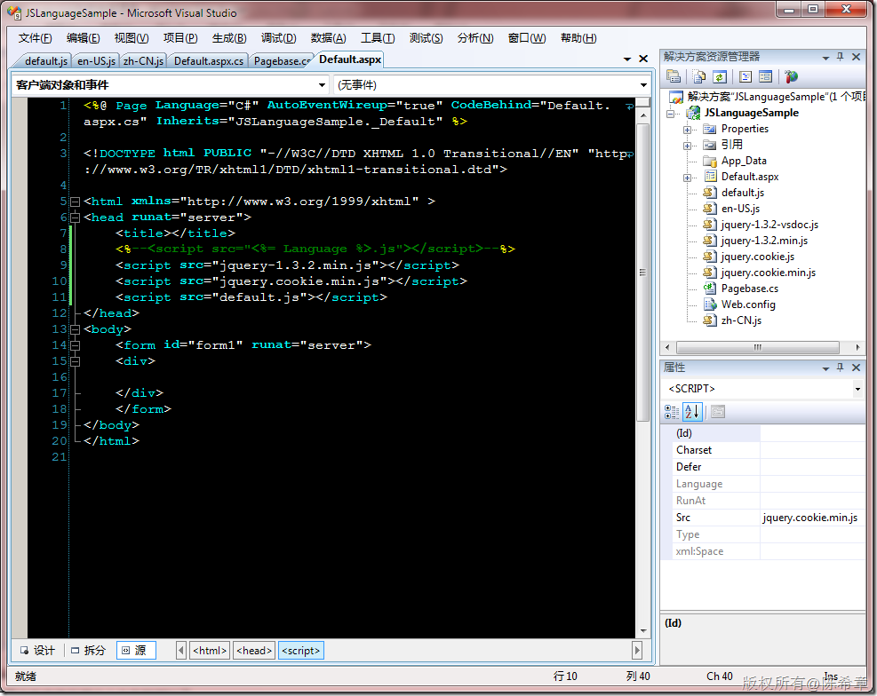
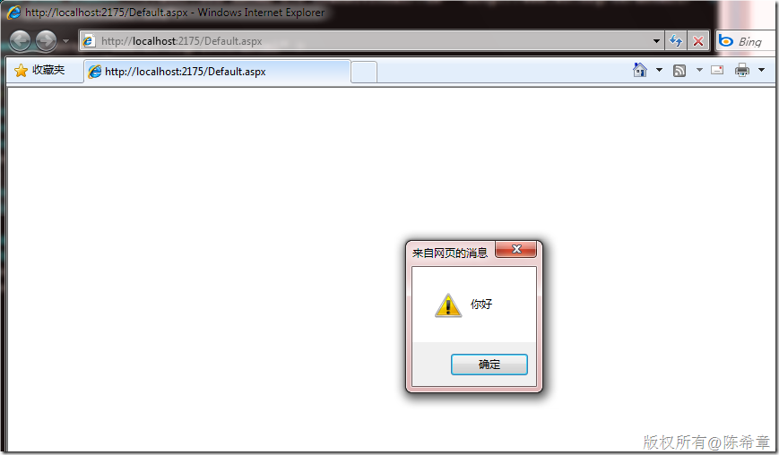
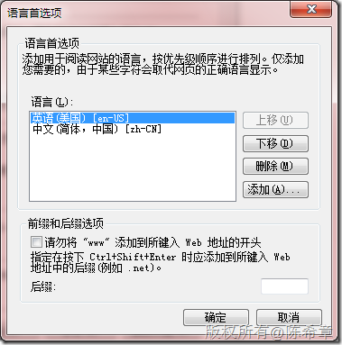

# 如何让javascript也支持多语言 
> 原文发表于 2009-11-28, 地址: http://www.cnblogs.com/chenxizhang/archive/2009/11/28/1612595.html 

关于这一点，第一种解决方案是使用多个js文件，下面这个文章介绍了着个做法

 [http://dcao.javaeye.com/blog/513944](http://dcao.javaeye.com/blog/513944 "http://dcao.javaeye.com/blog/513944")

 我基本上还是觉得这种方法不错，就是在导入有关js的时候动态地决定使用什么语言

 

 我的做法如下

  

 注意，我是通过一个页面级别的变量来实现这个功能的。 而且为了不需要再每个页面都去定义那个变量，我做了一个基类

  

  

 还有一个做法我也比较欣赏，尤其是说，js文件中需要做多语言不多，这种情况如果做多个文件，就比较不合算。我们可以让人使用一个文件，但里面将需要进行多语言的部分，用数组来保存起来。要知道javascript中的数组其实是一个字典的形式。

  

 再来看看基类要怎么修改

  

 页面中就直接引用这个文件就可以了

  

 在浏览器中看到的效果就象下面这样

  

 如果我把IE浏览器的默认语言改成了英语（美国）的话，

  

 则会出现下面这样的效果

  

 顺便说一下，我们这里读取Language的做法是读取用户浏览器的设置，有一定的局限性。如果浏览器不是IE，则可能出现如下的问题

  

 那么，如何解决这样的问题呢？更好的做法就是不要依赖浏览器。而是将用户的语言设置保存到数据库这样的地方。在Session\_Start的时候读取出来，保存在cookie中，这样就和谐了

