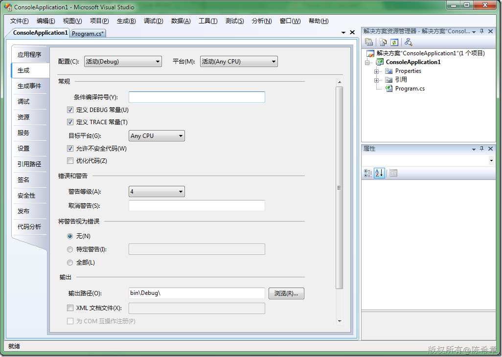

# .NET ：如何计算引用类型所占用的空间 
> 原文发表于 2009-12-09, 地址: http://www.cnblogs.com/chenxizhang/archive/2009/12/09/1620562.html 


```
引用类型是在堆上面分配的，与值类型不同的是，.NET没有办法直接计算得到它们所占用的大小。下面是一个解决方法。
```

```
 
```

```
using System;
using System.Reflection;


namespace Sample
{

    public class Customer {
        public int Id { get; set; }
        public string CompanyName { get; set; }

    }

    class Program
    {
        static void Main(string[] args)
        {
            Console.WriteLine(SizeOf<Customer>());
            Console.Read();
        }

        public static int SizeOf<T>()
        {
            return SizeOf(typeof(T));
        }

        public unsafe static int SizeOf(Type targetType)
        {
            if (targetType == null) return 0;
            var result = 0;
            foreach (var fld in targetType.GetFields(BindingFlags.Instance | BindingFlags.Public | BindingFlags.NonPublic))
                switch (Type.GetTypeCode(fld.FieldType))
                {
                    case TypeCode.Boolean: result += sizeof(bool); break;
                    case TypeCode.Byte: result += sizeof(byte); break;
                    case TypeCode.Char: result += sizeof(char); break;
                    case TypeCode.DateTime: result += sizeof(DateTime); break;
                    case TypeCode.String:
                    case TypeCode.DBNull: result += IntPtr.Size; break;
                    case TypeCode.Decimal: result += sizeof(decimal); break;
                    case TypeCode.Double: result += sizeof(double); break;
                    case TypeCode.Int16: result += sizeof(Int16); break;
                    case TypeCode.Int32: result += sizeof(Int32); break;
                    case TypeCode.Int64: result += sizeof(Int64); break;
                    case TypeCode.SByte: result += sizeof(SByte); break;
                    case TypeCode.Single: result += sizeof(float); break;
                    case TypeCode.UInt16: result += sizeof(UInt16); break;
                    case TypeCode.UInt32: result += sizeof(UInt32); break;
                    case TypeCode.UInt64: result += sizeof(UInt64); break;
                    case TypeCode.Object:
                        if (fld.FieldType.Equals(typeof(UIntPtr)))
                        {
                            result += UIntPtr.Size;
                            break;
                        }
                        if (fld.FieldType.Equals(typeof(IntPtr)))
                        {
                            result += IntPtr.Size;
                            break;
                        }
                        if (fld.FieldType.IsValueType)
                        {
                            result += SizeOf(fld.FieldType);
                            break;
                        }
                        if (fld.FieldType.IsEnum)
                        {
                            result += SizeOf(Enum.GetUnderlyingType(fld.FieldType));
                            break;
                        }
                        result += IntPtr.Size; break;
                    default: continue;
                }
            return result + SizeOf(targetType.BaseType);
        } 
    }


}

```

```
**注意：选中下图中的“允许不安全代码”**
```

```
[](http://images.cnblogs.com/cnblogs_com/chenxizhang/WindowsLiveWriter/b9bef5508bb5.NET_11F02/image_2.png) 
```

```
 
```

.csharpcode, .csharpcode pre
{
 font-size: small;
 color: black;
 font-family: consolas, "Courier New", courier, monospace;
 background-color: #ffffff;
 /*white-space: pre;*/
}
.csharpcode pre { margin: 0em; }
.csharpcode .rem { color: #008000; }
.csharpcode .kwrd { color: #0000ff; }
.csharpcode .str { color: #006080; }
.csharpcode .op { color: #0000c0; }
.csharpcode .preproc { color: #cc6633; }
.csharpcode .asp { background-color: #ffff00; }
.csharpcode .html { color: #800000; }
.csharpcode .attr { color: #ff0000; }
.csharpcode .alt 
{
 background-color: #f4f4f4;
 width: 100%;
 margin: 0em;
}
.csharpcode .lnum { color: #606060; }
