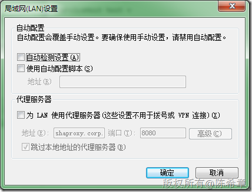
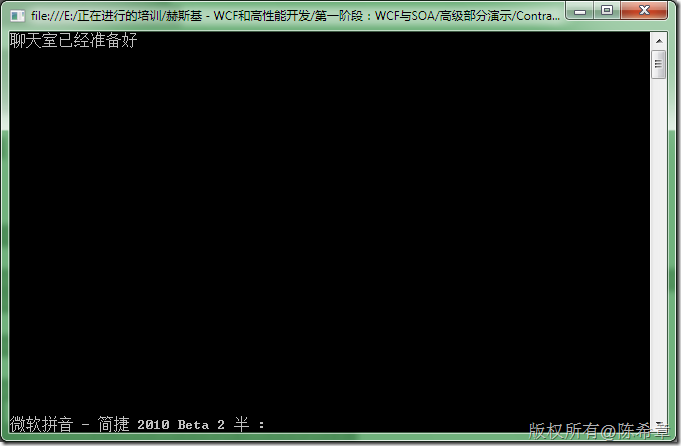
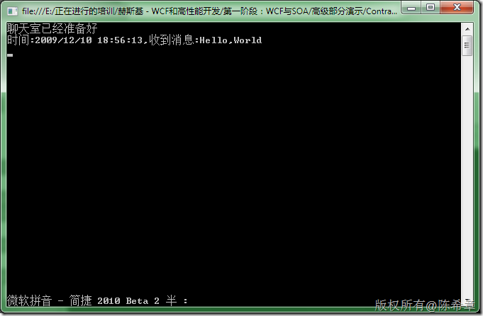
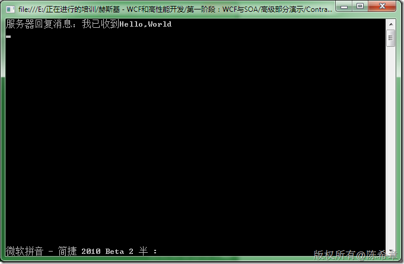

# .NET : 在实现WCF的双工服务时可能遇到的问题 
> 原文发表于 2009-12-10, 地址: http://www.cnblogs.com/chenxizhang/archive/2009/12/10/1621299.html 


今天继续在讲WCF方面的课程。期间演示双工服务的时候，总是遇到超时的问题，代码怎么看都是正确的，硬是没有找到原因。回到酒店，再次打开确又是正常的。总结下来，原因应该是我在IE中设置了连接代理的原因。

 [](http://images.cnblogs.com/cnblogs_com/chenxizhang/WindowsLiveWriter/1223eaaa8e00.NETWCF_10AA7/image_8.png) 

 1. 合约


```
using System;
using System.Collections.Generic;
using System.Linq;
using System.Text;

using System.ServiceModel;

namespace Contracts
{
    [
        ServiceContract(
            CallbackContract=typeof(ICallbackContract))
    ]
    public interface IChat
    {
        [OperationContract]
        void SendMessage(string msg);
    }

    [ServiceContract]
    public interface ICallbackContract {
        [OperationContract]
        void ReplyMessage(string msg);
    }
}

```


.csharpcode, .csharpcode pre
{
 font-size: small;
 color: black;
 font-family: consolas, "Courier New", courier, monospace;
 background-color: #ffffff;
 /*white-space: pre;*/
}
.csharpcode pre { margin: 0em; }
.csharpcode .rem { color: #008000; }
.csharpcode .kwrd { color: #0000ff; }
.csharpcode .str { color: #006080; }
.csharpcode .op { color: #0000c0; }
.csharpcode .preproc { color: #cc6633; }
.csharpcode .asp { background-color: #ffff00; }
.csharpcode .html { color: #800000; }
.csharpcode .attr { color: #ff0000; }
.csharpcode .alt 
{
 background-color: #f4f4f4;
 width: 100%;
 margin: 0em;
}
.csharpcode .lnum { color: #606060; }


2. 服务


```
using System;
using System.Collections.Generic;
using System.Linq;
using System.Text;

using System.ServiceModel;
using Contracts;

namespace HelloWorldServiceLib
{
    [ServiceBehavior(ConcurrencyMode = ConcurrencyMode.Reentrant)]
    public class ChatService:IChat
    {
        #region IChat 成员

        public void SendMessage(string msg)
        {
            Console.WriteLine("时间:{0},收到消息:{1}",
                DateTime.Now.ToString(),
                msg);

            ICallbackContract callback = OperationContext.Current.GetCallbackChannel<ICallbackContract>();

            callback.ReplyMessage("服务器回复消息：我已收到"+msg);

        }

        #endregion
    }
}

```

```
3. 宿主
```

```
         using (ServiceHost host =
                new ServiceHost(
                    typeof(HelloWorldServiceLib.ChatService),
                    new Uri("http://localhost:8000/ChatRoom")
                    )) {
                        host.AddServiceEndpoint(
                            "Contracts.IChat",
                            new WSDualHttpBinding(),
                            "");
                        host.Open();
                        Console.WriteLine("聊天室已经准备好");
                        Console.Read();
            }
```


.csharpcode, .csharpcode pre
{
 font-size: small;
 color: black;
 font-family: consolas, "Courier New", courier, monospace;
 background-color: #ffffff;
 /*white-space: pre;*/
}
.csharpcode pre { margin: 0em; }
.csharpcode .rem { color: #008000; }
.csharpcode .kwrd { color: #0000ff; }
.csharpcode .str { color: #006080; }
.csharpcode .op { color: #0000c0; }
.csharpcode .preproc { color: #cc6633; }
.csharpcode .asp { background-color: #ffff00; }
.csharpcode .html { color: #800000; }
.csharpcode .attr { color: #ff0000; }
.csharpcode .alt 
{
 background-color: #f4f4f4;
 width: 100%;
 margin: 0em;
}
.csharpcode .lnum { color: #606060; }

.csharpcode, .csharpcode pre
{
 font-size: small;
 color: black;
 font-family: consolas, "Courier New", courier, monospace;
 background-color: #ffffff;
 /*white-space: pre;*/
}
.csharpcode pre { margin: 0em; }
.csharpcode .rem { color: #008000; }
.csharpcode .kwrd { color: #0000ff; }
.csharpcode .str { color: #006080; }
.csharpcode .op { color: #0000c0; }
.csharpcode .preproc { color: #cc6633; }
.csharpcode .asp { background-color: #ffff00; }
.csharpcode .html { color: #800000; }
.csharpcode .attr { color: #ff0000; }
.csharpcode .alt 
{
 background-color: #f4f4f4;
 width: 100%;
 margin: 0em;
}
.csharpcode .lnum { color: #606060; }


4. 客户端


```
using System;
using System.Collections.Generic;
using System.Linq;
using System.Text;

using System.ServiceModel;
using Contracts;
using System.ServiceModel.Channels;

namespace ChatClient
{
    class Program
    {
        static void Main(string[] args)
        {
            Binding binding = new WSDualHttpBinding();
            EndpointAddress address = new EndpointAddress("http://localhost:8000/ChatRoom");
            CallBackHandler callback = new CallBackHandler();

            ChatClient client = new ChatClient(
                new InstanceContext(callback),
                binding,
                address);

            client.SendMessage("Hello,World");
            
            Console.Read();

        }
    }


    class ChatClient : ClientBase<IChat>, IChat {

        public ChatClient(InstanceContext callback,Binding binding, EndpointAddress address) : base(callback,binding, address) { }

        #region IChatContract 成员

        public void SendMessage(string message)
        {
            Channel.SendMessage(message);
        }

        #endregion
    }

    class CallBackHandler : ICallbackContract {

        #region ICallbackContract 成员

        public void ReplyMessage(string msg)
        {
            Console.WriteLine(msg);
        }

        #endregion
    }
}

```


.csharpcode, .csharpcode pre
{
 font-size: small;
 color: black;
 font-family: consolas, "Courier New", courier, monospace;
 background-color: #ffffff;
 /*white-space: pre;*/
}
.csharpcode pre { margin: 0em; }
.csharpcode .rem { color: #008000; }
.csharpcode .kwrd { color: #0000ff; }
.csharpcode .str { color: #006080; }
.csharpcode .op { color: #0000c0; }
.csharpcode .preproc { color: #cc6633; }
.csharpcode .asp { background-color: #ffff00; }
.csharpcode .html { color: #800000; }
.csharpcode .attr { color: #ff0000; }
.csharpcode .alt 
{
 background-color: #f4f4f4;
 width: 100%;
 margin: 0em;
}
.csharpcode .lnum { color: #606060; }


 


效果如下


1. 服务器初始化


[](http://images.cnblogs.com/cnblogs_com/chenxizhang/WindowsLiveWriter/1223eaaa8e00.NETWCF_10AA7/image_2.png) 


2. 服务器收到消息


[](http://images.cnblogs.com/cnblogs_com/chenxizhang/WindowsLiveWriter/1223eaaa8e00.NETWCF_10AA7/image_4.png) 


3. 客户端收到消息


[](http://images.cnblogs.com/cnblogs_com/chenxizhang/WindowsLiveWriter/1223eaaa8e00.NETWCF_10AA7/image_6.png)

