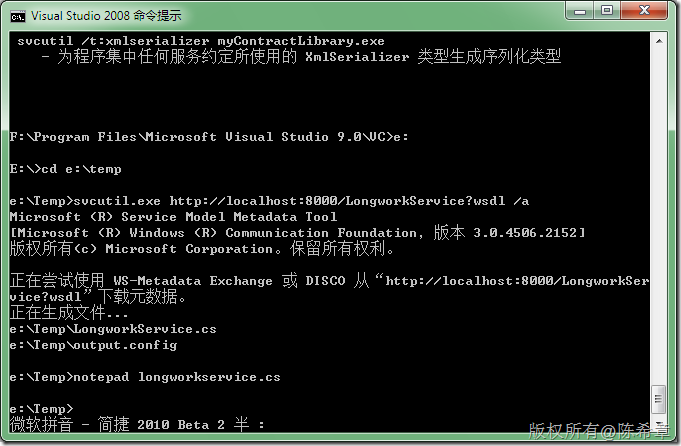
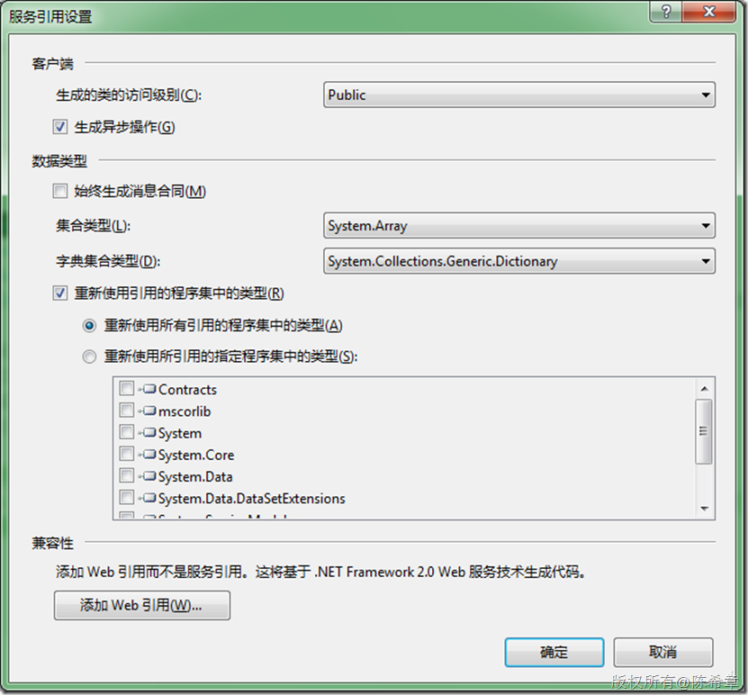
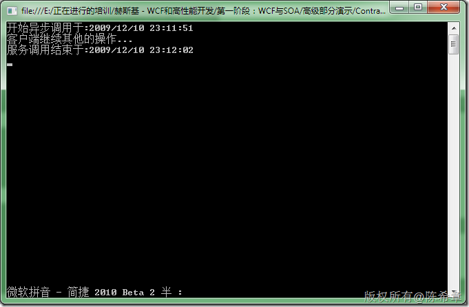

# WCF：如何创建带有异步访问委托的代理类 
> 原文发表于 2009-12-10, 地址: http://www.cnblogs.com/chenxizhang/archive/2009/12/10/1621467.html 


1. 合约


```
using System;
using System.Collections.Generic;
using System.Linq;
using System.Text;

using System.ServiceModel;

namespace Contracts
{
    [ServiceContract]
    public interface ILongworker
    {
        [OperationContract]
        void Dowork();
    }
}

```

.csharpcode, .csharpcode pre
{
 font-size: small;
 color: black;
 font-family: consolas, "Courier New", courier, monospace;
 background-color: #ffffff;
 /*white-space: pre;*/
}
.csharpcode pre { margin: 0em; }
.csharpcode .rem { color: #008000; }
.csharpcode .kwrd { color: #0000ff; }
.csharpcode .str { color: #006080; }
.csharpcode .op { color: #0000c0; }
.csharpcode .preproc { color: #cc6633; }
.csharpcode .asp { background-color: #ffff00; }
.csharpcode .html { color: #800000; }
.csharpcode .attr { color: #ff0000; }
.csharpcode .alt 
{
 background-color: #f4f4f4;
 width: 100%;
 margin: 0em;
}
.csharpcode .lnum { color: #606060; }

2. 服务


```
using System;
using System.Collections.Generic;
using System.Linq;
using System.Text;

namespace Services
{
    public class LongworkService:Contracts.ILongworker
    {
        #region ILongworker 成员

        public void Dowork()
        {
            //这是一个长时间工作的服务方法
            System.Threading.Thread.Sleep(10000);//设置休眠10秒钟
            Console.WriteLine("服务器执行完了操作");
        }

        #endregion
    }
}
```

```
3. 宿主
```

```
using System;
using System.Collections.Generic;
using System.Linq;
using System.Text;
using System.ServiceModel;
using System.ServiceModel.Description;

namespace LongworkServiceHost
{
    class Program
    {
        static void Main(string[] args)
        {
            #region 长时间工作的服务
            using (ServiceHost host =
                new ServiceHost(
                    typeof(Services.LongworkService),
                    new Uri("http://localhost:8000/LongworkService")
                    ))
            {
                host.AddServiceEndpoint(
                    "Contracts.ILongworker",
                    new BasicHttpBinding(),
                    "");

                ServiceMetadataBehavior behavior = new ServiceMetadataBehavior();
                behavior.HttpGetEnabled = true;
                host.Description.Behaviors.Add(behavior);

                host.AddServiceEndpoint(
                    "IMetadataExchange",
                    MetadataExchangeBindings.CreateMexHttpBinding(),
                    "mex");


                host.Open();
                Console.WriteLine("服务器已经准备好");
                Console.Read();
            }
            #endregion
        }
    }
}

```

.csharpcode, .csharpcode pre
{
 font-size: small;
 color: black;
 font-family: consolas, "Courier New", courier, monospace;
 background-color: #ffffff;
 /*white-space: pre;*/
}
.csharpcode pre { margin: 0em; }
.csharpcode .rem { color: #008000; }
.csharpcode .kwrd { color: #0000ff; }
.csharpcode .str { color: #006080; }
.csharpcode .op { color: #0000c0; }
.csharpcode .preproc { color: #cc6633; }
.csharpcode .asp { background-color: #ffff00; }
.csharpcode .html { color: #800000; }
.csharpcode .attr { color: #ff0000; }
.csharpcode .alt 
{
 background-color: #f4f4f4;
 width: 100%;
 margin: 0em;
}
.csharpcode .lnum { color: #606060; }


```
4. 客户端
首先如何生成带有异步操作的代理类。可以采用带有/a参数的svcutil工具，也可以在添加引用那个对话框中指定生成异步操作，如下图所示
```

.csharpcode, .csharpcode pre
{
 font-size: small;
 color: black;
 font-family: consolas, "Courier New", courier, monospace;
 background-color: #ffffff;
 /*white-space: pre;*/
}
.csharpcode pre { margin: 0em; }
.csharpcode .rem { color: #008000; }
.csharpcode .kwrd { color: #0000ff; }
.csharpcode .str { color: #006080; }
.csharpcode .op { color: #0000c0; }
.csharpcode .preproc { color: #cc6633; }
.csharpcode .asp { background-color: #ffff00; }
.csharpcode .html { color: #800000; }
.csharpcode .attr { color: #ff0000; }
.csharpcode .alt 
{
 background-color: #f4f4f4;
 width: 100%;
 margin: 0em;
}
.csharpcode .lnum { color: #606060; }

[](http://images.cnblogs.com/cnblogs_com/chenxizhang/WindowsLiveWriter/WCF_1467A/image_2.png) 


[](http://images.cnblogs.com/cnblogs_com/chenxizhang/WindowsLiveWriter/WCF_1467A/image_4.png) 


```
using System;
using System.Collections.Generic;
using System.Linq;
using System.Text;
using System.ServiceModel;

namespace LongworkServiceClient
{
    class Program
    {
        static void Main(string[] args)
        {
            //第一步：默认的调用（同步）
            //Contracts.ILongworker proxy =
            // new ChannelFactory<Contracts.ILongworker>(
            // new BasicHttpBinding(),
            // new EndpointAddress("http://localhost:8000/LongworkService")).CreateChannel();
            //Console.WriteLine("同步调用开始于:{0}", DateTime.Now);
            //proxy.Dowork();
            //Console.WriteLine("同步调用结束于:{0}", DateTime.Now);
            //Console.Read();

            //第二步：采用异步的调用
            //svcutil.exe http://localhost:8000/LongworkService?wsdl /a 创建异步委托
            //通过添加服务中指定异步选项创建代理类
            LongworkerClient client = new LongworkerClient(
                new BasicHttpBinding(),
                new EndpointAddress("http://localhost:8000/LongworkService"));

            Console.WriteLine("开始异步调用于:{0}", DateTime.Now);
            //client.Dowork();//如果这样调用，则是同步调用
            client.BeginDowork(new AsyncCallback(OnCallback), null);
            Console.WriteLine("客户端继续其他的操作...");

            Console.Read();


        }

        static void OnCallback(IAsyncResult ar) {
            Console.WriteLine("服务调用结束于:{0}", DateTime.Now);
        }
    }
}

```

[](http://images.cnblogs.com/cnblogs_com/chenxizhang/WindowsLiveWriter/WCF_1467A/image_6.png)
.csharpcode, .csharpcode pre
{
 font-size: small;
 color: black;
 font-family: consolas, "Courier New", courier, monospace;
 background-color: #ffffff;
 /*white-space: pre;*/
}
.csharpcode pre { margin: 0em; }
.csharpcode .rem { color: #008000; }
.csharpcode .kwrd { color: #0000ff; }
.csharpcode .str { color: #006080; }
.csharpcode .op { color: #0000c0; }
.csharpcode .preproc { color: #cc6633; }
.csharpcode .asp { background-color: #ffff00; }
.csharpcode .html { color: #800000; }
.csharpcode .attr { color: #ff0000; }
.csharpcode .alt 
{
 background-color: #f4f4f4;
 width: 100%;
 margin: 0em;
}
.csharpcode .lnum { color: #606060; }


