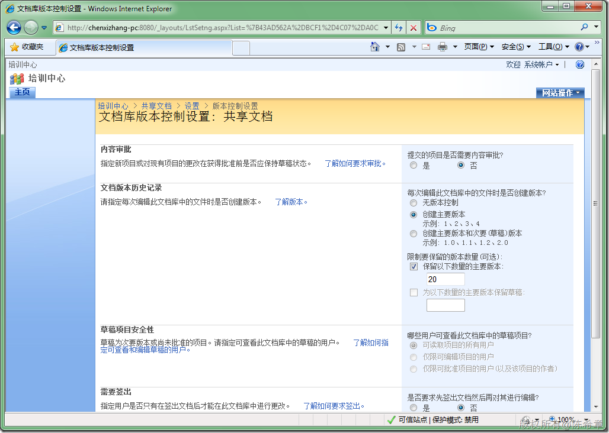
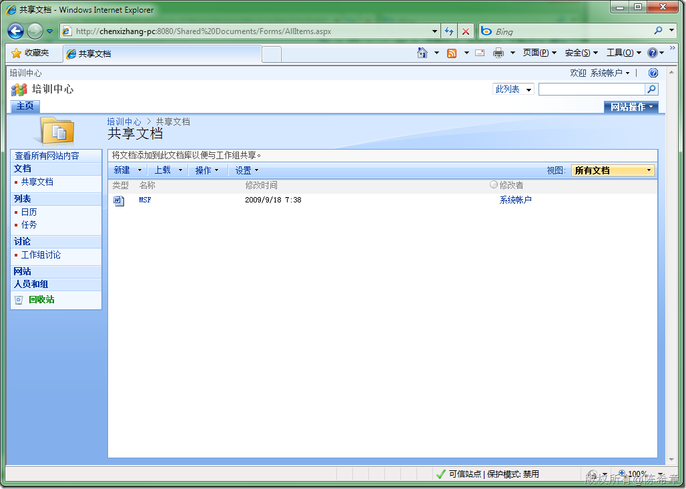
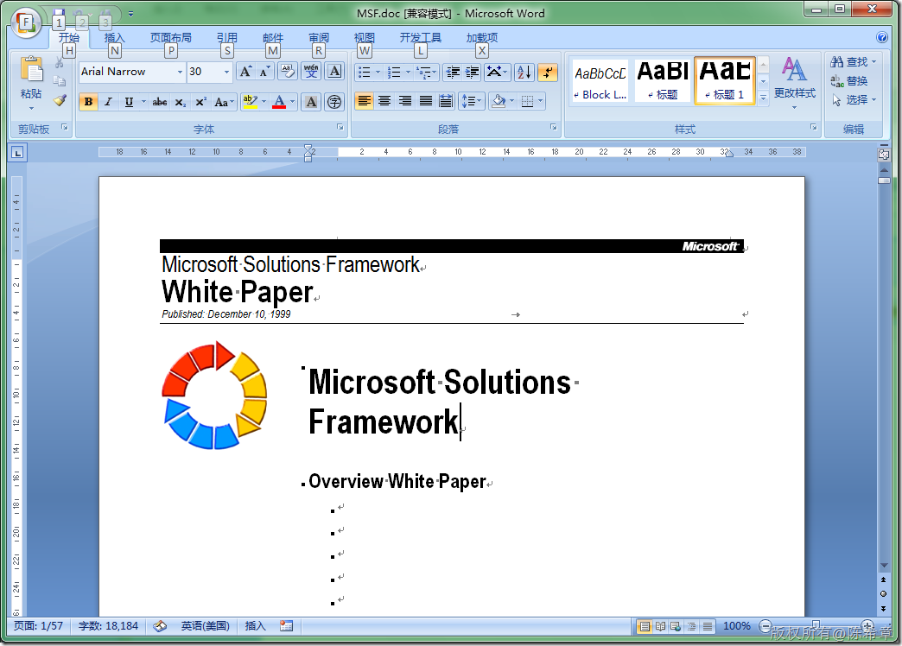
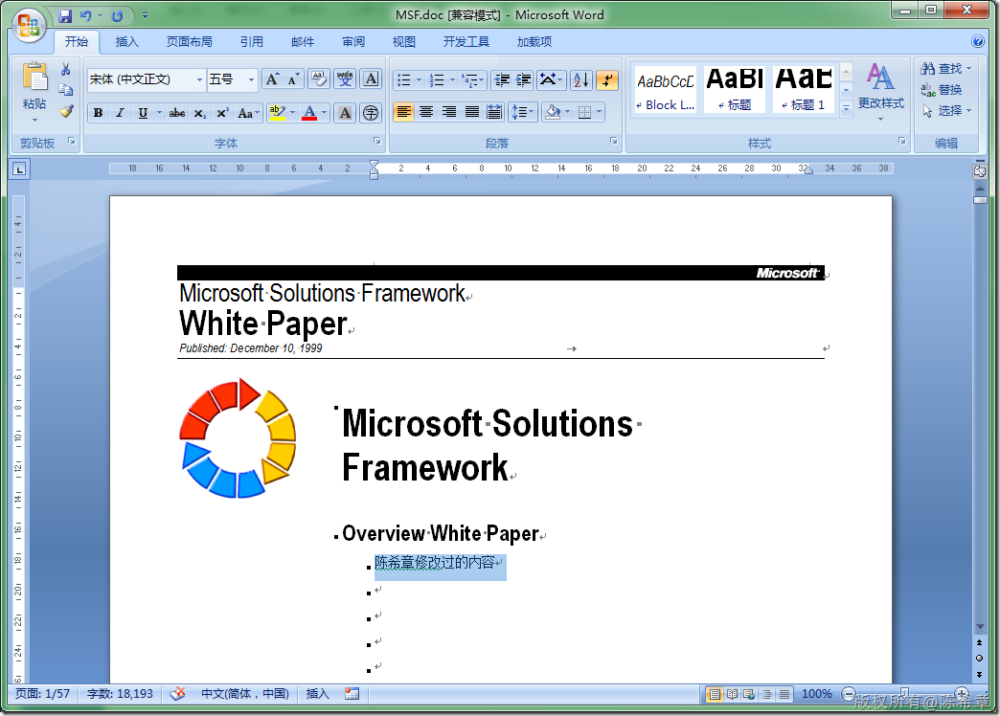
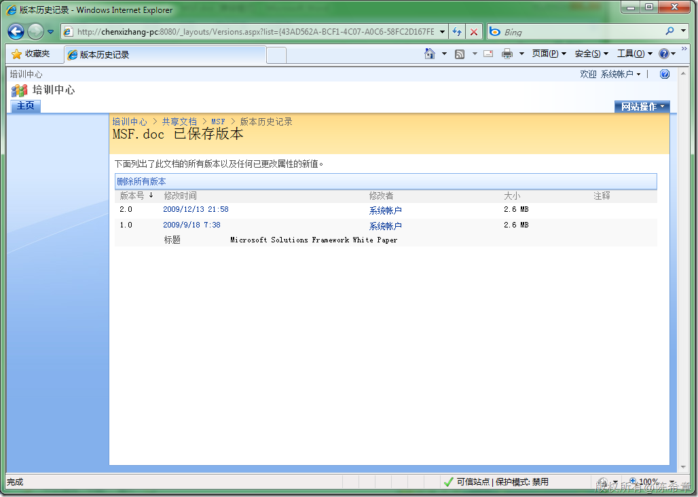
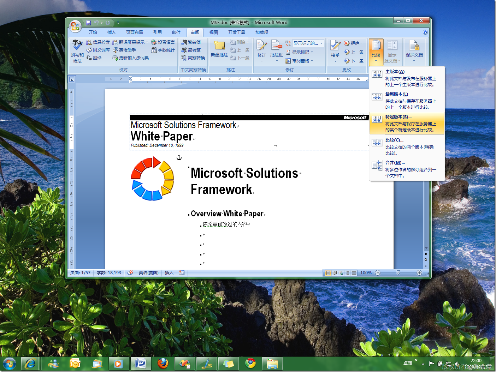
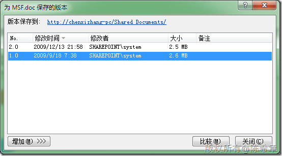
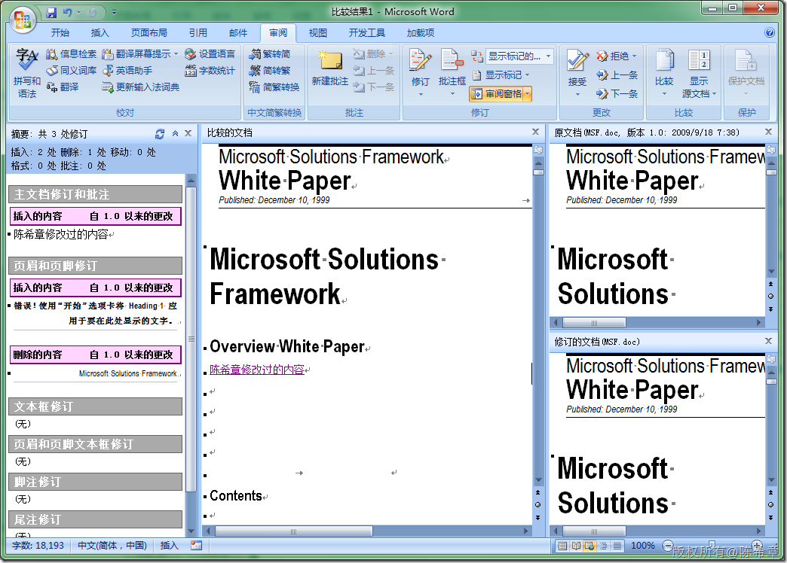

# SharePoint: 如何比较文档的不同版本 
> 原文发表于 2009-12-13, 地址: http://www.cnblogs.com/chenxizhang/archive/2009/12/13/1623224.html 

文档管理是SharePoint Server的基本功能。而版本控制又是文档管理中不可或缺的一个功能。但是，如果有了多个版本之后，没有一定的机制可以比较不同版本之间的差异，那么这部能不说是一个遗憾。很显然，WSS不会让这样的事情发生。

 下面的截图基于WSS 3.0.

  

 1.设置文档库的版本控制功能。一般的应用保留主版本即可，没有必要保留那么多版本。

  

 2. 打开某个文档，然后在Word中打开它，并进行编辑

  

  

    

 3. 到网站上看到版本历史

  

 4. 在Word中比较版本

  

   

 

