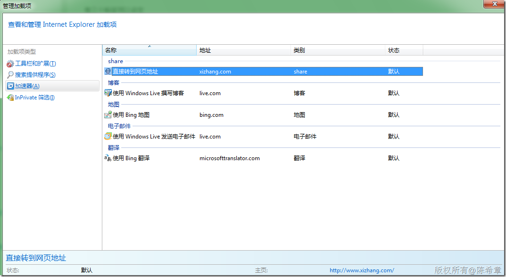

# IE 8 Accelerator加速器开发介绍{转载} 
> 原文发表于 2009-12-13, 地址: http://www.cnblogs.com/chenxizhang/archive/2009/12/13/1623238.html 


记录这篇博客的原因是因为我自己想要有一个快速的加速器，就是我经常在浏览网页的时候，看到有些网址，如果想要转过去的话，我必须手工复制到地址栏，然后回车一下。然后我就想，如果能直接通过一个快捷方式就太好了。

 实际上很早之前就知道IE8有一套新的所谓的“加速器”的功能，只是很奇怪为什么我这样的一个需求，居然没有现成的加速器。找时间可以自己做一个

 以下内容转载自： [http://www.okajax.com/a/200905/get\_Activities\_Accelerator.html](http://www.okajax.com/a/200905/get_Activities_Accelerator.html "http://www.okajax.com/a/200905/get_Activities_Accelerator.html")

  

 
>  随着Windows Internet Explorer 8 Beta 2 IE8中文版的发布， IE 8能让程式设计人员更容易增加的小工具进去的Accelerator加速器， 这篇将介绍如何简单制作一个IE 8 Accelerator加速器来搭配get的模式， 而讲get模式实在有点玄，这边就讲白一点的方式，就是搭配Querystring传递， 很多网站的功能都是透过传递关键的Querystring参数来显示查询的功能， 透过IE 8 Accelerator加速器来将所选取反白的文字做一各快速的查询是非常的简单制作。 整个IE 8 Accelerator加速器的关键灵魂就是一个xml档案
> ```
> 1. <?xml version="1.0" encoding="UTF-8"?> - <openServiceDescription - xmlns="http://www.microsoft.com/schemas/openservicedescription/1.0"> - <homepageUrl>http://zh.wikipedia.org/</homepageUrl> - <display> - <name>Wiki</name> - <icon>http://www.dotblogs.com.tw/favicon.ico</icon> - <description>Wiki</description> - </display> - <activity category="share"> - <activityAction context="selection"> - <preview action="http://zh.wikipedia.org/w/index.php"> - <parameter name="title" value="{selection}" />     - <parameter name="variant" value="zh-tw" />                                  - </preview> - <execute method="get" action="http://zh.wikipedia.org/w/index.php" > - <parameter name="title" value="{selection}" type="text" /> - <parameter name="variant" value="zh-tw" />    - </execute>      - </activityAction> - </activity> - </openServiceDescription>
> 
> ```
> 
> 而这篇将透过查询wiki的范例，来做整个xml的说明， 整个xml主要组成是由<homepageUrl> <display><activity>这三个区块， 而这三个区块也将是设定的重要来源。 
> 一.<homepageUrl > 
> 首先先介绍homepageUrl ，这边有一个非常重要要注意的， 就是<homepageUrl>的设定是跟<activity>是相关的，当如果你设定<homepageUrl>http:///www.dotblogs.com.tw</homepageUrl>那<activity>里面的action网址，一定要是<http://www.dotblogs.com.tw>这个网域的才可以， 如果是不同的网域，将会在IE8注册进去Accelerator出现提示错误的视窗，这个Accelerator将无法注册进去。 
> 二.<display> 
> 有三个标签可以设定   
> name :显示在IE8加速器的名称   
> icon:显示在IE8加速器的小图   
> description:描述功能 
> 三.<activity> 
> category属性:显示在IE8分类，有map blog define add translate share六种   
> context属性：预设为selection ，目前选到反白的资料 
> 而让IE8能够搭配指定的网站连结的关键就是activityAction， activityAction分两个部分previrew (执行加速器后先跑出预览小视窗) , excute (跳至指定网页来接QueryString） .设定action部分就直接程式码讲解，action属性为要去查询的网页，一般查询wiki页面上的网址列会显示 <http://zh.wikipedia.org/w/index.php?variant=zh-tw&title>=查询的内容 
> 这种透过QueryString方式的，就可以用get的方式，所以在action里的设定就是网址， 而后面的参数，请不要直接串在action的网址列，而是增加<parameter />方式， 在这个wiki的范例中， title就是反白选取的资料{selection} ， 而另一个传入变数variant则可再增加一个<parameter /> 
> ```
> 1. <execute method="get" action="http://zh.wikipedia.org/w/index.php" >   - <parameter name="title" value="{selection}" type="text" />   - <parameter name="variant" value="zh-tw" />   - </execute>
> 
> ```
> 
> 就这样非常简单的步骤，已经完成IE 8 Accelerator加速器的wiki设计， 而preview的部分设定与excute一样，只是要特别注意的是preview的部分必须考量到显示的视窗320 × 240， 超过这个指定的大小，预览的视窗就会不完整。 
> 而要怎么让大家来安装你的IE 8 Accelerator加速器，只需要发布你的xml到网路上并搭配一个简单的html页面， 加上以下的程式码，就能将你做的IE 8 Accelerator加速器分享给其他的朋友。 
> <button onclick="window.external.addService('http://demo.dotblogs.com.tw/dotjum/wiki.xml')"> Add Wiki</button> 
> 当然IE 8 Accelerator除了{selection}可以使用当作值的传递外，在白皮书中还提到有{documentUrl}{documentTitle}，
> 
> 
> 
> 
> 
> 
> 
> 
> 
> 
> 
> 
> 
> 
> 
> 
> 
> 
> 
> 
> 
> 
> 
> 
> 
> 
> 
> 
> 
> 


 


补充：我已经依葫芦画瓢，做了一个简单的加速器。因为是通过我自己的网站的某个页面转接地址的，所以这个小工具的具体安装地址就不公开了，以免造成服务器太大的压力，呵呵


[](http://images.cnblogs.com/cnblogs_com/chenxizhang/WindowsLiveWriter/IE8Accelerator_13CE3/image_2.png)

