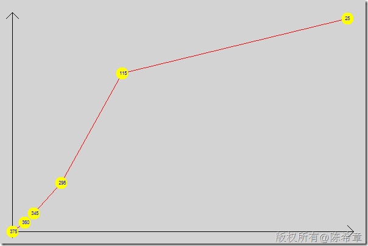

# .NET : 如何利用GDI+绘制折线图 
> 原文发表于 2009-12-16, 地址: http://www.cnblogs.com/chenxizhang/archive/2009/12/16/1625926.html 


```
这是今天课堂上讲的一个范例小程序。 其实很多图表控件大多也是这样画出来的。           
```

```
            //如何从零开始构造一个图片
            Bitmap b = new Bitmap(600, 400);
            Graphics bg = Graphics.FromImage(b);
            //背景颜色先清除掉
            bg.Clear(Color.LightGray);

            //先画横轴
            bg.DrawLine(
                new Pen(Color.Black),
                new Point(10, 380),
                new Point(580, 380));

            bg.DrawLine(
                new Pen(Color.Black),
                new Point(570, 370),
                new Point(580, 380));

            bg.DrawLine(
                new Pen(Color.Black),
                new Point(570, 390),
                new Point(580, 380));


            //再画纵轴
            bg.DrawLine(
                new Pen(Color.Black),
                new Point(20, 390),
                new Point(20, 20));

            bg.DrawLine(
                new Pen(Color.Black),
                new Point(10, 30),
                new Point(20, 20));
            bg.DrawLine(
                new Pen(Color.Black),
                new Point(30, 30),
                new Point(20, 20));


            //画我们那条趋势线
            List<Point> points = new List<Point>()
            {
                new Point(20,380),
                new Point(40,365),
                new Point(55,350),
                new Point(100,300),
                new Point(200,120),
                new Point(570,30)};

            bg.DrawLines(
                new Pen(Color.Red),
                points.ToArray());


            foreach (var item in points)
            {
                item.Offset(-10, -10);

                bg.FillEllipse(
                    new SolidBrush(Color.Yellow),
                    new Rectangle(item,new Size(20,20)));


                item.Offset(5, 5);
                bg.DrawString(
                    item.Y.ToString(),
                    new Font("Arial", 6),
                    new SolidBrush(Color.Blue),
                    item);

            }

            bg.Dispose();

            b.Save("demo.bmp");
```

.csharpcode, .csharpcode pre
{
 font-size: small;
 color: black;
 font-family: consolas, "Courier New", courier, monospace;
 background-color: #ffffff;
 /*white-space: pre;*/
}
.csharpcode pre { margin: 0em; }
.csharpcode .rem { color: #008000; }
.csharpcode .kwrd { color: #0000ff; }
.csharpcode .str { color: #006080; }
.csharpcode .op { color: #0000c0; }
.csharpcode .preproc { color: #cc6633; }
.csharpcode .asp { background-color: #ffff00; }
.csharpcode .html { color: #800000; }
.csharpcode .attr { color: #ff0000; }
.csharpcode .alt 
{
 background-color: #f4f4f4;
 width: 100%;
 margin: 0em;
}
.csharpcode .lnum { color: #606060; }


.csharpcode, .csharpcode pre
{
 font-size: small;
 color: black;
 font-family: consolas, "Courier New", courier, monospace;
 background-color: #ffffff;
 /*white-space: pre;*/
}
.csharpcode pre { margin: 0em; }
.csharpcode .rem { color: #008000; }
.csharpcode .kwrd { color: #0000ff; }
.csharpcode .str { color: #006080; }
.csharpcode .op { color: #0000c0; }
.csharpcode .preproc { color: #cc6633; }
.csharpcode .asp { background-color: #ffff00; }
.csharpcode .html { color: #800000; }
.csharpcode .attr { color: #ff0000; }
.csharpcode .alt 
{
 background-color: #f4f4f4;
 width: 100%;
 margin: 0em;
}
.csharpcode .lnum { color: #606060; }


 


 

[](http://images.cnblogs.com/cnblogs_com/chenxizhang/WindowsLiveWriter/cdace66f8236.NETGDI_11CCF/demo.png)