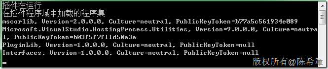
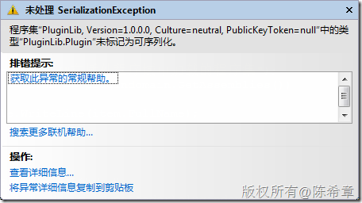
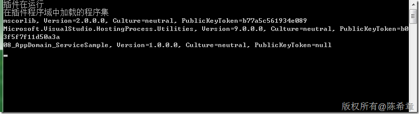

# .NET: 如何通过AppDomain动态加载插件程序 
> 原文发表于 2009-12-16, 地址: http://www.cnblogs.com/chenxizhang/archive/2009/12/16/1625953.html 


这是今天课堂上的一个小例子程序

 1. 接口


```
using System;
using System.Collections.Generic;
using System.Linq;
using System.Text;

namespace Interfaces
{
    public interface IPlugin
    {
        void Run();
    }
}

```

.csharpcode, .csharpcode pre
{
 font-size: small;
 color: black;
 font-family: consolas, "Courier New", courier, monospace;
 background-color: #ffffff;
 /*white-space: pre;*/
}
.csharpcode pre { margin: 0em; }
.csharpcode .rem { color: #008000; }
.csharpcode .kwrd { color: #0000ff; }
.csharpcode .str { color: #006080; }
.csharpcode .op { color: #0000c0; }
.csharpcode .preproc { color: #cc6633; }
.csharpcode .asp { background-color: #ffff00; }
.csharpcode .html { color: #800000; }
.csharpcode .attr { color: #ff0000; }
.csharpcode .alt 
{
 background-color: #f4f4f4;
 width: 100%;
 margin: 0em;
}
.csharpcode .lnum { color: #606060; }

2. 插件


```
using System;
using System.Collections.Generic;
using System.Linq;
using System.Text;

namespace PluginLib
{
    [Serializable]
    public class Plugin:Interfaces.IPlugin
    {
        public void Run() {
            Console.WriteLine("插件在运行");
        }


    }
}

```

.csharpcode, .csharpcode pre
{
 font-size: small;
 color: black;
 font-family: consolas, "Courier New", courier, monospace;
 background-color: #ffffff;
 /*white-space: pre;*/
}
.csharpcode pre { margin: 0em; }
.csharpcode .rem { color: #008000; }
.csharpcode .kwrd { color: #0000ff; }
.csharpcode .str { color: #006080; }
.csharpcode .op { color: #0000c0; }
.csharpcode .preproc { color: #cc6633; }
.csharpcode .asp { background-color: #ffff00; }
.csharpcode .html { color: #800000; }
.csharpcode .attr { color: #ff0000; }
.csharpcode .alt 
{
 background-color: #f4f4f4;
 width: 100%;
 margin: 0em;
}
.csharpcode .lnum { color: #606060; }

3. 主程序


```
            AppDomain plugindomain = AppDomain.CreateDomain("PluginDomain");

```

.csharpcode, .csharpcode pre
{
 font-size: small;
 color: black;
 font-family: consolas, "Courier New", courier, monospace;
 background-color: #ffffff;
 /*white-space: pre;*/
}
.csharpcode pre { margin: 0em; }
.csharpcode .rem { color: #008000; }
.csharpcode .kwrd { color: #0000ff; }
.csharpcode .str { color: #006080; }
.csharpcode .op { color: #0000c0; }
.csharpcode .preproc { color: #cc6633; }
.csharpcode .asp { background-color: #ffff00; }
.csharpcode .html { color: #800000; }
.csharpcode .attr { color: #ff0000; }
.csharpcode .alt 
{
 background-color: #f4f4f4;
 width: 100%;
 margin: 0em;
}
.csharpcode .lnum { color: #606060; }


```

            #region 使用接口的方式来动态执行方法
            Interfaces.IPlugin plugin = (Interfaces.IPlugin)plugindomain.CreateInstanceFromAndUnwrap("PluginLib.dll", "PluginLib.Plugin");

            plugin.Run();


            Console.WriteLine("在插件程序域中加载的程序集");
            foreach (var item in plugindomain.GetAssemblies())
            {
                Console.WriteLine(item.FullName);
            }
            #endregion
```


.csharpcode, .csharpcode pre
{
 font-size: small;
 color: black;
 font-family: consolas, "Courier New", courier, monospace;
 background-color: #ffffff;
 /*white-space: pre;*/
}
.csharpcode pre { margin: 0em; }
.csharpcode .rem { color: #008000; }
.csharpcode .kwrd { color: #0000ff; }
.csharpcode .str { color: #006080; }
.csharpcode .op { color: #0000c0; }
.csharpcode .preproc { color: #cc6633; }
.csharpcode .asp { background-color: #ffff00; }
.csharpcode .html { color: #800000; }
.csharpcode .attr { color: #ff0000; }
.csharpcode .alt 
{
 background-color: #f4f4f4;
 width: 100%;
 margin: 0em;
}
.csharpcode .lnum { color: #606060; }

结果如下


[](http://images.cnblogs.com/cnblogs_com/chenxizhang/WindowsLiveWriter/cf6ed28b3afc.NETAppDomain_12832/image_4.png) 


注意：这种方式加载的插件，里面的类型必须声明可序列化（[Serializable] ），否则就会出现下面的错误


[](http://images.cnblogs.com/cnblogs_com/chenxizhang/WindowsLiveWriter/cf6ed28b3afc.NETAppDomain_12832/image_2.png) 


 


 


但是，如果插件真的没有声明可序列化，是不是就没有办法呢？也不是这么说


4. 在主程序中添加一个TypeLoader


```
using System;
using System.Collections.Generic;
using System.Linq;
using System.Text;

using System.Reflection;
using System.IO;

namespace \_08\_AppDomain\_ServiceSample
{
    [Serializable]
    public class TypeLoader
    {
        public Assembly LoadAssembly(string path) {
            return Assembly.LoadFile(Path.Combine(Environment.CurrentDirectory, path));
        }
    }
}

```

.csharpcode, .csharpcode pre
{
 font-size: small;
 color: black;
 font-family: consolas, "Courier New", courier, monospace;
 background-color: #ffffff;
 /*white-space: pre;*/
}
.csharpcode pre { margin: 0em; }
.csharpcode .rem { color: #008000; }
.csharpcode .kwrd { color: #0000ff; }
.csharpcode .str { color: #006080; }
.csharpcode .op { color: #0000c0; }
.csharpcode .preproc { color: #cc6633; }
.csharpcode .asp { background-color: #ffff00; }
.csharpcode .html { color: #800000; }
.csharpcode .attr { color: #ff0000; }
.csharpcode .alt 
{
 background-color: #f4f4f4;
 width: 100%;
 margin: 0em;
}
.csharpcode .lnum { color: #606060; }

 


5. 修改代码，利用TypeLoader作为中间人，去动态加载那些插件程序集


```

            #region 使用加载代理的方式
            TypeLoader loader = (TypeLoader)plugindomain.CreateInstanceFromAndUnwrap("08\_AppDomain\_ServiceSample.exe", typeof(TypeLoader).FullName);
            Interfaces.IPlugin plugin = (Interfaces.IPlugin)loader.LoadAssembly("PluginLib.dll").CreateInstance("PluginLib.Plugin");
            plugin.Run();
            Console.WriteLine("在插件程序域中加载的程序集");
            foreach (var item in plugindomain.GetAssemblies())
            {
                Console.WriteLine(item.FullName);
            }

            AppDomain.Unload(plugindomain);

            #endregion
```

.csharpcode, .csharpcode pre
{
 font-size: small;
 color: black;
 font-family: consolas, "Courier New", courier, monospace;
 background-color: #ffffff;
 /*white-space: pre;*/
}
.csharpcode pre { margin: 0em; }
.csharpcode .rem { color: #008000; }
.csharpcode .kwrd { color: #0000ff; }
.csharpcode .str { color: #006080; }
.csharpcode .op { color: #0000c0; }
.csharpcode .preproc { color: #cc6633; }
.csharpcode .asp { background-color: #ffff00; }
.csharpcode .html { color: #800000; }
.csharpcode .attr { color: #ff0000; }
.csharpcode .alt 
{
 background-color: #f4f4f4;
 width: 100%;
 margin: 0em;
}
.csharpcode .lnum { color: #606060; }


[](http://images.cnblogs.com/cnblogs_com/chenxizhang/WindowsLiveWriter/cf6ed28b3afc.NETAppDomain_12832/image_6.png)

