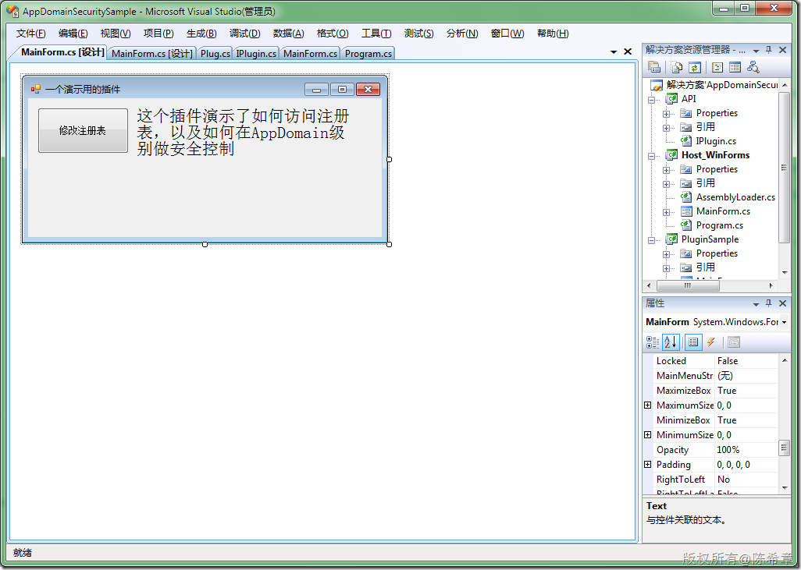
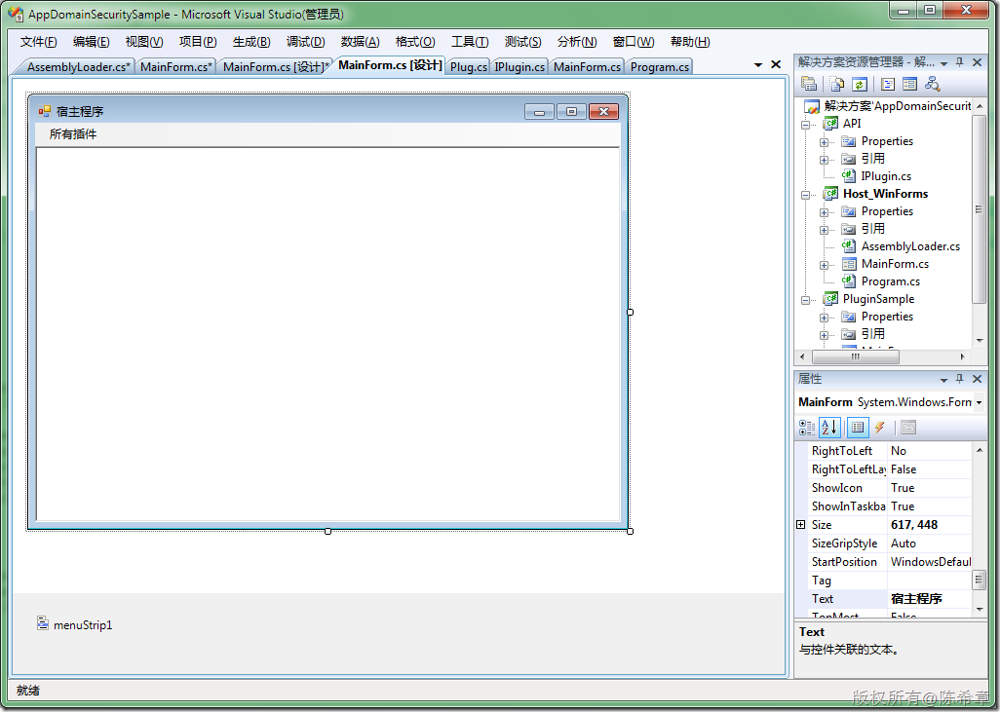
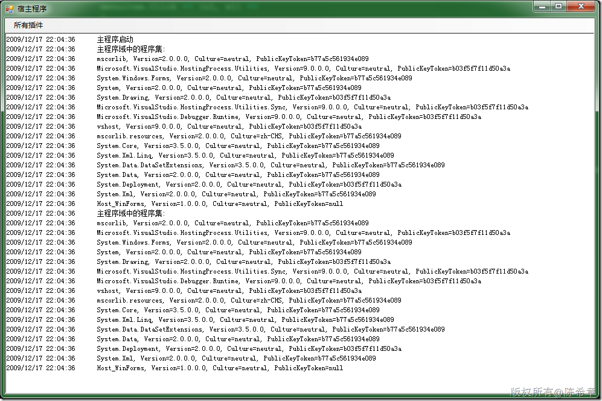
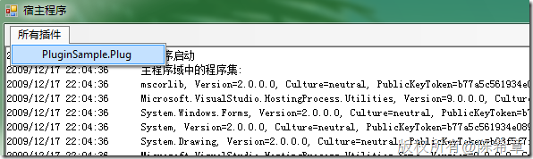
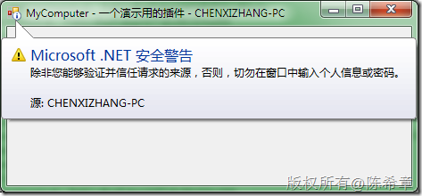
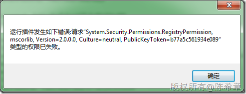

# .NET: 通过AppDomain级别控制安全策略的例子 
> 原文发表于 2009-12-17, 地址: http://www.cnblogs.com/chenxizhang/archive/2009/12/17/1626717.html 


这是在课堂上讲的一个小范例。场景是：

 1. 我们有一个主程序，它公开了一套API，允许其他开发人员为它设计插件

 2. 因为插件不是我们设计的，所以我们需要确保这些插件不会恶意地伤害到用意。为此，我们希望将插件的运行权限降低。

  

 解决方案就是，我们单独用一个AppDomain来运行这些插件，并且在该AppDomain级别单独设置安全策略。

  

 1. API


```
using System;
using System.Collections.Generic;
using System.Linq;
using System.Text;

namespace API
{
    public interface IPlugin
    {
        void Run();
    }
}

```


.csharpcode, .csharpcode pre
{
 font-size: small;
 color: black;
 font-family: consolas, "Courier New", courier, monospace;
 background-color: #ffffff;
 /*white-space: pre;*/
}
.csharpcode pre { margin: 0em; }
.csharpcode .rem { color: #008000; }
.csharpcode .kwrd { color: #0000ff; }
.csharpcode .str { color: #006080; }
.csharpcode .op { color: #0000c0; }
.csharpcode .preproc { color: #cc6633; }
.csharpcode .asp { background-color: #ffff00; }
.csharpcode .html { color: #800000; }
.csharpcode .attr { color: #ff0000; }
.csharpcode .alt 
{
 background-color: #f4f4f4;
 width: 100%;
 margin: 0em;
}
.csharpcode .lnum { color: #606060; }


2. Plugin


```
using System;
using System.Collections.Generic;
using System.Linq;
using System.Text;

namespace PluginSample
{
    public class Plug:API.IPlugin
    {
        #region IPlugin 成员

        void API.IPlugin.Run()
        {
            MainForm form = new MainForm();
            form.ShowDialog();
        }

        #endregion
    }
}

```

Plugin中有一个窗体，里面有一个按钮，执行访问注册表的操作


[](http://images.cnblogs.com/cnblogs_com/chenxizhang/WindowsLiveWriter/2906a869af46.NETAppDomain_13718/image_2.png) 


```
using System;
using System.Windows.Forms;

using Microsoft.Win32;

namespace PluginSample
{
    public partial class MainForm : Form
    {
        public MainForm()
        {
            InitializeComponent();
        }

        private void button1\_Click(object sender, EventArgs e)
        {
            RegistryKey key = Registry.CurrentUser.CreateSubKey("Plugins");
            key.SetValue("Version", "1.0.0");
            key.SetValue("Update", DateTime.Now.ToString());

            MessageBox.Show("操作已经完成");
        }
    }
}

```


.csharpcode, .csharpcode pre
{
 font-size: small;
 color: black;
 font-family: consolas, "Courier New", courier, monospace;
 background-color: #ffffff;
 /*white-space: pre;*/
}
.csharpcode pre { margin: 0em; }
.csharpcode .rem { color: #008000; }
.csharpcode .kwrd { color: #0000ff; }
.csharpcode .str { color: #006080; }
.csharpcode .op { color: #0000c0; }
.csharpcode .preproc { color: #cc6633; }
.csharpcode .asp { background-color: #ffff00; }
.csharpcode .html { color: #800000; }
.csharpcode .attr { color: #ff0000; }
.csharpcode .alt 
{
 background-color: #f4f4f4;
 width: 100%;
 margin: 0em;
}
.csharpcode .lnum { color: #606060; }


3. 宿主程序


为了实现跨应用程序域的加载，我们设计了一个AssemblyLoader类型


```
using System;
using System.Linq;

using System.Reflection;

namespace Host\_WinForms
{
    [Serializable]
    class AssemblyLoader:MarshalByRefObject
        //必须继承MarshalByRefObject，否则无法实现AppDomain级别的安全控制
    {
        public string[] GetPluginTypeNames(string path) {
            Assembly ass = Assembly.LoadFile(path);
            var query = from type in ass.GetTypes()
                        where type.GetInterface(typeof(API.IPlugin).FullName) != null
                        select type.FullName;

            return query.ToArray();
        }

        public void RunPlugin(string path, string typeName) {
            Assembly ass = Assembly.LoadFile(path);
            API.IPlugin plugin = (API.IPlugin)ass.CreateInstance(typeName);
            plugin.Run();
        }
    }
}

```

.csharpcode, .csharpcode pre
{
 font-size: small;
 color: black;
 font-family: consolas, "Courier New", courier, monospace;
 background-color: #ffffff;
 /*white-space: pre;*/
}
.csharpcode pre { margin: 0em; }
.csharpcode .rem { color: #008000; }
.csharpcode .kwrd { color: #0000ff; }
.csharpcode .str { color: #006080; }
.csharpcode .op { color: #0000c0; }
.csharpcode .preproc { color: #cc6633; }
.csharpcode .asp { background-color: #ffff00; }
.csharpcode .html { color: #800000; }
.csharpcode .attr { color: #ff0000; }
.csharpcode .alt 
{
 background-color: #f4f4f4;
 width: 100%;
 margin: 0em;
}
.csharpcode .lnum { color: #606060; }

 


宿主程序有一个MainForm


[](http://images.cnblogs.com/cnblogs_com/chenxizhang/WindowsLiveWriter/2906a869af46.NETAppDomain_13718/image_4.png) 


```
using System;
using System.Windows.Forms;

using System.IO;
using System.Security.Permissions;
using System.Security.Policy;
using System.Security;

namespace Host\_WinForms
{
    public partial class MainForm : Form
    {
        public MainForm()
        {
            InitializeComponent();
        }


        private void Log(string message)
        {
            richTextBox1.AppendText(DateTime.Now.ToString().PadRight(25));
            richTextBox1.AppendText(message);
            richTextBox1.AppendText(Environment.NewLine);
        }

        private void MainForm\_Load(object sender, EventArgs e)
        {
            Log("主程序启动");

            Log("主程序域中的程序集:");
            foreach (var item in AppDomain.CurrentDomain.GetAssemblies())
            {
                Log(item.FullName);
            }


            //加载所有的插件（遍历当前目录下面的dll),动态创建菜单项目
            AppDomain plugindomain = AppDomain.CreateDomain("PluginDomain");
            AssemblyLoader loader = (AssemblyLoader)plugindomain.CreateInstanceFromAndUnwrap("Host\_WinForms.exe", typeof(AssemblyLoader).FullName);

            foreach (var item in Directory.GetFiles(Environment.CurrentDirectory, "*.dll"))
            {
                foreach (var type in loader.GetPluginTypeNames(item))
                {
                    ToolStripMenuItem menuitem = new ToolStripMenuItem(type);
                    menuitem.Tag = item;
                    menuitem.Click += (o1, e1) =>
                    {
                        //当点击了之后执行有关的插件
                        AppDomain plugindomaintemp = AppDomain.CreateDomain("PluginDomain");

 **PolicyLevel level = PolicyLevel.CreateAppDomainLevel();
 PermissionSet ps = level.GetNamedPermissionSet("Internet");
 ps.AddPermission(new FileIOPermission(
 FileIOPermissionAccess.AllAccess, Environment.CurrentDirectory));
 level.RootCodeGroup.PolicyStatement = new PolicyStatement(ps);
 plugindomaintemp.SetAppDomainPolicy(level);**

                        try
                        {

                            AssemblyLoader loadertemp = (AssemblyLoader)plugindomaintemp.CreateInstanceFromAndUnwrap(
                                "Host\_WinForms.exe", typeof(AssemblyLoader).FullName);

                            ToolStripMenuItem temp = (ToolStripMenuItem)o1;
                            loadertemp.RunPlugin(temp.Tag.ToString(), temp.Text);
                        }
                        catch (Exception ex) {
                            MessageBox.Show(string.Format("运行插件发生如下错误:{0}", ex.Message));
                        }
                        finally
                        {
                            AppDomain.Unload(plugindomaintemp);
                        }
                    };

                    AllPluginMenu.DropDownItems.Add(menuitem);
                }
            }


            AppDomain.Unload(plugindomain);

            Log("主程序域中的程序集:");
            foreach (var item in AppDomain.CurrentDomain.GetAssemblies())
            {
                Log(item.FullName);
            }

        }


    }
}

```

.csharpcode, .csharpcode pre
{
 font-size: small;
 color: black;
 font-family: consolas, "Courier New", courier, monospace;
 background-color: #ffffff;
 /*white-space: pre;*/
}
.csharpcode pre { margin: 0em; }
.csharpcode .rem { color: #008000; }
.csharpcode .kwrd { color: #0000ff; }
.csharpcode .str { color: #006080; }
.csharpcode .op { color: #0000c0; }
.csharpcode .preproc { color: #cc6633; }
.csharpcode .asp { background-color: #ffff00; }
.csharpcode .html { color: #800000; }
.csharpcode .attr { color: #ff0000; }
.csharpcode .alt 
{
 background-color: #f4f4f4;
 width: 100%;
 margin: 0em;
}
.csharpcode .lnum { color: #606060; }

 


4. 运行效果


[](http://images.cnblogs.com/cnblogs_com/chenxizhang/WindowsLiveWriter/2906a869af46.NETAppDomain_13718/image_6.png) 


[](http://images.cnblogs.com/cnblogs_com/chenxizhang/WindowsLiveWriter/2906a869af46.NETAppDomain_13718/image_8.png) 


[](http://images.cnblogs.com/cnblogs_com/chenxizhang/WindowsLiveWriter/2906a869af46.NETAppDomain_13718/image_10.png) [](http://images.cnblogs.com/cnblogs_com/chenxizhang/WindowsLiveWriter/2906a869af46.NETAppDomain_13718/image_12.png)

