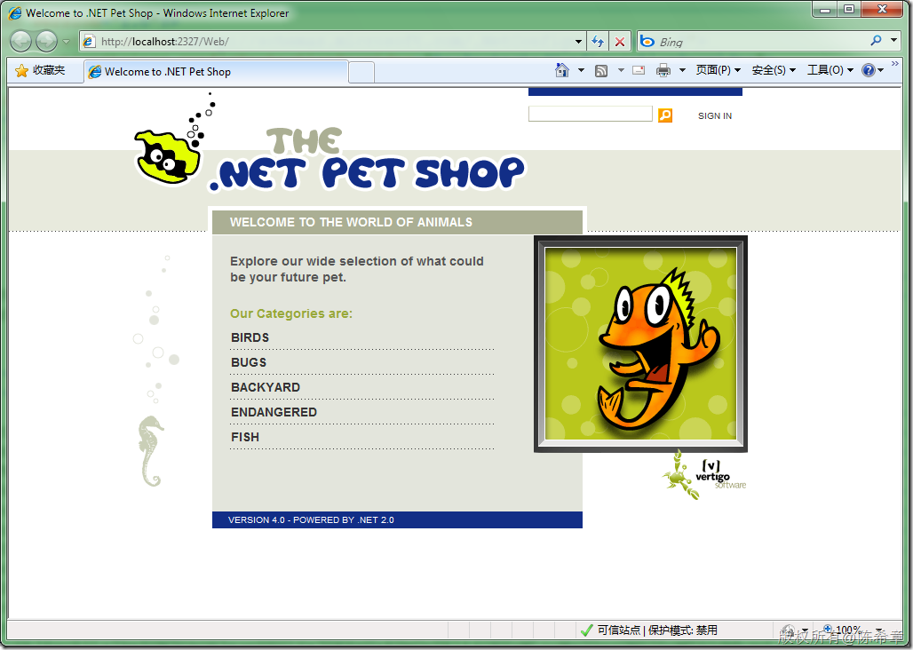
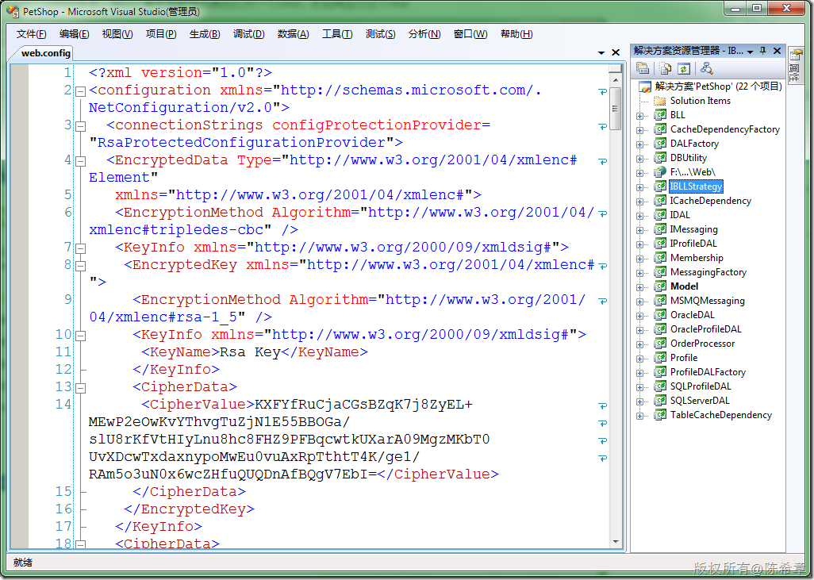

# ASP.NET: 在Win 7中安装PetShop范例时要注意的问题 
> 原文发表于 2009-12-19, 地址: http://www.cnblogs.com/chenxizhang/archive/2009/12/19/1627894.html 

**因为安装程序除了安装源代码，还会安装4个数据库，所以要求提升为管理员运行。**

 又因为msi文件的右键菜单中没有“以管理员运行”这样的菜单，所以，要先用管理员身份打开一个cmd，然后再运行这个msi

  

  

 注意，这个web.config默认是加过密的，可以通过aspnet\_regiis 进行解密。

