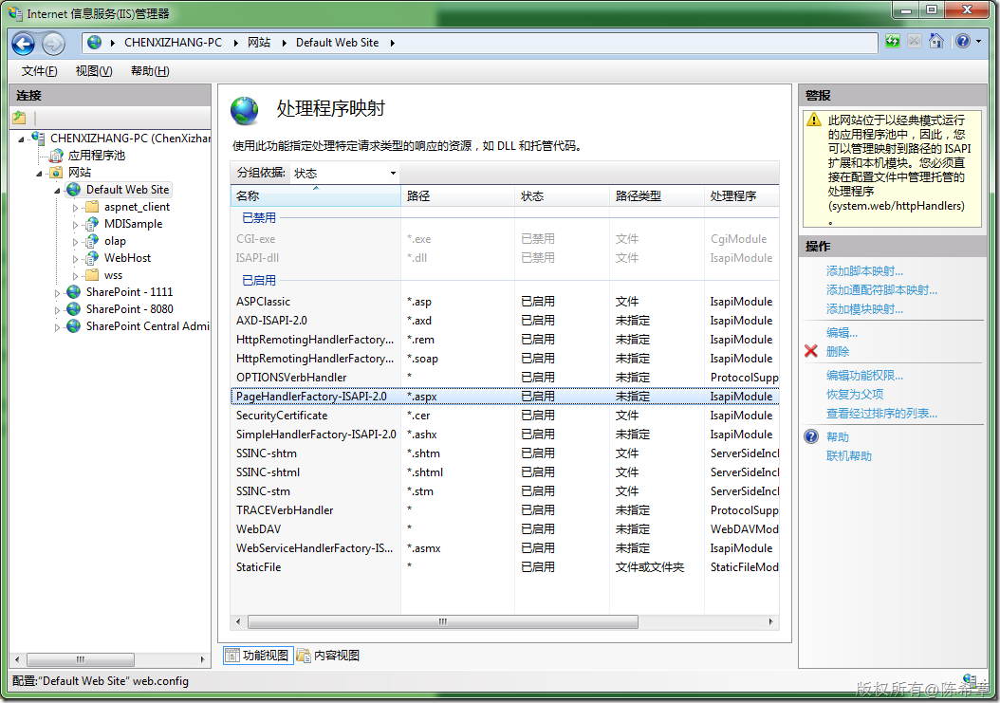
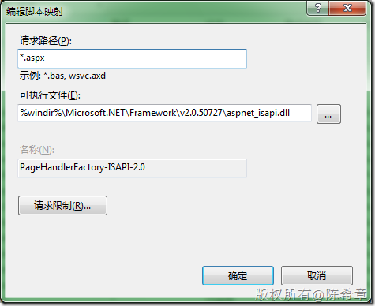

# ASP.NET ： Win7 及 IIS 7中对于处理程序映射 
> 原文发表于 2009-12-19, 地址: http://www.cnblogs.com/chenxizhang/archive/2009/12/19/1627912.html 

IIS7 的管理界面与IIS 6差别很大，找这个东西费了老半天的功夫， 

  

  

  

 如果要添加我们自己的映射，则在右侧点击有关的链接

