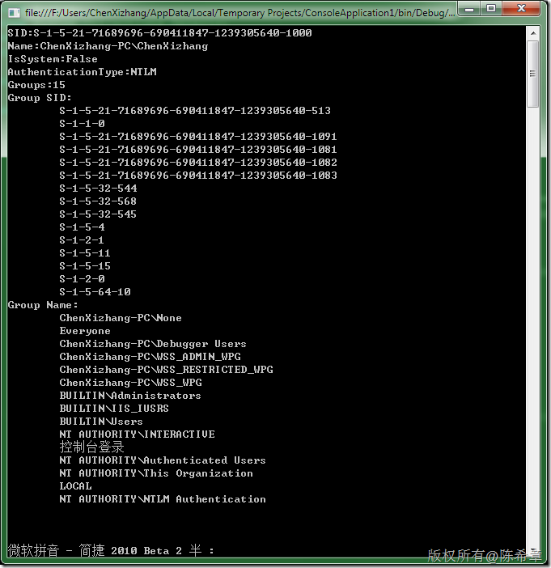

# .NET : 取得Windows账号的有关信息 
> 原文发表于 2009-12-19, 地址: http://www.cnblogs.com/chenxizhang/archive/2009/12/19/1627927.html 


下面这个小程序演示了如何取得当前用户身份的相关信息


```
using System;

using System.Security.Principal;

namespace ConsoleApplication1
{
    class Program
    {

        /// <summary>
        /// 这个程序演示了如何获得当前Windows账号的相关信息
        /// 作者：陈希章
        /// </summary>
        /// <param name="args"></param>
        static void Main(string[] args)
        {
            AppDomain.CurrentDomain.SetPrincipalPolicy(PrincipalPolicy.WindowsPrincipal);
            WindowsIdentity identity = System.Threading.Thread.CurrentPrincipal.Identity as WindowsIdentity;
            Console.WriteLine("SID:{0}",identity.User.ToString());
            Console.WriteLine("Name:{0}",identity.Name);
            Console.WriteLine("IsSystem:{0}",identity.IsSystem);
            Console.WriteLine("AuthenticationType:{0}",identity.AuthenticationType);
            Console.WriteLine("Groups:{0}", identity.Groups.Count);

            Console.WriteLine("Group SID:");
            foreach (var item in identity.Groups)
            {
                Console.WriteLine("\t{0}",item.Value);
            }

            Console.WriteLine("Group Name:");
            foreach (var item in identity.Groups.Translate(typeof(NTAccount)))
            {
                Console.WriteLine("\t{0}",item.Value);
            }
            Console.Read();

        }
    }
}

```

.csharpcode, .csharpcode pre
{
 font-size: small;
 color: black;
 font-family: consolas, "Courier New", courier, monospace;
 background-color: #ffffff;
 /*white-space: pre;*/
}
.csharpcode pre { margin: 0em; }
.csharpcode .rem { color: #008000; }
.csharpcode .kwrd { color: #0000ff; }
.csharpcode .str { color: #006080; }
.csharpcode .op { color: #0000c0; }
.csharpcode .preproc { color: #cc6633; }
.csharpcode .asp { background-color: #ffff00; }
.csharpcode .html { color: #800000; }
.csharpcode .attr { color: #ff0000; }
.csharpcode .alt 
{
 background-color: #f4f4f4;
 width: 100%;
 margin: 0em;
}
.csharpcode .lnum { color: #606060; }

 


[](http://images.cnblogs.com/cnblogs_com/chenxizhang/WindowsLiveWriter/6fca501c7b5c.NETWindows_12959/image_2.png)

