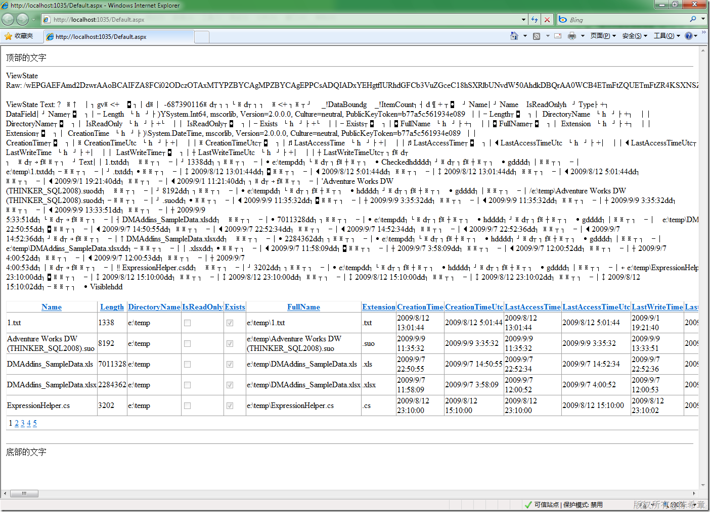

# ASP.NET : ViewState解析 
> 原文发表于 2009-12-19, 地址: http://www.cnblogs.com/chenxizhang/archive/2009/12/19/1627982.html 


ASP.NET 的ViewState是使用Base64的字符串保存在一个隐藏域中的。下面通过一个例子来解析它们

  

 1. 页面


```
<%@ Page Language="C#" AutoEventWireup="true" CodeBehind="Default.aspx.cs" Inherits="WebApp.\_Default" %>

<!DOCTYPE html PUBLIC "-//W3C//DTD XHTML 1.0 Transitional//EN" "http://www.w3.org/TR/xhtml1/DTD/xhtml1-transitional.dtd">

<html xmlns="http://www.w3.org/1999/xhtml" >
<head runat="server">
    <title></title>
</head>
<body>
    <form id="form1" runat="server">
    <div>
    <asp:GridView ID="gv" runat="server" AllowPaging="true" AllowSorting="true" PageSize="5" onpageindexchanging="gv\_PageIndexChanging"></asp:GridView>
    </div>
    </form>
</body>
</html>

```

.csharpcode, .csharpcode pre
{
 font-size: small;
 color: black;
 font-family: consolas, "Courier New", courier, monospace;
 background-color: #ffffff;
 /*white-space: pre;*/
}
.csharpcode pre { margin: 0em; }
.csharpcode .rem { color: #008000; }
.csharpcode .kwrd { color: #0000ff; }
.csharpcode .str { color: #006080; }
.csharpcode .op { color: #0000c0; }
.csharpcode .preproc { color: #cc6633; }
.csharpcode .asp { background-color: #ffff00; }
.csharpcode .html { color: #800000; }
.csharpcode .attr { color: #ff0000; }
.csharpcode .alt 
{
 background-color: #f4f4f4;
 width: 100%;
 margin: 0em;
}
.csharpcode .lnum { color: #606060; }

2. 页面代码


```
using System;
using System.Web.UI;
using System.Web.UI.WebControls;

using System.IO;
using System.Text;

namespace WebApp
{
    public partial class \_Default : System.Web.UI.Page
    {
        protected void Page\_Load(object sender, EventArgs e)
        {
            if (!IsPostBack)
            {
                DataBind();
            }
        }

        public override void DataBind()
        {
            //1. 最传统的做法，直接在页面中处理业务逻辑
            DirectoryInfo dir = new DirectoryInfo("e:\\temp");
            gv.DataSource = dir.GetFiles();
            gv.DataBind();

            //2. 通过分层来实现业务逻辑的隔离
            //localhost.Service1SoapClient proxy = new WebApp.localhost.Service1SoapClient();

            //gv.DataSource = proxy.GetFiles();
            //gv.DataBind();
        }

        protected void gv\_PageIndexChanging(object sender, GridViewPageEventArgs e)
        {
            gv.PageIndex = e.NewPageIndex;
            DataBind();
        }


        protected override void SavePageStateToPersistenceMedium(object viewState)
        {
            // 调用基类的方法，完成基本操作
            base.SavePageStateToPersistenceMedium(viewState);
            // 获取ViewState的Base64值
            LosFormatter format = new LosFormatter();
            StringWriter writer = new StringWriter();
            format.Serialize(writer, viewState);
            string vsRaw = writer.ToString();
            Response.Write("ViewState Raw: " + Server.HtmlEncode(vsRaw));
            Response.Write("<br /><br />");
            // 解析内容
            byte[] buffer = Convert.FromBase64String(vsRaw);
            string vsText = Encoding.ASCII.GetString(buffer);
            Response.Write("ViewState Text: " + Server.HtmlEncode(vsText));
        }
       
    }
}

```

.csharpcode, .csharpcode pre
{
 font-size: small;
 color: black;
 font-family: consolas, "Courier New", courier, monospace;
 background-color: #ffffff;
 /*white-space: pre;*/
}
.csharpcode pre { margin: 0em; }
.csharpcode .rem { color: #008000; }
.csharpcode .kwrd { color: #0000ff; }
.csharpcode .str { color: #006080; }
.csharpcode .op { color: #0000c0; }
.csharpcode .preproc { color: #cc6633; }
.csharpcode .asp { background-color: #ffff00; }
.csharpcode .html { color: #800000; }
.csharpcode .attr { color: #ff0000; }
.csharpcode .alt 
{
 background-color: #f4f4f4;
 width: 100%;
 margin: 0em;
}
.csharpcode .lnum { color: #606060; }

 


3. 测试效果


[](http://images.cnblogs.com/cnblogs_com/chenxizhang/WindowsLiveWriter/ASP.NETViewState_1427E/image_2.png)

