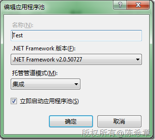
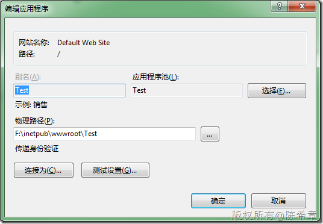
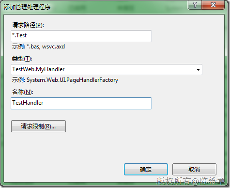
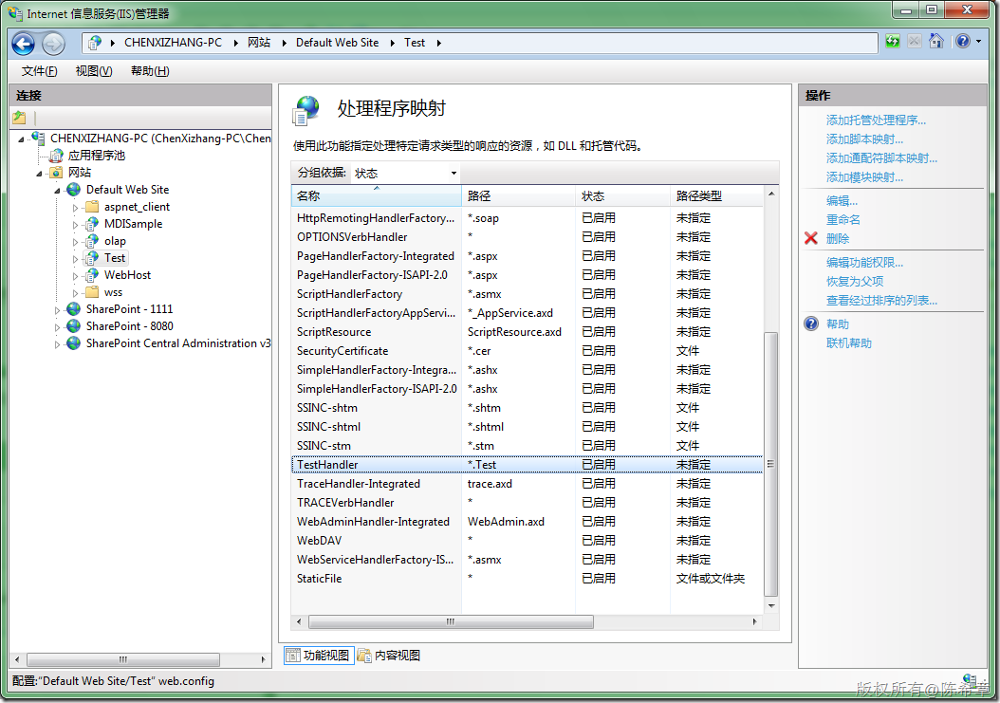
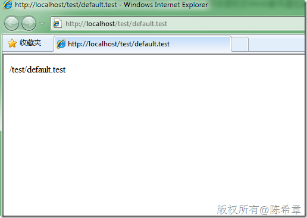

# IIS 7 :集成管道模式下的文件处理类型注册 
> 原文发表于 2009-12-21, 地址: http://www.cnblogs.com/chenxizhang/archive/2009/12/21/1628942.html 

在IIS 7中，除了向前兼容IIS 6的那种架构（也就是IIS收到请求，通过isapi的判断，转交请求）之外，还提供了另外一种所谓的集成管道模式。关于这种模式的详细信息，请参考微软官方文档。简要地说，在集成模式下，ASP.NET会作为IIS 7的内核组件存在，而不是ISAPI组件存在。

 可以在创建应用程序池的时候，选择该模式。

  

 然后设置网站或者虚拟目录使用该应用程序池

  

 这样设置了之后，最直接的好处就是，网站所使用的一些自定义Handler,无需在web.config中进行设置，而是直接在IIS中“添加管理处理程序”，如下所示

  

  

  

 

