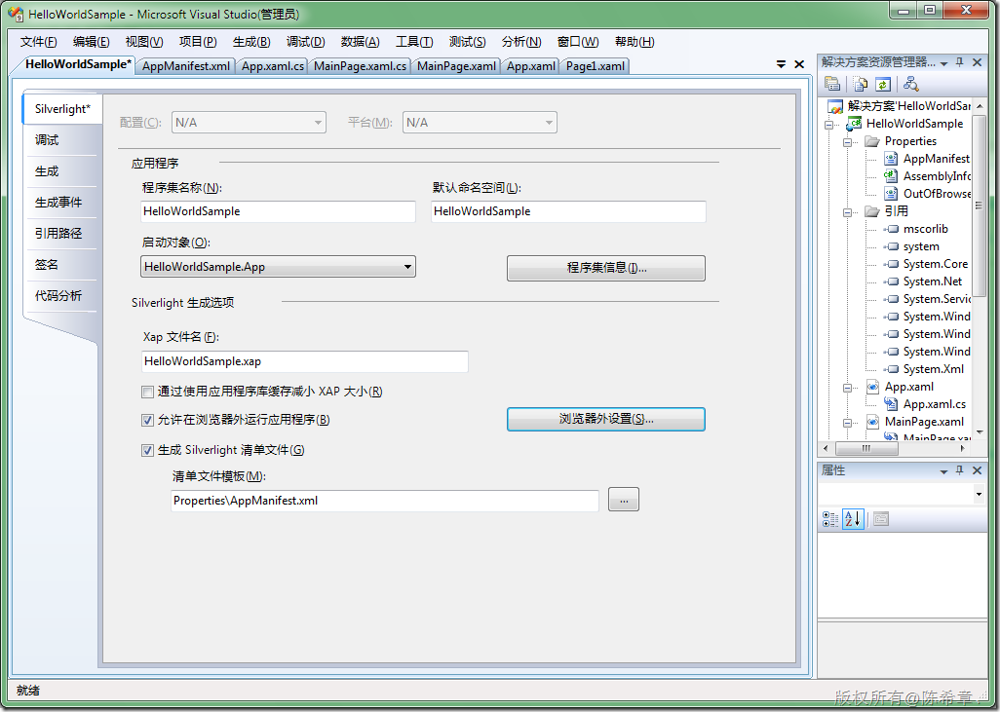
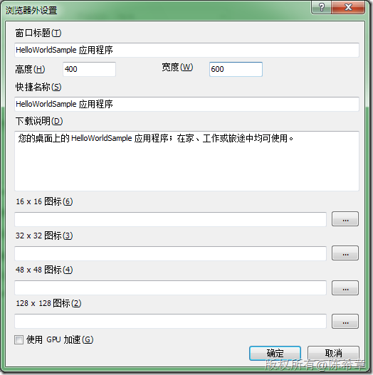
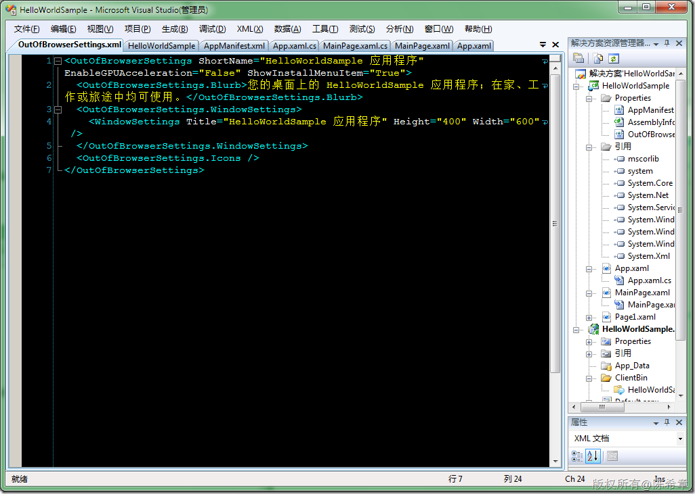
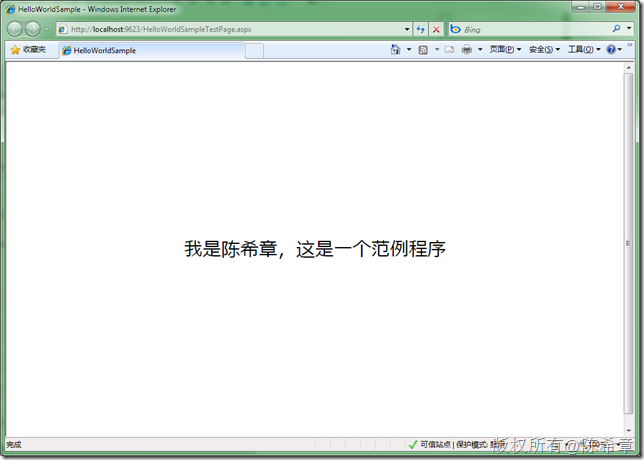
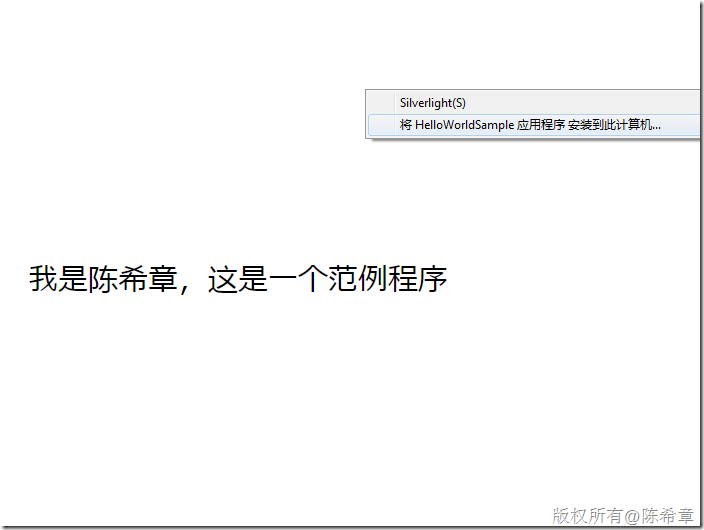
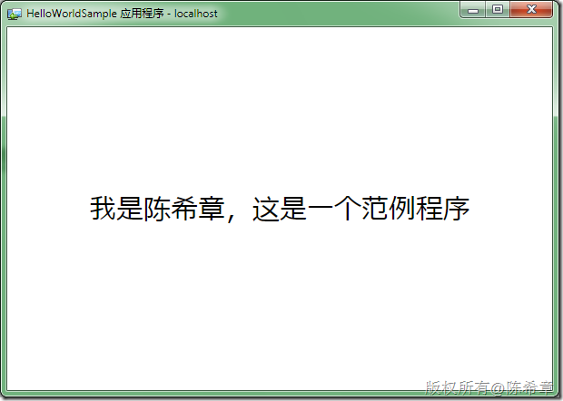
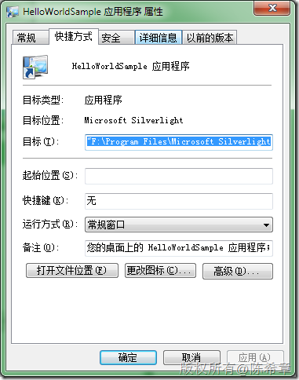
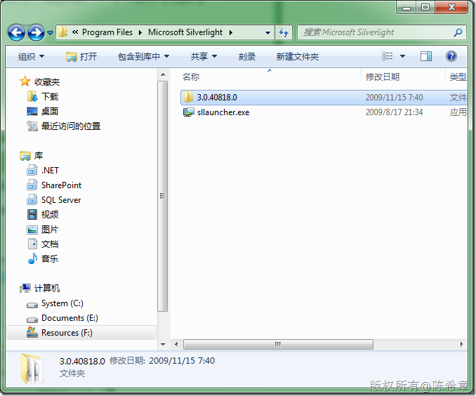
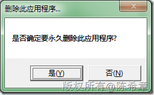

# 如何让Silverlight程序可以在浏览器外运行 
> 原文发表于 2009-12-21, 地址: http://www.cnblogs.com/chenxizhang/archive/2009/12/21/1629228.html 

这是一个很有意思的特性。在Silverlight 3中实现起来很容易，如下面的步骤

  

 选中“允许在浏览器外运行应用程序”，并点击“浏览器外设置”

  

  

 

 编译，并且运行 

  

 点击右键

  

  

   

  

 其实它是调用下面的工具

 "F:\Program Files\Microsoft Silverlight\sllauncher.exe" 2282018109.localhost

 这个sllauncher.exe在下面的目录

  

  

 而如果要卸载的话，运行起来之后，点右键，可以“删除该应用程序”

 

