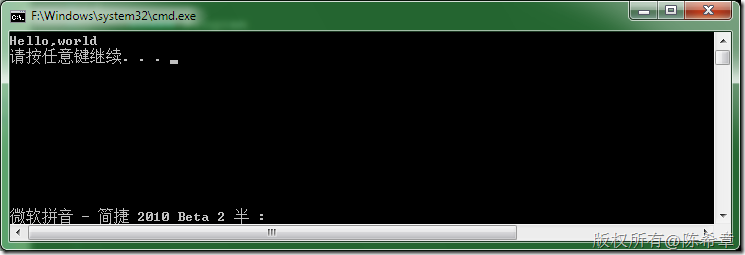
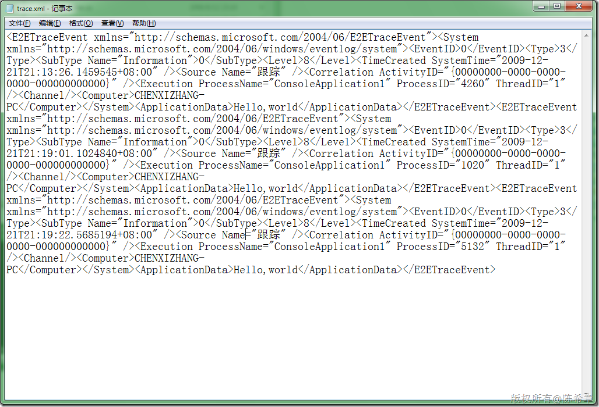

# .NET : 跟踪和调试技术 
> 原文发表于 2009-12-21, 地址: http://www.cnblogs.com/chenxizhang/archive/2009/12/21/1629289.html 


我们如果要为.NET程序启用跟踪和调试，则可以使用System.Diagnostics空间下面的一些API。为了方便编程，我们通常会使用配置文件来定义有关的信息

 1. 配置文件


```
<?xml version="1.0" encoding="utf-8" ?>
<configuration>
  <system.diagnostics>

    
    <trace autoflush="true">
      <listeners>
        <clear/>
        <add name="default" type="System.Diagnostics.ConsoleTraceListener" initializeData=""></add>
        <add name="text" type="System.Diagnostics.XmlWriterTraceListener" initializeData="e:\temp\trace.xml"></add>
      </listeners>
    </trace>
  </system.diagnostics>
</configuration>
```

.csharpcode, .csharpcode pre
{
 font-size: small;
 color: black;
 font-family: consolas, "Courier New", courier, monospace;
 background-color: #ffffff;
 /*white-space: pre;*/
}
.csharpcode pre { margin: 0em; }
.csharpcode .rem { color: #008000; }
.csharpcode .kwrd { color: #0000ff; }
.csharpcode .str { color: #006080; }
.csharpcode .op { color: #0000c0; }
.csharpcode .preproc { color: #cc6633; }
.csharpcode .asp { background-color: #ffff00; }
.csharpcode .html { color: #800000; }
.csharpcode .attr { color: #ff0000; }
.csharpcode .alt 
{
 background-color: #f4f4f4;
 width: 100%;
 margin: 0em;
}
.csharpcode .lnum { color: #606060; }

 


2. 写入调试信息


```

using System.Diagnostics;

namespace ConsoleApplication1
{
    class Program
    {
        static void Main(string[] args)
        {
            Debug.WriteLine("Hello,world");

            
        }
    }
}

```


.csharpcode, .csharpcode pre
{
 font-size: small;
 color: black;
 font-family: consolas, "Courier New", courier, monospace;
 background-color: #ffffff;
 /*white-space: pre;*/
}
.csharpcode pre { margin: 0em; }
.csharpcode .rem { color: #008000; }
.csharpcode .kwrd { color: #0000ff; }
.csharpcode .str { color: #006080; }
.csharpcode .op { color: #0000c0; }
.csharpcode .preproc { color: #cc6633; }
.csharpcode .asp { background-color: #ffff00; }
.csharpcode .html { color: #800000; }
.csharpcode .attr { color: #ff0000; }
.csharpcode .alt 
{
 background-color: #f4f4f4;
 width: 100%;
 margin: 0em;
}
.csharpcode .lnum { color: #606060; }


3. 测试结果


[](http://images.cnblogs.com/cnblogs_com/chenxizhang/WindowsLiveWriter/c0a2dd89ac59.NET_12EC5/image_4.png) 


[](http://images.cnblogs.com/cnblogs_com/chenxizhang/WindowsLiveWriter/c0a2dd89ac59.NET_12EC5/image_6.png) 


 


4. 假设需要根据不同的设置来将调试信息保存到不同的Listener中去，那么该怎么办呢


假设，我们只是希望将一些紧要的跟踪信息写入到XML文件中，其他的消息输出到屏幕即可。那么按照下面这样修改一下配置文件


```
<?xml version="1.0" encoding="utf-8" ?>
<configuration>
  <system.diagnostics>
    <sources>
      <source name="sample" switchValue="Error">
        <listeners>
          <add name="text" type="System.Diagnostics.XmlWriterTraceListener" initializeData="e:\temp\trace.xml"></add>
        </listeners>
      </source>
    </sources>

    <trace autoflush="true">
      <listeners>
        <clear/>
        <add name="default" type="System.Diagnostics.ConsoleTraceListener" initializeData=""></add>
      </listeners>
    </trace>
  </system.diagnostics>
</configuration>
```

```
 
```

```
代码
```

```

using System.Diagnostics;

namespace ConsoleApplication1
{
    class Program
    {
        static void Main(string[] args)
        {
            Debug.WriteLine("Hello,world");


            //写入特定的源
            TraceSource source = new TraceSource("sample");
            source.TraceData(TraceEventType.Error, 1, "Hello,World");
        }
    }
}

```

.csharpcode, .csharpcode pre
{
 font-size: small;
 color: black;
 font-family: consolas, "Courier New", courier, monospace;
 background-color: #ffffff;
 /*white-space: pre;*/
}
.csharpcode pre { margin: 0em; }
.csharpcode .rem { color: #008000; }
.csharpcode .kwrd { color: #0000ff; }
.csharpcode .str { color: #006080; }
.csharpcode .op { color: #0000c0; }
.csharpcode .preproc { color: #cc6633; }
.csharpcode .asp { background-color: #ffff00; }
.csharpcode .html { color: #800000; }
.csharpcode .attr { color: #ff0000; }
.csharpcode .alt 
{
 background-color: #f4f4f4;
 width: 100%;
 margin: 0em;
}
.csharpcode .lnum { color: #606060; }

.csharpcode, .csharpcode pre
{
 font-size: small;
 color: black;
 font-family: consolas, "Courier New", courier, monospace;
 background-color: #ffffff;
 /*white-space: pre;*/
}
.csharpcode pre { margin: 0em; }
.csharpcode .rem { color: #008000; }
.csharpcode .kwrd { color: #0000ff; }
.csharpcode .str { color: #006080; }
.csharpcode .op { color: #0000c0; }
.csharpcode .preproc { color: #cc6633; }
.csharpcode .asp { background-color: #ffff00; }
.csharpcode .html { color: #800000; }
.csharpcode .attr { color: #ff0000; }
.csharpcode .alt 
{
 background-color: #f4f4f4;
 width: 100%;
 margin: 0em;
}
.csharpcode .lnum { color: #606060; }
