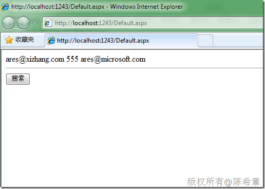
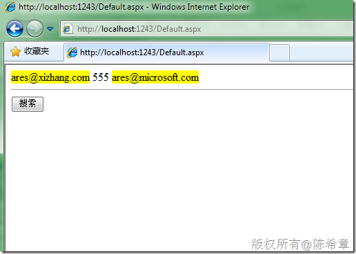

# 使用正则表达式实现搜索关键字高亮显示 
> 原文发表于 2009-12-21, 地址: http://www.cnblogs.com/chenxizhang/archive/2009/12/21/1629304.html 


下面通过一个小例子讲解一下在网页开发中，如何实现关键字检索之后的高亮显示。我们使用到的技术是正则表达式的替换功能

  

 1. 页面源文件


```
<%@ Page Language="C#" AutoEventWireup="true" CodeBehind="Default.aspx.cs" Inherits="WebApplication5.\_Default" %>

<!DOCTYPE html PUBLIC "-//W3C//DTD XHTML 1.0 Transitional//EN" "http://www.w3.org/TR/xhtml1/DTD/xhtml1-transitional.dtd">

<html xmlns="http://www.w3.org/1999/xhtml" >
<head runat="server">
    <title></title>
</head>
<body>
    <form id="form1" runat="server">
    <div>
    <asp:Literal runat="server" ID="lb"></asp:Literal>
    <hr />
    <asp:Button runat="server" ID="submit"  Text="搜索" onclick="submit\_Click"/>
    </div>
    </form>
</body>
</html>
```

```
 
```

```
2. 代码源文件
```

```
using System;

using System.Text.RegularExpressions;

namespace WebApplication5
{
    public partial class \_Default : System.Web.UI.Page
    {
        protected void Page\_Load(object sender, EventArgs e)
        {
            if (!IsPostBack) {
                lb.Text = "ares@xizhang.com 555 ares@microsoft.com";
            }
        }

        protected void submit\_Click(object sender, EventArgs e)
        {
            string temp = lb.Text;
            lb.Text = Regex.Replace(temp, @"[\w\.=-]+@[\w\.-]+\.[\w]{2,3}", c => { return string.Format("<span style='background-color:yellow'>{0}</span>", c); });

        }
    }
}

```


.csharpcode, .csharpcode pre
{
 font-size: small;
 color: black;
 font-family: consolas, "Courier New", courier, monospace;
 background-color: #ffffff;
 /*white-space: pre;*/
}
.csharpcode pre { margin: 0em; }
.csharpcode .rem { color: #008000; }
.csharpcode .kwrd { color: #0000ff; }
.csharpcode .str { color: #006080; }
.csharpcode .op { color: #0000c0; }
.csharpcode .preproc { color: #cc6633; }
.csharpcode .asp { background-color: #ffff00; }
.csharpcode .html { color: #800000; }
.csharpcode .attr { color: #ff0000; }
.csharpcode .alt 
{
 background-color: #f4f4f4;
 width: 100%;
 margin: 0em;
}
.csharpcode .lnum { color: #606060; }


3. 测试效果


[](http://images.cnblogs.com/cnblogs_com/chenxizhang/WindowsLiveWriter/9c66410fc915_1321A/image_2.png) 


点击“搜索”按钮


[](http://images.cnblogs.com/cnblogs_com/chenxizhang/WindowsLiveWriter/9c66410fc915_1321A/image_4.png)
.csharpcode, .csharpcode pre
{
 font-size: small;
 color: black;
 font-family: consolas, "Courier New", courier, monospace;
 background-color: #ffffff;
 /*white-space: pre;*/
}
.csharpcode pre { margin: 0em; }
.csharpcode .rem { color: #008000; }
.csharpcode .kwrd { color: #0000ff; }
.csharpcode .str { color: #006080; }
.csharpcode .op { color: #0000c0; }
.csharpcode .preproc { color: #cc6633; }
.csharpcode .asp { background-color: #ffff00; }
.csharpcode .html { color: #800000; }
.csharpcode .attr { color: #ff0000; }
.csharpcode .alt 
{
 background-color: #f4f4f4;
 width: 100%;
 margin: 0em;
}
.csharpcode .lnum { color: #606060; }


