# 在WCF中使用消息队列 
> 原文发表于 2009-12-22, 地址: http://www.cnblogs.com/chenxizhang/archive/2009/12/22/1629990.html 


在一些大型的解决方案中，假设我们的服务没有办法一直在线，或者因为这样那样的原因宕机了，有没有什么办法让客户端的影响最小化呢？答案是可以通过消息队列的方式，哪怕服务是没有在线的，客户端依然可以继续操作。

  

 1. 首先来学习一些消息队列的基础知识

 消息队列默认是没有安装的，可以通过下面的方式进行安装

 [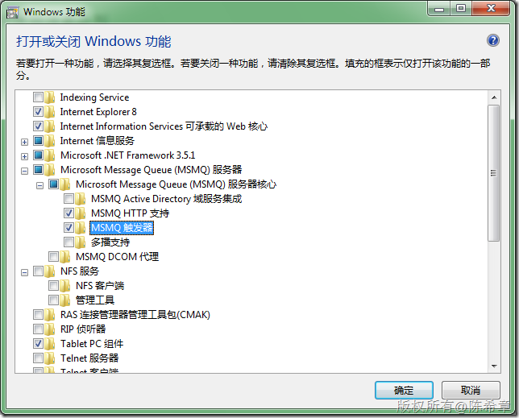](http://images.cnblogs.com/cnblogs_com/chenxizhang/WindowsLiveWriter/WCF_F462/image_2.png) 

  

 2. 通过一个小程序来演示一下如何发送和接受消息

 [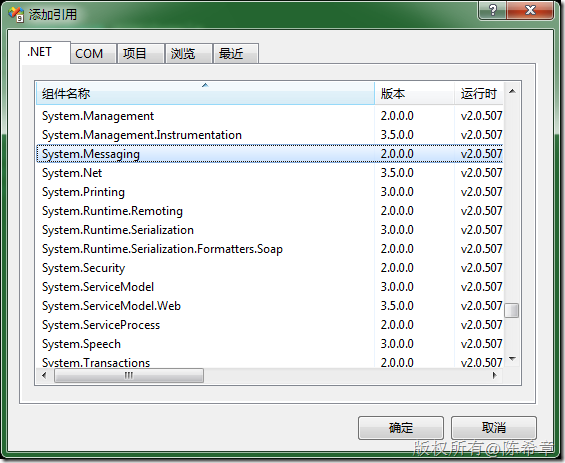](http://images.cnblogs.com/cnblogs_com/chenxizhang/WindowsLiveWriter/WCF_F462/image_4.png) 


```
        static void SendMessage() {
            Message msg = new Message("这是我的一个消息");

            string queueName = @".\Private$\SampleQueue";
            MessageQueue mq = null;

            if (!MessageQueue.Exists(queueName))
                mq = MessageQueue.Create(queueName);
            else
                mq = new MessageQueue(queueName);

            mq.Formatter = new XmlMessageFormatter(new[] { "System.String" });

            mq.Send(msg, "测试消息");

            Console.WriteLine("消息发送成功");
        }
```

.csharpcode, .csharpcode pre
{
 font-size: small;
 color: black;
 font-family: consolas, "Courier New", courier, monospace;
 background-color: #ffffff;
 /*white-space: pre;*/
}
.csharpcode pre { margin: 0em; }
.csharpcode .rem { color: #008000; }
.csharpcode .kwrd { color: #0000ff; }
.csharpcode .str { color: #006080; }
.csharpcode .op { color: #0000c0; }
.csharpcode .preproc { color: #cc6633; }
.csharpcode .asp { background-color: #ffff00; }
.csharpcode .html { color: #800000; }
.csharpcode .attr { color: #ff0000; }
.csharpcode .alt 
{
 background-color: #f4f4f4;
 width: 100%;
 margin: 0em;
}
.csharpcode .lnum { color: #606060; }

.csharpcode, .csharpcode pre
{
 font-size: small;
 color: black;
 font-family: consolas, "Courier New", courier, monospace;
 background-color: #ffffff;
 /*white-space: pre;*/
}
.csharpcode pre { margin: 0em; }
.csharpcode .rem { color: #008000; }
.csharpcode .kwrd { color: #0000ff; }
.csharpcode .str { color: #006080; }
.csharpcode .op { color: #0000c0; }
.csharpcode .preproc { color: #cc6633; }
.csharpcode .asp { background-color: #ffff00; }
.csharpcode .html { color: #800000; }
.csharpcode .attr { color: #ff0000; }
.csharpcode .alt 
{
 background-color: #f4f4f4;
 width: 100%;
 margin: 0em;
}
.csharpcode .lnum { color: #606060; }

然后，我们就可以看到这个消息了（通过mmc控制台）


[注意]xp和vista或者win 7都属于桌面操作系统，它们只支持私有队列。如果是服务器操作系统的话，则还支持公共队列。


[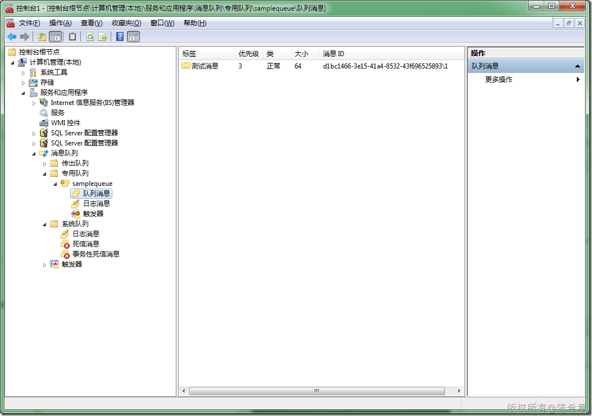](http://images.cnblogs.com/cnblogs_com/chenxizhang/WindowsLiveWriter/WCF_F462/image_6.png) 


[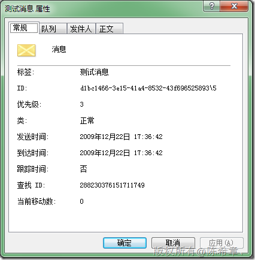](http://images.cnblogs.com/cnblogs_com/chenxizhang/WindowsLiveWriter/WCF_F462/image_8.png) [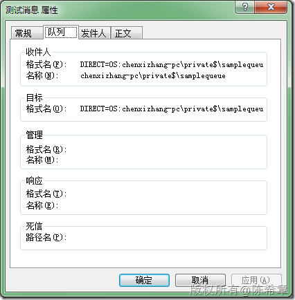](http://images.cnblogs.com/cnblogs_com/chenxizhang/WindowsLiveWriter/WCF_F462/image_10.png) 


[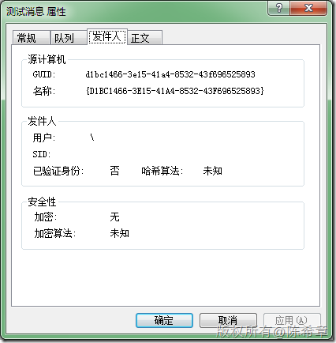](http://images.cnblogs.com/cnblogs_com/chenxizhang/WindowsLiveWriter/WCF_F462/image_12.png) [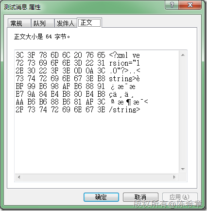](http://images.cnblogs.com/cnblogs_com/chenxizhang/WindowsLiveWriter/WCF_F462/image_14.png) 


下面看看如何读取队列中的消息


```
 static void ReadMessage() {
            string queueName = @".\Private$\SampleQueue";
            MessageQueue mq = new MessageQueue(queueName);
            mq.Formatter = new XmlMessageFormatter(new[] { "System.String" });
            Message msg = mq.Receive();
            Console.WriteLine(msg.Label);
            Console.WriteLine(msg.Body.ToString());
            
        }
```

[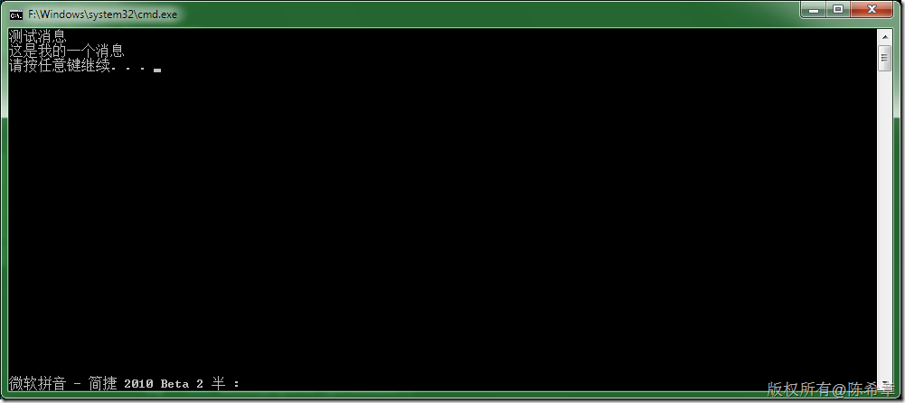](http://images.cnblogs.com/cnblogs_com/chenxizhang/WindowsLiveWriter/WCF_F462/image_16.png) 


上面是一个很简单的例子，演示了如何发送和接收消息。


 


下面用一个例子来讲解WCF中如何利用消息队列来实现异步的服务。


1. 创建契约


```
using System;
using System.ServiceModel;
using System.Runtime.Serialization;

namespace Contracts
{
    [ServiceContract]
    public interface IMSMQService
    {
        [OperationContract(IsOneWay = true)]
        void PlaceOrder(OrderEntry entry);
    }

    [DataContract]
    public class OrderEntry {
        [DataMember]
        public int OrderID { get; set; }
        [DataMember]
        public DateTime OrderDate { get; set; }
        [DataMember]
        public int Quantity { get; set; }
        [DataMember]        
        public int UnitPrice { get; set; }

        public override string ToString()
        {
            return string.Format(
                "ID:{0}\tDate:{1}\tQuantity:{2}\tUnitPrice:{3}\t",
                OrderID,
                OrderDate,
                Quantity,
                UnitPrice);
        }
    }

    
}

```

.csharpcode, .csharpcode pre
{
 font-size: small;
 color: black;
 font-family: consolas, "Courier New", courier, monospace;
 background-color: #ffffff;
 /*white-space: pre;*/
}
.csharpcode pre { margin: 0em; }
.csharpcode .rem { color: #008000; }
.csharpcode .kwrd { color: #0000ff; }
.csharpcode .str { color: #006080; }
.csharpcode .op { color: #0000c0; }
.csharpcode .preproc { color: #cc6633; }
.csharpcode .asp { background-color: #ffff00; }
.csharpcode .html { color: #800000; }
.csharpcode .attr { color: #ff0000; }
.csharpcode .alt 
{
 background-color: #f4f4f4;
 width: 100%;
 margin: 0em;
}
.csharpcode .lnum { color: #606060; }

.csharpcode, .csharpcode pre
{
 font-size: small;
 color: black;
 font-family: consolas, "Courier New", courier, monospace;
 background-color: #ffffff;
 /*white-space: pre;*/
}
.csharpcode pre { margin: 0em; }
.csharpcode .rem { color: #008000; }
.csharpcode .kwrd { color: #0000ff; }
.csharpcode .str { color: #006080; }
.csharpcode .op { color: #0000c0; }
.csharpcode .preproc { color: #cc6633; }
.csharpcode .asp { background-color: #ffff00; }
.csharpcode .html { color: #800000; }
.csharpcode .attr { color: #ff0000; }
.csharpcode .alt 
{
 background-color: #f4f4f4;
 width: 100%;
 margin: 0em;
}
.csharpcode .lnum { color: #606060; }

2. 实现服务


```
using System;

namespace Services
{
    public class MSMQOrderService:Contracts.IMSMQService
    {
        #region IMSMQService 成员

        public void PlaceOrder(Contracts.OrderEntry entry)
        {
            Console.WriteLine("收到订单:{0}", entry);
        }

        #endregion
    }
}

```

.csharpcode, .csharpcode pre
{
 font-size: small;
 color: black;
 font-family: consolas, "Courier New", courier, monospace;
 background-color: #ffffff;
 /*white-space: pre;*/
}
.csharpcode pre { margin: 0em; }
.csharpcode .rem { color: #008000; }
.csharpcode .kwrd { color: #0000ff; }
.csharpcode .str { color: #006080; }
.csharpcode .op { color: #0000c0; }
.csharpcode .preproc { color: #cc6633; }
.csharpcode .asp { background-color: #ffff00; }
.csharpcode .html { color: #800000; }
.csharpcode .attr { color: #ff0000; }
.csharpcode .alt 
{
 background-color: #f4f4f4;
 width: 100%;
 margin: 0em;
}
.csharpcode .lnum { color: #606060; }

 


3. 创建宿主


```
using System;
using System.ServiceModel;


namespace Host
{
    class Program
    {
        static void Main(string[] args)
        {
            using (ServiceHost host =
                new ServiceHost(
                    typeof(Services.MSMQOrderService),
                    new Uri("net.msmq://localhost/Private/SampleQueue")
                    ))
            {

                NetMsmqBinding binding = new NetMsmqBinding(NetMsmqSecurityMode.None);
                binding.ExactlyOnce = false;
                binding.Durable = true;

                host.AddServiceEndpoint(
                    typeof(Contracts.IMSMQService).FullName,
                    binding,
                    "");

                host.Open();
                Console.WriteLine("服务器已经准备好");
                Console.Read();

            }

        }
    }
}

```

.csharpcode, .csharpcode pre
{
 font-size: small;
 color: black;
 font-family: consolas, "Courier New", courier, monospace;
 background-color: #ffffff;
 /*white-space: pre;*/
}
.csharpcode pre { margin: 0em; }
.csharpcode .rem { color: #008000; }
.csharpcode .kwrd { color: #0000ff; }
.csharpcode .str { color: #006080; }
.csharpcode .op { color: #0000c0; }
.csharpcode .preproc { color: #cc6633; }
.csharpcode .asp { background-color: #ffff00; }
.csharpcode .html { color: #800000; }
.csharpcode .attr { color: #ff0000; }
.csharpcode .alt 
{
 background-color: #f4f4f4;
 width: 100%;
 margin: 0em;
}
.csharpcode .lnum { color: #606060; }

 


4. 创建客户端


```
using System;
using System.ServiceModel;

namespace Client
{
    class Program
    {
        static void Main(string[] args)
        {
            NetMsmqBinding binding = new NetMsmqBinding(NetMsmqSecurityMode.None);
            binding.ExactlyOnce = false;
            binding.Durable = true;


            ChannelFactory<Contracts.IMSMQService> channel =
                new ChannelFactory<Contracts.IMSMQService>(
                    binding, new EndpointAddress("net.msmq://localhost/Private/SampleQueue"));

            Contracts.IMSMQService client =
                channel.CreateChannel();

            client.PlaceOrder(
                new Contracts.OrderEntry()
                {
                    OrderID = 1,
                    OrderDate = DateTime.Now,
                    UnitPrice = 10,
                    Quantity = 10
                });

            Console.WriteLine("发送了一个订单");
            Console.Read();

        }
    }
}

```

.csharpcode, .csharpcode pre
{
 font-size: small;
 color: black;
 font-family: consolas, "Courier New", courier, monospace;
 background-color: #ffffff;
 /*white-space: pre;*/
}
.csharpcode pre { margin: 0em; }
.csharpcode .rem { color: #008000; }
.csharpcode .kwrd { color: #0000ff; }
.csharpcode .str { color: #006080; }
.csharpcode .op { color: #0000c0; }
.csharpcode .preproc { color: #cc6633; }
.csharpcode .asp { background-color: #ffff00; }
.csharpcode .html { color: #800000; }
.csharpcode .attr { color: #ff0000; }
.csharpcode .alt 
{
 background-color: #f4f4f4;
 width: 100%;
 margin: 0em;
}
.csharpcode .lnum { color: #606060; }

 


5. 测试


[](http://images.cnblogs.com/cnblogs_com/chenxizhang/WindowsLiveWriter/WCF_F462/image_18.png) 


[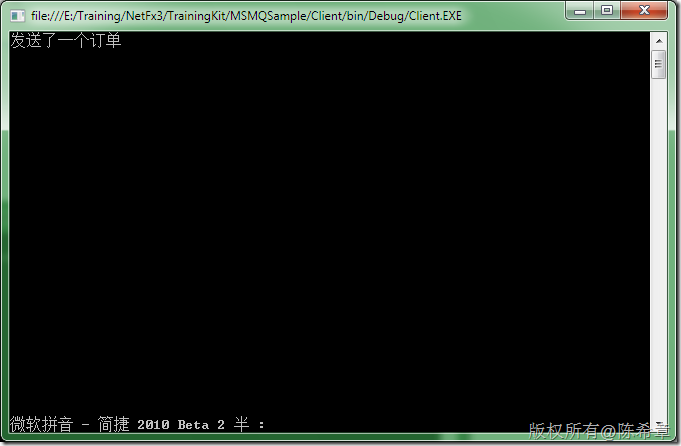](http://images.cnblogs.com/cnblogs_com/chenxizhang/WindowsLiveWriter/WCF_F462/image_20.png) 


很好，我们看到消息发送到了服务器端。但，如果仅仅是这样，那么使用消息队列有什么优势呢？


我们现在不启动服务端，而仅仅启动客户端。看看是否可以发出订单


[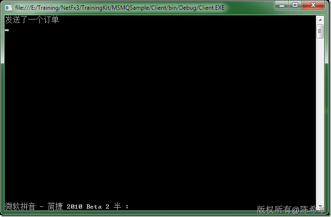](http://images.cnblogs.com/cnblogs_com/chenxizhang/WindowsLiveWriter/WCF_F462/image_22.png) 


我们发现，虽然服务没有开启来，但是却依然可以发出订单。那么这个订单到哪里去了呢。原来是被存放到了队列中。如下图所示


[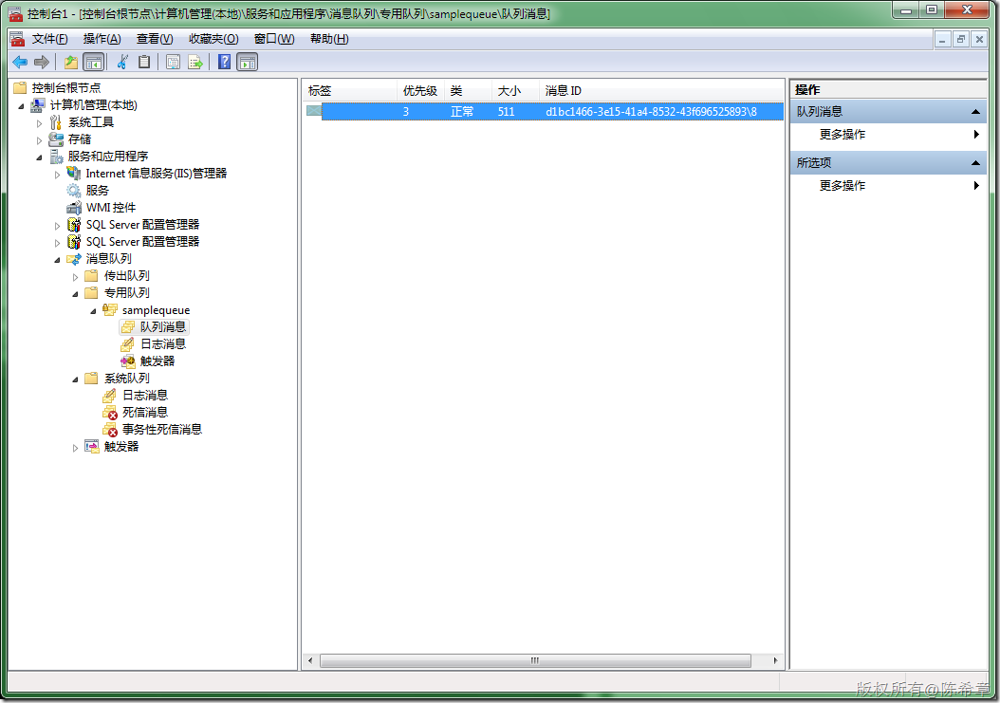](http://images.cnblogs.com/cnblogs_com/chenxizhang/WindowsLiveWriter/WCF_F462/image_24.png) 


[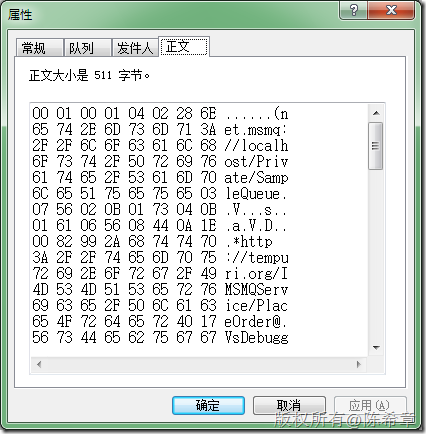](http://images.cnblogs.com/cnblogs_com/chenxizhang/WindowsLiveWriter/WCF_F462/image_26.png) 


 


然后，我们再去开服务宿主程序。


[](http://images.cnblogs.com/cnblogs_com/chenxizhang/WindowsLiveWriter/WCF_F462/image_28.png) 


宿主程序会自动读取消息队列中的消息，并自动进行处理。此时再次去查看队列的话，就会发现已经没有消息了


[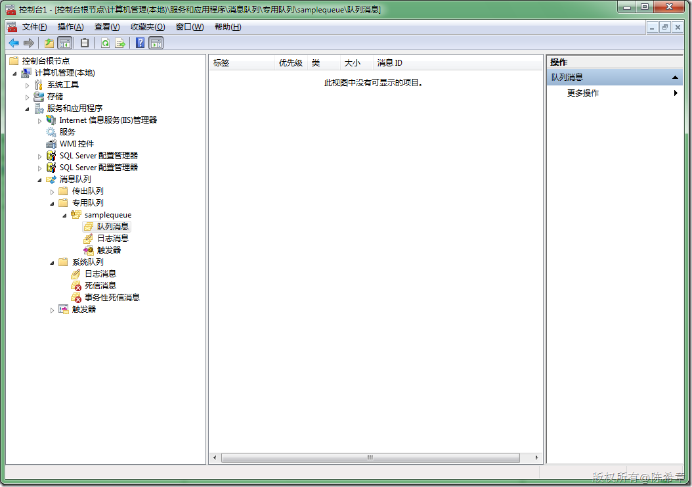](http://images.cnblogs.com/cnblogs_com/chenxizhang/WindowsLiveWriter/WCF_F462/image_30.png)

