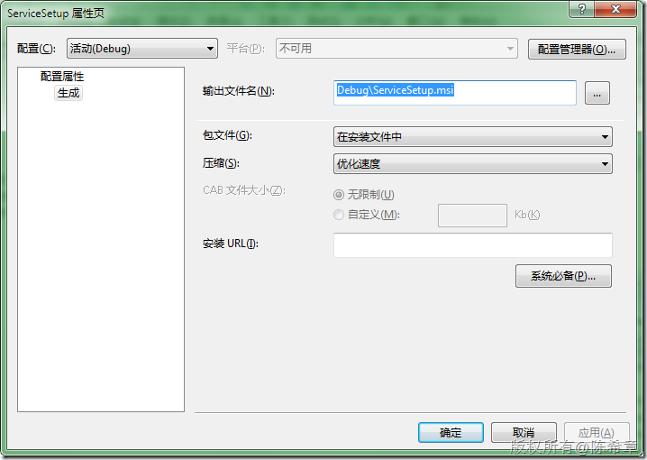

# .NET : 自定义安装服务 
> 原文发表于 2009-12-23, 地址: http://www.cnblogs.com/chenxizhang/archive/2009/12/23/1630707.html 


今天处理了这样一个事情，我们希望给用户安装的程序满足如下几个要求

 1. 安装步骤尽量简单，最好一步到位，不需要用户按部就班地做那些选择

 2. 安装程序要检测用户是否安装.NET Framework 2.0，如果没有，则自动安装。而且最好不要去微软网站临时下载。

 3. 安装程序最好不能在“添加/删除程序”面板中删除

  

 为了实现这三个目的，下面来看看我是如何解决的

 1. 要简化安装步骤其实不难，就是在“用户界面编辑器”中将不需要的窗口删除掉即可

 [](http://images.cnblogs.com/cnblogs_com/chenxizhang/WindowsLiveWriter/233652789c39.NET_E1D3/image_2.png) 

 2. 安装检测.NET Framework，这本来也不难，但关键在于如何不去网站下载呢？

 在安装程序的属性对话框中，点击“系统必备”

 [](http://images.cnblogs.com/cnblogs_com/chenxizhang/WindowsLiveWriter/233652789c39.NET_E1D3/image_4.png) 

 [](http://images.cnblogs.com/cnblogs_com/chenxizhang/WindowsLiveWriter/233652789c39.NET_E1D3/image_6.png) 

 注意：这里应该选择“从与我的应用程序相同的位置下载系统必备组件”

 生成之后，就可以看到如下一个特殊文件夹

 [](http://images.cnblogs.com/cnblogs_com/chenxizhang/WindowsLiveWriter/233652789c39.NET_E1D3/image_8.png) 

 把这个与我们的msi打包在一起即可。

  

 3. 如何让用户无法删除程序呢？我找了一下注册表，发现有些不能删除的程序都有一个特殊的键值NoRemove。于是乎在我们的安装程序中添加了一个注册表值

 [](http://images.cnblogs.com/cnblogs_com/chenxizhang/WindowsLiveWriter/233652789c39.NET_E1D3/image_10.png) 

 安装好之后，注意我们这个安装程序是没有卸载操作的

 [](http://images.cnblogs.com/cnblogs_com/chenxizhang/WindowsLiveWriter/233652789c39.NET_E1D3/image_12.png) 

       

 4. 最后补充一个，如果我们希望在安装程序运行完成之后，打开我们的一个网站，应该如何实现呢

 其实这个也不难，我们可以在自定义安装类中，添加一句代码


```

        public override void Commit(IDictionary savedState)
        {
            base.Commit(savedState);

            Process.Start("http://www.xizhang.com");
        }

```

.csharpcode, .csharpcode pre
{
 font-size: small;
 color: black;
 font-family: consolas, "Courier New", courier, monospace;
 background-color: #ffffff;
 /*white-space: pre;*/
}
.csharpcode pre { margin: 0em; }
.csharpcode .rem { color: #008000; }
.csharpcode .kwrd { color: #0000ff; }
.csharpcode .str { color: #006080; }
.csharpcode .op { color: #0000c0; }
.csharpcode .preproc { color: #cc6633; }
.csharpcode .asp { background-color: #ffff00; }
.csharpcode .html { color: #800000; }
.csharpcode .attr { color: #ff0000; }
.csharpcode .alt 
{
 background-color: #f4f4f4;
 width: 100%;
 margin: 0em;
}
.csharpcode .lnum { color: #606060; }

[](http://images.cnblogs.com/cnblogs_com/chenxizhang/WindowsLiveWriter/233652789c39.NET_E1D3/image_14.png)

