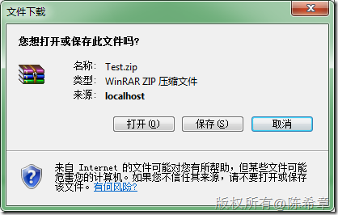

# ASP.NET :  如何将服务端的多个文件打包下载 
> 原文发表于 2009-12-23, 地址: http://www.cnblogs.com/chenxizhang/archive/2009/12/23/1630844.html 


正在开发的系统中包含了这部分功能。下面将有关重点的代码粘贴出来，给大家参考

 我用到了ICSharpCode.SharpZipLib这个dll. 据我所知，凡是现在做压缩和解压缩之类的程序，很少有人会不用这个组件的。赞一个先

  

 1. 核心代码

  


```
            MemoryStream ms = new MemoryStream();
            byte[] buffer = null;

            using (ZipFile file = ZipFile.Create(ms))
            {
                file.BeginUpdate();
                file.NameTransform = new MyNameTransfom();//通过这个名称格式化器，可以将里面的文件名进行一些处理。默认情况下，会自动根据文件的路径在zip中创建有关的文件夹。


                file.Add(Server.MapPath("~/images/1.jpg"));
                file.Add(Server.MapPath("~/images/2.jpg"));
                file.Add(Server.MapPath("~/images/3.jpg"));
                
                file.CommitUpdate();

                buffer = new byte[ms.Length];
                ms.Position = 0;
                ms.Read(buffer, 0, buffer.Length);
            }


            Response.AddHeader("content-disposition", "attachment;filename=Test.zip");
            Response.BinaryWrite(buffer);
            Response.Flush();
            Response.End();
```

```
 
```

```
另外,我专门写了一个NameTransfom
```

```
    public class MyNameTransfom : ICSharpCode.SharpZipLib.Core.INameTransform {

        #region INameTransform 成员

        public string TransformDirectory(string name)
        {
            return null;
        }

        public string TransformFile(string name)
        {
            return Path.GetFileName(name);
        }

        #endregion
    }
```

.csharpcode, .csharpcode pre
{
 font-size: small;
 color: black;
 font-family: consolas, "Courier New", courier, monospace;
 background-color: #ffffff;
 /*white-space: pre;*/
}
.csharpcode pre { margin: 0em; }
.csharpcode .rem { color: #008000; }
.csharpcode .kwrd { color: #0000ff; }
.csharpcode .str { color: #006080; }
.csharpcode .op { color: #0000c0; }
.csharpcode .preproc { color: #cc6633; }
.csharpcode .asp { background-color: #ffff00; }
.csharpcode .html { color: #800000; }
.csharpcode .attr { color: #ff0000; }
.csharpcode .alt 
{
 background-color: #f4f4f4;
 width: 100%;
 margin: 0em;
}
.csharpcode .lnum { color: #606060; }

.csharpcode, .csharpcode pre
{
 font-size: small;
 color: black;
 font-family: consolas, "Courier New", courier, monospace;
 background-color: #ffffff;
 /*white-space: pre;*/
}
.csharpcode pre { margin: 0em; }
.csharpcode .rem { color: #008000; }
.csharpcode .kwrd { color: #0000ff; }
.csharpcode .str { color: #006080; }
.csharpcode .op { color: #0000c0; }
.csharpcode .preproc { color: #cc6633; }
.csharpcode .asp { background-color: #ffff00; }
.csharpcode .html { color: #800000; }
.csharpcode .attr { color: #ff0000; }
.csharpcode .alt 
{
 background-color: #f4f4f4;
 width: 100%;
 margin: 0em;
}
.csharpcode .lnum { color: #606060; }

2. 测试效果


[](http://images.cnblogs.com/cnblogs_com/chenxizhang/WindowsLiveWriter/ASP.NET_FAA1/image_2.png) 


[](http://images.cnblogs.com/cnblogs_com/chenxizhang/WindowsLiveWriter/ASP.NET_FAA1/image_4.png)

