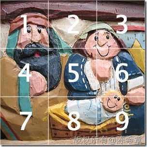
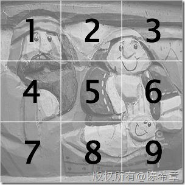
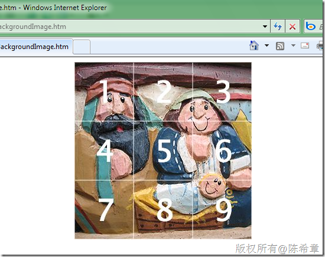
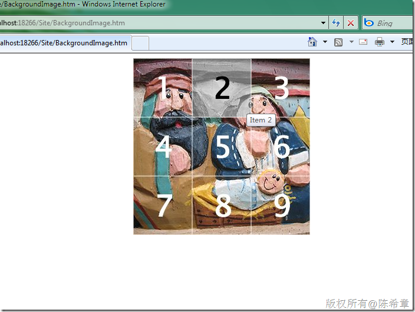

# Background-position的妙用 
> 原文发表于 2009-12-25, 地址: http://www.cnblogs.com/chenxizhang/archive/2009/12/25/1631807.html 


```
在网页中，我们会用到大量的图片，其中大部分是作为背景存在的。大家都会用Background-image的属性指定图片。但今天重点演示一下使用background-position的妙用
```

```
 
```

```
<!DOCTYPE html PUBLIC "-//W3C//DTD XHTML 1.0 Transitional//EN" "http://www.w3.org/TR/xhtml1/DTD/xhtml1-transitional.dtd">
<html xmlns="http://www.w3.org/1999/xhtml">
<head>
    <title></title>
    <style type="text/css">
        ul
        {
            width: 300px;
            height: 300px;
            margin: 0px auto;
            padding: 0px;
            overflow: hidden;
            background: transparent url(images/menu\_gray.jpg);
        }
        li
        {
            list-style-type: none;
            width: 100px;
            height: 100px;
            float: left;
        }
        li a
        {
            display: block;
            width: 100px;
            height: 100px;
            text-decoration: none;
            background: transparent url(images/menu\_color.jpg) no-repeat 500px 500px;
        }
        a#item1:hover
        {
            background-position: 0 0;
        }
        a#item2:hover
        {
            background-position: -100px 0;
        }
        a#item3:hover
        {
            background-position: -200px 0;
        }
        a#item4:hover
        {
            background-position: 0 -100px;
        }
        a#item5:hover
        {
            background-position: -100px -100px;
        }
        a#item6:hover
        {
            background-position: -200px -100px;
        }
        a#item7:hover
        {
            background-position: 0 -200px;
        }
        a#item8:hover
        {
            background-position: -100px -200px;
        }
        a#item9:hover
        {
            background-position: -200px -200px;
        }
    </style>
</head>
<body>
    <ul>
        <li><a id="item1" href="#" title="Item 1"></a></li>
        <li><a id="item2" href="#" title="Item 2"></a></li>
        <li><a id="item3" href="#" title="Item 3"></a></li>
        <li><a id="item4" href="#" title="Item 4"></a></li>
        <li><a id="item5" href="#" title="Item 5"></a></li>
        <li><a id="item6" href="#" title="Item 6"></a></li>
        <li><a id="item7" href="#" title="Item 7"></a></li>
        <li><a id="item8" href="#" title="Item 8"></a></li>
        <li><a id="item9" href="#" title="Item 9"></a></li>
    </ul>
</body>
</html>
```

```
情况是这样的，我们希望将一个图片切割为9个部分，每个部分当鼠标滑过的时候，都可以实现单独地变成灰色的效果。
```

```
我们有两张图片
```

```
[](http://images.cnblogs.com/cnblogs_com/chenxizhang/WindowsLiveWriter/Backgroundposition_7DDD/2006619215956692_2.jpg) [](http://images.cnblogs.com/cnblogs_com/chenxizhang/WindowsLiveWriter/Backgroundposition_7DDD/2006619215957116_2.jpg)
```

```
我们首先需要显示第一张照片，然后当用户将鼠标滑过某一个方块的时候，应该将图片切换为灰色的部分。
```

```
[](http://images.cnblogs.com/cnblogs_com/chenxizhang/WindowsLiveWriter/Backgroundposition_7DDD/image_2.png) 
```

```
[](http://images.cnblogs.com/cnblogs_com/chenxizhang/WindowsLiveWriter/Backgroundposition_7DDD/image_4.png) 
```

```
由此可见，css是多么强大并且有创造力
```

```
 
```

.csharpcode, .csharpcode pre
{
 font-size: small;
 color: black;
 font-family: consolas, "Courier New", courier, monospace;
 background-color: #ffffff;
 /*white-space: pre;*/
}
.csharpcode pre { margin: 0em; }
.csharpcode .rem { color: #008000; }
.csharpcode .kwrd { color: #0000ff; }
.csharpcode .str { color: #006080; }
.csharpcode .op { color: #0000c0; }
.csharpcode .preproc { color: #cc6633; }
.csharpcode .asp { background-color: #ffff00; }
.csharpcode .html { color: #800000; }
.csharpcode .attr { color: #ff0000; }
.csharpcode .alt 
{
 background-color: #f4f4f4;
 width: 100%;
 margin: 0em;
}
.csharpcode .lnum { color: #606060; }
