# 在ASP.NET Web Forms中使用ASP.NET Routing模块 
> 原文发表于 2009-12-27, 地址: http://www.cnblogs.com/chenxizhang/archive/2009/12/27/1633265.html 


ASP.NET Routing是随着MVC框架一起发布的，目前主要使用在MVC框架和Dynamic Data Web Application中。但这并不代表在标准的Web Forms中就不能使用这个模块。下面我就以一个实例的方式带领大家了解这个模块的简要使用步骤。

 注：所谓Routing指的是地址的路由，早年微软有一个UrlRewriting的范例。现在算是真正做到了Framework级别的支持了。

  

 1. 创建一个新的Web应用程序

 [](http://images.cnblogs.com/cnblogs_com/chenxizhang/WindowsLiveWriter/ASP.NETWebFormsASP.NETRouting_9453/image_2.png) 

 2.添加引用

 [](http://images.cnblogs.com/cnblogs_com/chenxizhang/WindowsLiveWriter/ASP.NETWebFormsASP.NETRouting_9453/image_4.png) 

 3. 修改配置文件，添加一个模块的支持

  [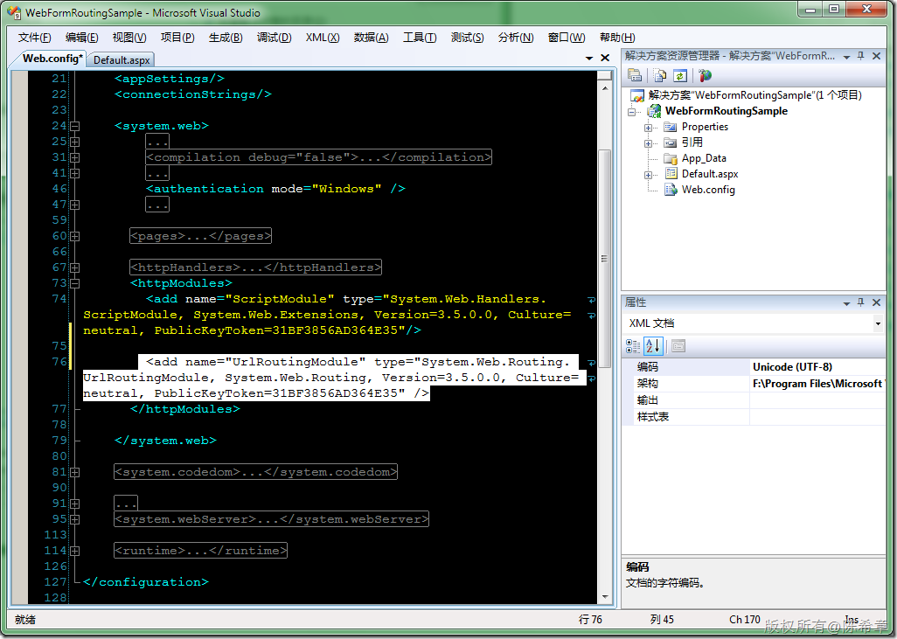](http://images.cnblogs.com/cnblogs_com/chenxizhang/WindowsLiveWriter/ASP.NETWebFormsASP.NETRouting_9453/image_6.png) 

 4. 添加Routing规则

 首先我们需要添加一个global.asax文件

 [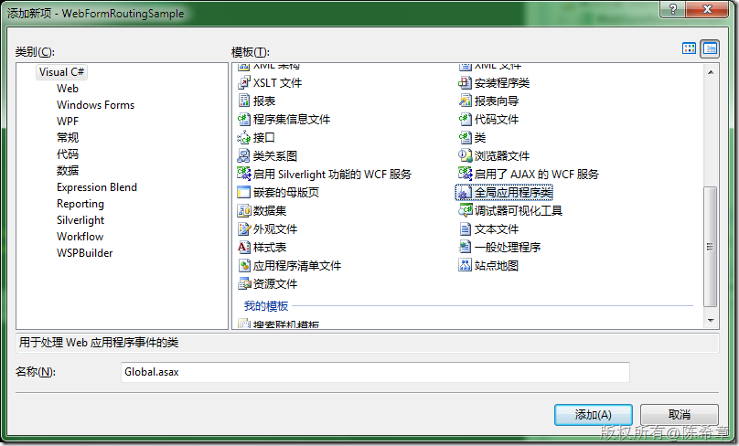](http://images.cnblogs.com/cnblogs_com/chenxizhang/WindowsLiveWriter/ASP.NETWebFormsASP.NETRouting_9453/image_8.png) 

 我们需要在global.asax中注册路由规则。大致是下面这样的语法


```
    public class Global : System.Web.HttpApplication
    {
        public static void RegisterRoutes(RouteCollection routes)
        {
            routes.Add(
                new Route("Product/{ProductName}", new MyRouteHandler()));


        }
        protected void Application\_Start(object sender, EventArgs e)
        {
            RegisterRoutes(RouteTable.Routes);
        }

    }
```

.csharpcode, .csharpcode pre
{
 font-size: small;
 color: black;
 font-family: consolas, "Courier New", courier, monospace;
 background-color: #ffffff;
 /*white-space: pre;*/
}
.csharpcode pre { margin: 0em; }
.csharpcode .rem { color: #008000; }
.csharpcode .kwrd { color: #0000ff; }
.csharpcode .str { color: #006080; }
.csharpcode .op { color: #0000c0; }
.csharpcode .preproc { color: #cc6633; }
.csharpcode .asp { background-color: #ffff00; }
.csharpcode .html { color: #800000; }
.csharpcode .attr { color: #ff0000; }
.csharpcode .alt 
{
 background-color: #f4f4f4;
 width: 100%;
 margin: 0em;
}
.csharpcode .lnum { color: #606060; }

定义路由规则中，凡是可变的部分都用{}包含起来，例如上面的ProductName就表示这是一个变量。


路由规则匹配之后，Routing组件会把请求转交给我们一个自定义的RouteHandler来处理，所以我们要定义这个Handler


```
    public class MyRouteHandler : IRouteHandler
    {

        #region IRouteHandler 成员

        public IHttpHandler GetHttpHandler(RequestContext requestContext)
        {
            string productName = requestContext.RouteData.GetRequiredString("ProductName");
            return new MyPageHandler() { ProductName = productName };
        }

        #endregion
    }
```

```
这里我们通过GetRequiredString的方式取得那个具体的ProductName,然后我们再次转交给一个特定的HttpHandler来处理。所以我们又要定义这个HttpHandler
```

```
   public class MyPageHandler : IHttpHandler
    {

        #region IHttpHandler 成员

        public bool IsReusable
        {
            get { return false; }
        }

        public void ProcessRequest(HttpContext context)
        {
            context.Response.Write(string.Format("当前请求的产品是:{0}", ProductName));
        }

        public string ProductName { get; set; }

        #endregion
    }
```

到这里为止，我们就完成了所有的操作，虽然功能很简单。但流程已经很完整了，现在可以马上来看看效果


[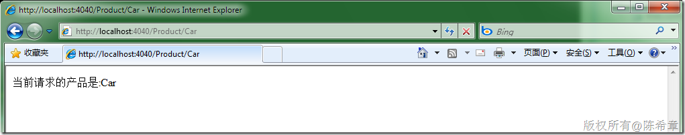](http://images.cnblogs.com/cnblogs_com/chenxizhang/WindowsLiveWriter/ASP.NETWebFormsASP.NETRouting_9453/image_10.png) 


[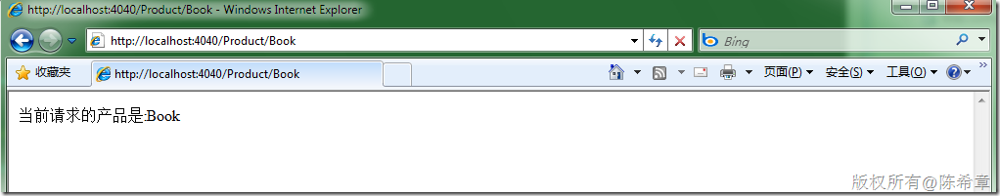](http://images.cnblogs.com/cnblogs_com/chenxizhang/WindowsLiveWriter/ASP.NETWebFormsASP.NETRouting_9453/image_12.png) 


请大家注意，我们在网站中并没有所谓的Product目录，也不可能存在所谓的Car目录或者页面。这就是Routing的厉害之处。


实际上，我们如果设置两个断点，就可以看到中间的工作过程


[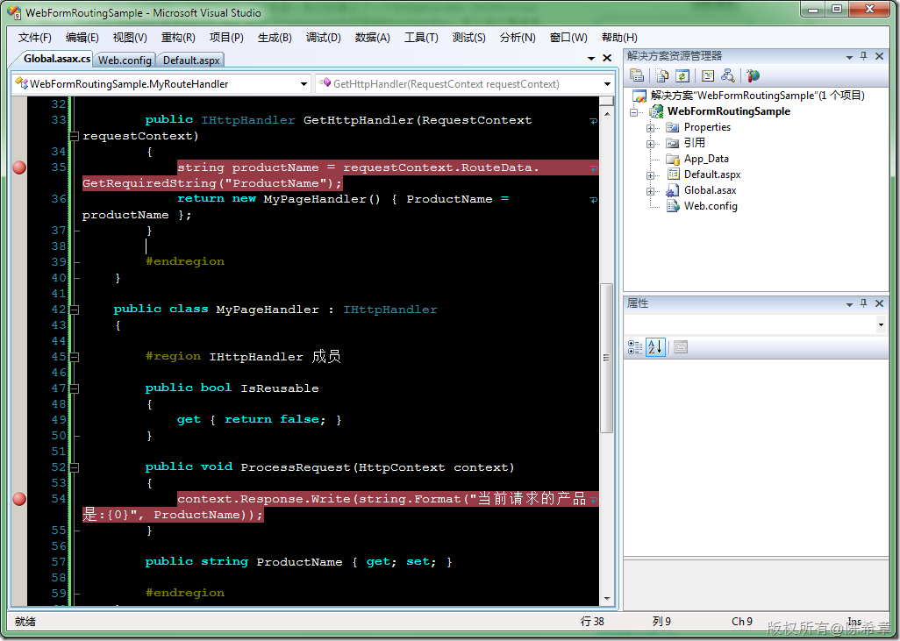](http://images.cnblogs.com/cnblogs_com/chenxizhang/WindowsLiveWriter/ASP.NETWebFormsASP.NETRouting_9453/image_14.png) 


读者可能会说，如果在这个MyPageHandler里面这样处理是不是太难了些。我们需要根据参数的不同，去显示不同的页面内容呢？


实际上，很简单，我们可以添加一个Product的页面


[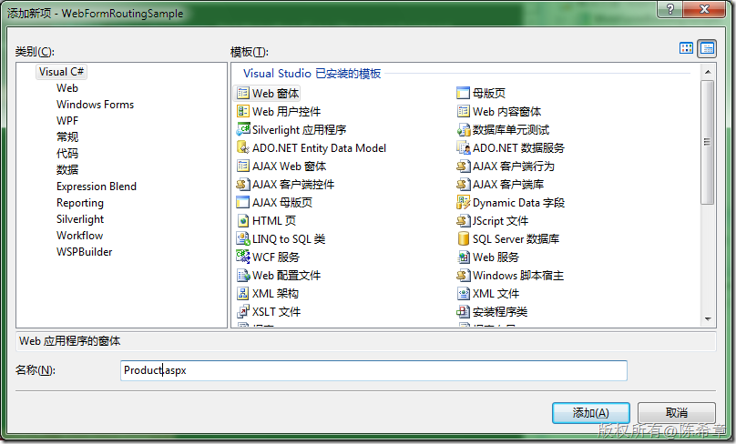](http://images.cnblogs.com/cnblogs_com/chenxizhang/WindowsLiveWriter/ASP.NETWebFormsASP.NETRouting_9453/image_16.png) 


[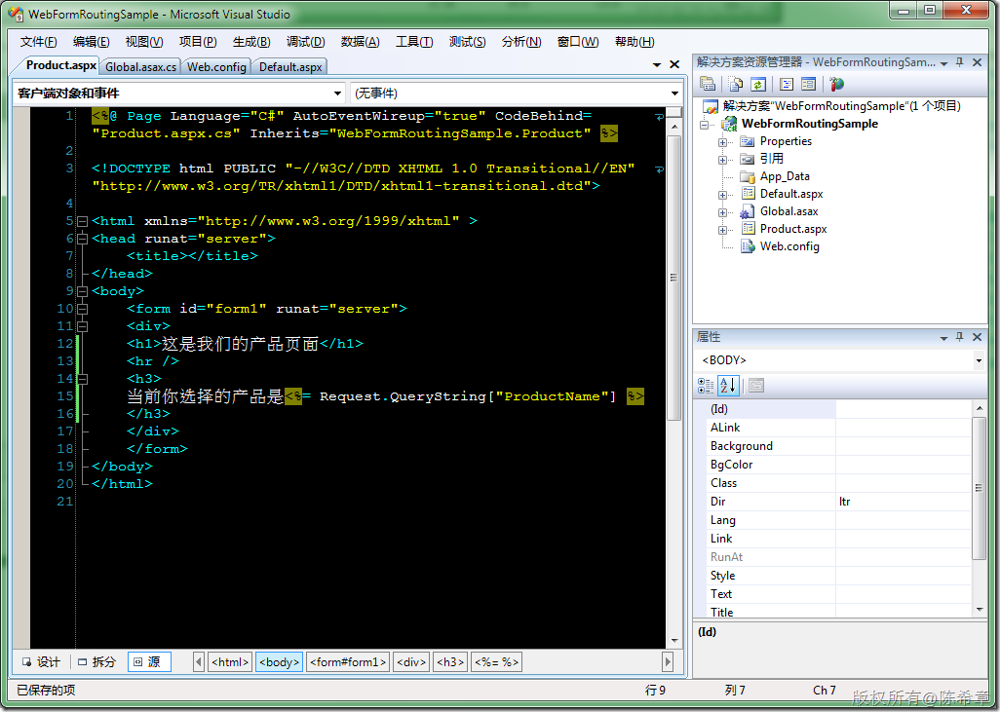](http://images.cnblogs.com/cnblogs_com/chenxizhang/WindowsLiveWriter/ASP.NETWebFormsASP.NETRouting_9453/image_18.png) 


注：出于简单的考虑，我们这里只是显示一个产品名称。只要你愿意，你当然可以根据它查询数据库，并作任意复杂的数据绑定和展现。


接下来，修改一下我们的PageHandler


[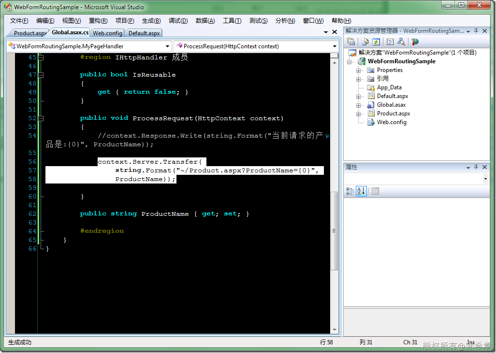](http://images.cnblogs.com/cnblogs_com/chenxizhang/WindowsLiveWriter/ASP.NETWebFormsASP.NETRouting_9453/image_26.png) 


实际上，我们将地址处理成了标准的Product.aspx?ProductName=Car这样的格式。但是用户是看不到的，因为我们是用Server.Transfer,而不是Response.Redirect


[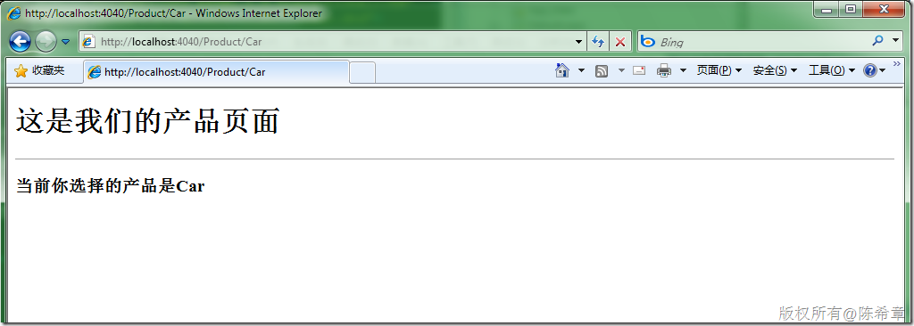](http://images.cnblogs.com/cnblogs_com/chenxizhang/WindowsLiveWriter/ASP.NETWebFormsASP.NETRouting_9453/image_24.png) 


我们发现它依然能很好地进行工作。鼓掌~


注：这里还要注意一个问题，因为是重定向到了其他的路径，实际上又是一个Request，这一点上是不如MVC的，因为MVC框架下只要接管到了请求，直接就可以通过创建Controller去执行某个Action即可。


 


最后，假设我们希望给路径设置一个默认值，例如如果请求/Product，没有提供具体的ProductName的话，我们认为是请求所有页面。这要如何实现呢


[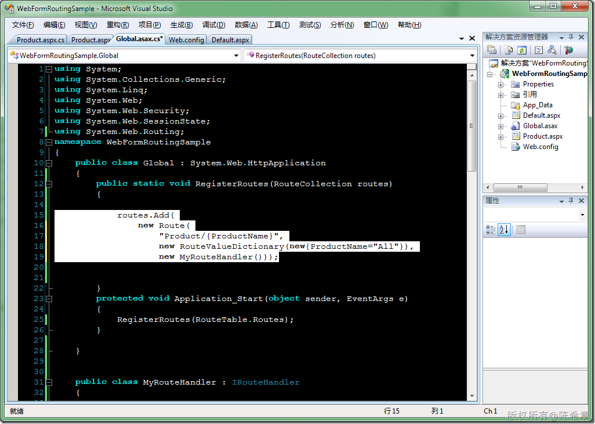](http://images.cnblogs.com/cnblogs_com/chenxizhang/WindowsLiveWriter/ASP.NETWebFormsASP.NETRouting_9453/image_28.png) 


[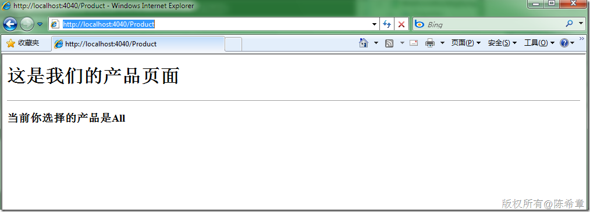](http://images.cnblogs.com/cnblogs_com/chenxizhang/WindowsLiveWriter/ASP.NETWebFormsASP.NETRouting_9453/image_30.png) 


 


.csharpcode, .csharpcode pre
{
 font-size: small;
 color: black;
 font-family: consolas, "Courier New", courier, monospace;
 background-color: #ffffff;
 /*white-space: pre;*/
}
.csharpcode pre { margin: 0em; }
.csharpcode .rem { color: #008000; }
.csharpcode .kwrd { color: #0000ff; }
.csharpcode .str { color: #006080; }
.csharpcode .op { color: #0000c0; }
.csharpcode .preproc { color: #cc6633; }
.csharpcode .asp { background-color: #ffff00; }
.csharpcode .html { color: #800000; }
.csharpcode .attr { color: #ff0000; }
.csharpcode .alt 
{
 background-color: #f4f4f4;
 width: 100%;
 margin: 0em;
}
.csharpcode .lnum { color: #606060; }


