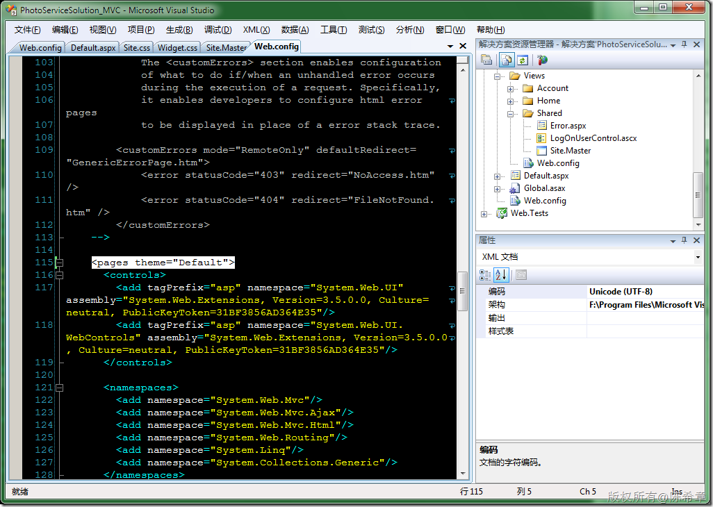
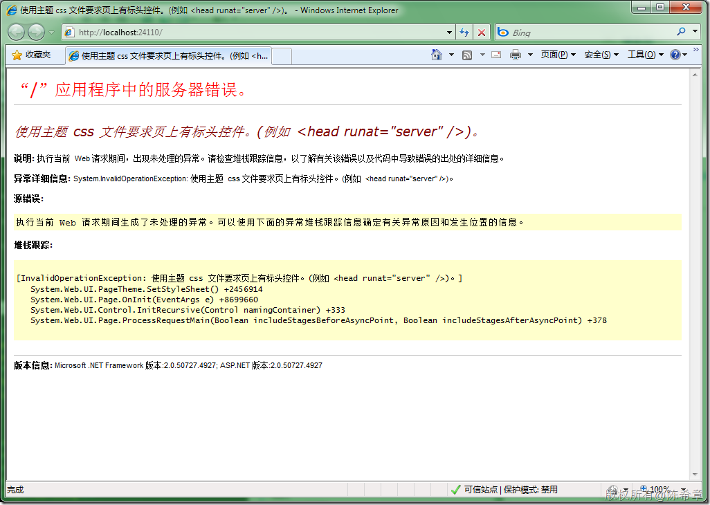
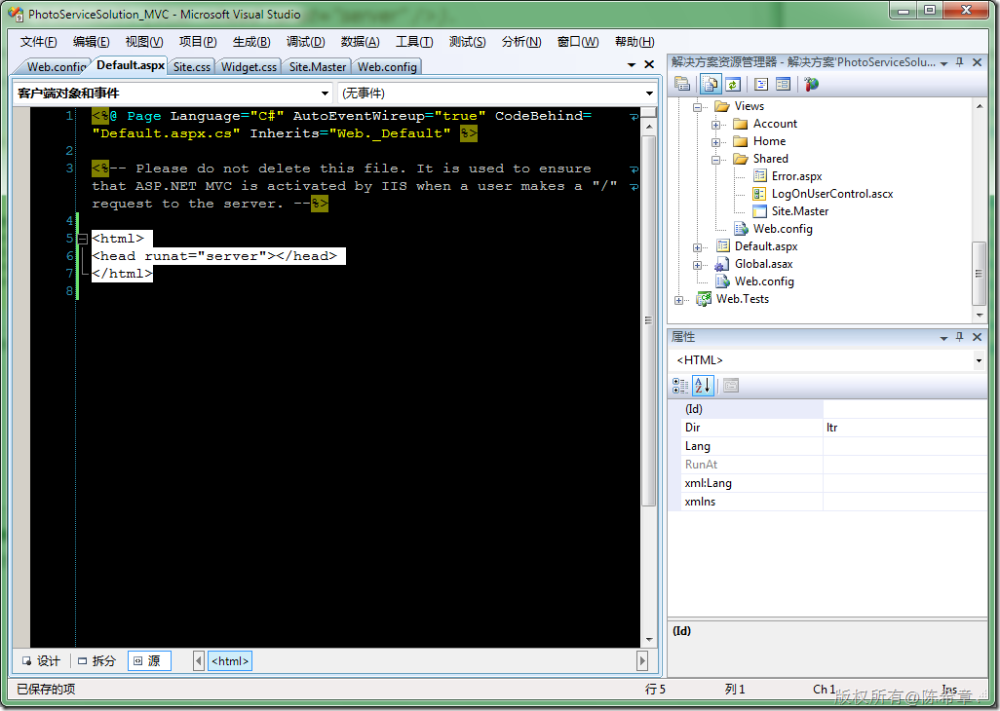
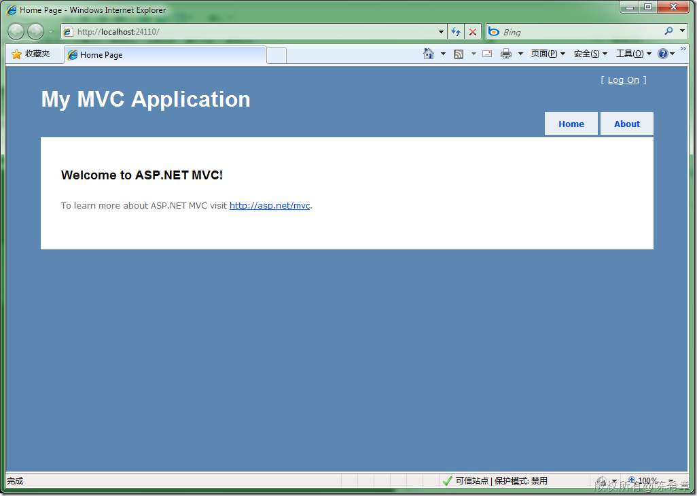
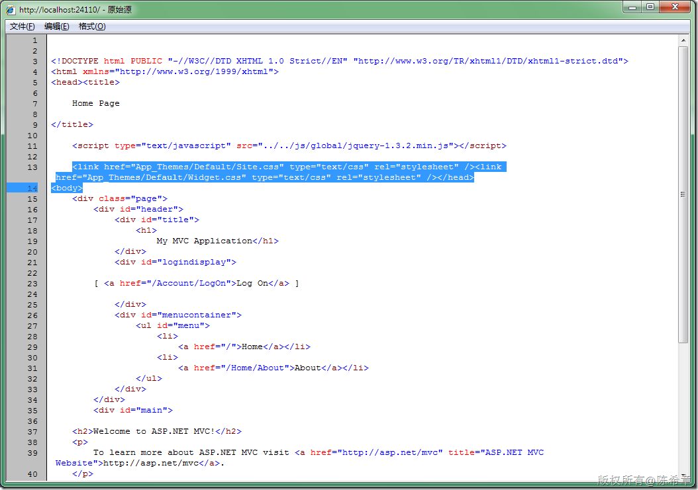

# 使用MVC框架中要注意的问题（一）：修改首页以支持主题 
> 原文发表于 2009-12-27, 地址: http://www.cnblogs.com/chenxizhang/archive/2009/12/27/1633476.html 

下面的一个项目将使用MVC框架，陆续也可能会整理出来一些日记。今天说一下的是，如果你希望在MVC项目中使用主题(Apo\_Themes)，那么可能需要修改首页

 我们先来看一下主题的设置

  

 这样设置好了之后，运行项目，会遇到下面的错误

  

 那么应该如何修改呢？照它的提示修改即可，所谓从善如流，对吧，呵呵

  

 [注]因为使用主题，所以页面中并不需要声明样式表的链接。

  

 然后再次运行即可看到传说中的MVC首页

  

 为什么会发生这个问题呢？

 其实，如果我们使用主题的话，因为那些样式表并没有在页面中预先定义好，所以页面需要动态地添加到页面中来。大家如果看一下页面的源文件就明白了

 

