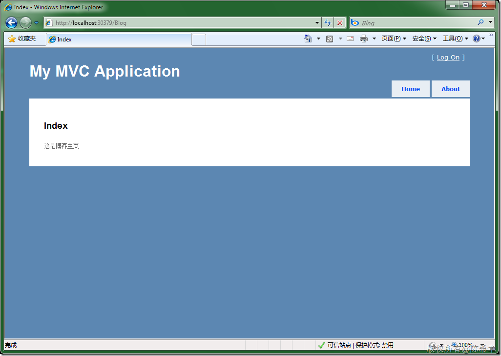

# 使用MVC框架中要注意的问题(二):将Model和Controller单独用一个项目设计 
> 原文发表于 2009-12-27, 地址: http://www.cnblogs.com/chenxizhang/archive/2009/12/27/1633547.html 


这个问题很多朋友都会问到，MVC让分工协作成为了可能。但如果所有代码和页面都在一个项目中的话，那么分工就会受到限制。其实，Model和Controller都可以单独用一个（或者多个）程序单独来做。

 1. Model 

 Model主要负责数据读写。现在我们一般可以直接用LINQ TO SQL类型或者Entity Framework 模型来做。

 严格来说，Model也分为两个部分，一个是业务实体定义（这是需要与View共享的），一个是针对业务实体的操作。只不过，上面提到的两种做法将他们合二为一了。

 Model项目单独做好之后，只要在MVC Web Application中添加引用即可。很简单，也很自然。

  

 2. Controller

 相对来说这就稍微复杂一些。请遵循下面的规范

 * Controller的名字要满足规范，例如Blog**Controller**。Blog是Controller的名字，而Controller是后缀。


```
using System;
using System.Collections.Generic;
using System.Linq;
using System.Text;

using System.Web.Mvc;

namespace MyControllers
{
    public class BlogController:Controller
    {

        public ActionResult Index() {
            return View();
        }
    }
}

```

.csharpcode, .csharpcode pre
{
 font-size: small;
 color: black;
 font-family: consolas, "Courier New", courier, monospace;
 background-color: #ffffff;
 /*white-space: pre;*/
}
.csharpcode pre { margin: 0em; }
.csharpcode .rem { color: #008000; }
.csharpcode .kwrd { color: #0000ff; }
.csharpcode .str { color: #006080; }
.csharpcode .op { color: #0000c0; }
.csharpcode .preproc { color: #cc6633; }
.csharpcode .asp { background-color: #ffff00; }
.csharpcode .html { color: #800000; }
.csharpcode .attr { color: #ff0000; }
.csharpcode .alt 
{
 background-color: #f4f4f4;
 width: 100%;
 margin: 0em;
}
.csharpcode .lnum { color: #606060; }

* 在global.asax文件中添加命名空间的注册，让MVC引擎知道如何查找Controller


```
using System;
using System.Collections.Generic;
using System.Linq;
using System.Web;
using System.Web.Mvc;
using System.Web.Routing;

namespace MvcApplication2
{
    // Note: For instructions on enabling IIS6 or IIS7 classic mode, 
    // visit http://go.microsoft.com/?LinkId=9394801

    public class MvcApplication : System.Web.HttpApplication
    {
        public static void RegisterRoutes(RouteCollection routes)
        {
            routes.IgnoreRoute("{resource}.axd/{*pathInfo}");

            routes.MapRoute(
                "Default",                                              // Route name
                "{controller}/{action}/{id}",                           // URL with parameters
                new { controller = "Home", action = "Index", id = "" },  // Parameter defaults
 **new[] {"MyControllers"}**            );

        }

        protected void Application\_Start()
        {
            RegisterRoutes(RouteTable.Routes);
        }
    }
}
```

```
[](http://images.cnblogs.com/cnblogs_com/chenxizhang/WindowsLiveWriter/MVCModelController_123D0/image_2.png) 
```

.csharpcode, .csharpcode pre
{
 font-size: small;
 color: black;
 font-family: consolas, "Courier New", courier, monospace;
 background-color: #ffffff;
 /*white-space: pre;*/
}
.csharpcode pre { margin: 0em; }
.csharpcode .rem { color: #008000; }
.csharpcode .kwrd { color: #0000ff; }
.csharpcode .str { color: #006080; }
.csharpcode .op { color: #0000c0; }
.csharpcode .preproc { color: #cc6633; }
.csharpcode .asp { background-color: #ffff00; }
.csharpcode .html { color: #800000; }
.csharpcode .attr { color: #ff0000; }
.csharpcode .alt 
{
 background-color: #f4f4f4;
 width: 100%;
 margin: 0em;
}
.csharpcode .lnum { color: #606060; }
