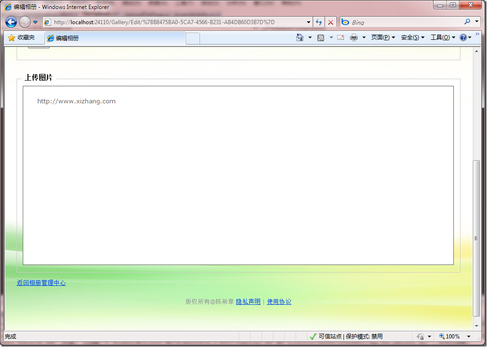

# 如何在使用ActiveX时通过Param指定属性值 
> 原文发表于 2010-01-09, 地址: http://www.cnblogs.com/chenxizhang/archive/2010/01/09/1643181.html 


在某些时候，我们需要在网页中使用一些ActiveX控件，其实这些控件也就是一个class。那么如何给这些class指定属性值呢？


```
        <object id="upload" classid="clsid:{FD172CB6-0156-4c44-A0C3-22D30B41A394}" width="100%">
            <param name="ServerUrl" value="http://www.xizhang.com" />
        </object>
```


.csharpcode, .csharpcode pre
{
 font-size: small;
 color: black;
 font-family: consolas, "Courier New", courier, monospace;
 background-color: #ffffff;
 /*white-space: pre;*/
}
.csharpcode pre { margin: 0em; }
.csharpcode .rem { color: #008000; }
.csharpcode .kwrd { color: #0000ff; }
.csharpcode .str { color: #006080; }
.csharpcode .op { color: #0000c0; }
.csharpcode .preproc { color: #cc6633; }
.csharpcode .asp { background-color: #ffff00; }
.csharpcode .html { color: #800000; }
.csharpcode .attr { color: #ff0000; }
.csharpcode .alt 
{
 background-color: #f4f4f4;
 width: 100%;
 margin: 0em;
}
.csharpcode .lnum { color: #606060; }


上面的param语句，就是指定一个属性值。


 


那么在控件中应该如何设计来接收这个属性值呢？其实就是一个标准的Property即可。


```
        private string url;
        public string ServerUrl
        {
            get
            {
                return url;
            }
            set
            {
                url = value; label1.Text = value;
            }
        }
```


.csharpcode, .csharpcode pre
{
 font-size: small;
 color: black;
 font-family: consolas, "Courier New", courier, monospace;
 background-color: #ffffff;
 /*white-space: pre;*/
}
.csharpcode pre { margin: 0em; }
.csharpcode .rem { color: #008000; }
.csharpcode .kwrd { color: #0000ff; }
.csharpcode .str { color: #006080; }
.csharpcode .op { color: #0000c0; }
.csharpcode .preproc { color: #cc6633; }
.csharpcode .asp { background-color: #ffff00; }
.csharpcode .html { color: #800000; }
.csharpcode .attr { color: #ff0000; }
.csharpcode .alt 
{
 background-color: #f4f4f4;
 width: 100%;
 margin: 0em;
}
.csharpcode .lnum { color: #606060; }


我们可以看看简单的效果


[](http://images.cnblogs.com/cnblogs_com/chenxizhang/WindowsLiveWriter/ActiveXParam_13C48/image_2.png)

