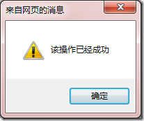
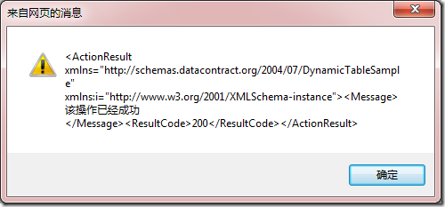
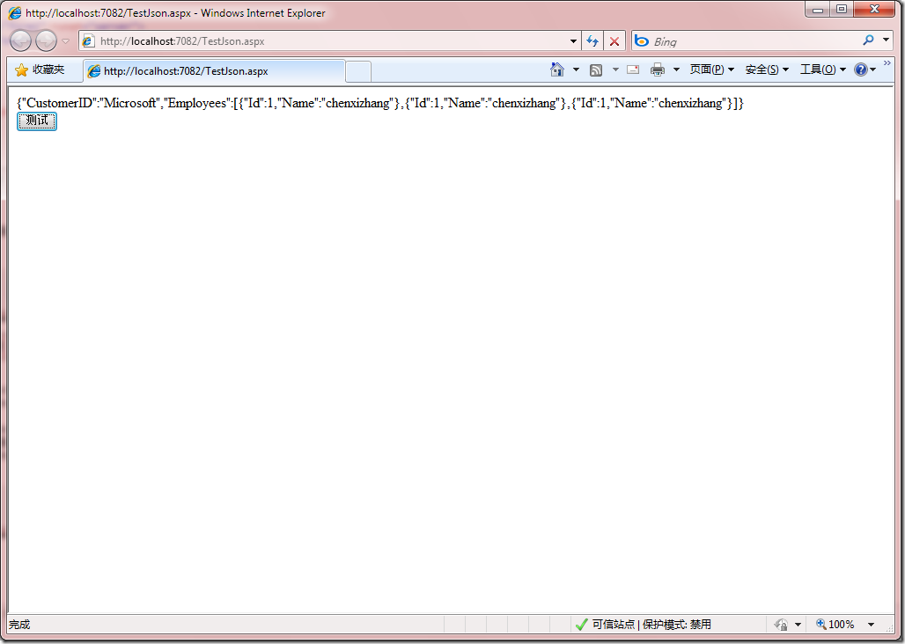

# javascript, json, xml 
> 原文发表于 2010-01-13, 地址: http://www.cnblogs.com/chenxizhang/archive/2010/01/13/1646255.html 


在网络编程中，我们经常需要用到javascript,这些客户端脚本又经常需要与服务端进行异步的通讯，提交并接收数据。下面这个例子演示了如何设计服务，如何编写脚本

 1. 服务端，这是一个ashx文件

 需要添加两个引用 System.Runtime.Serialization和System.ServiceModel.Web


```
using System.Web;
using System.Web.Services;
using System.Runtime.Serialization.Json;
using System.Runtime.Serialization;
using System.IO;
using System.Text;


namespace DynamicTableSample
{
    /// <summary>
    /// $codebehindclassname$ 的摘要说明
    /// </summary>
    [WebService(Namespace = "http://tempuri.org/")]
    [WebServiceBinding(ConformsTo = WsiProfiles.BasicProfile1\_1)]
    public class Test : IHttpHandler
    {

        public void ProcessRequest(HttpContext context)
        {
            //解析客户端传过来的数据
            var c = context.Request["data"];
            var ser = new DataContractJsonSerializer(typeof(Customer));
            Customer customer =ser.ReadObject(new MemoryStream(Encoding.UTF8.GetBytes(c))) as Customer;//反序列化，将字符串转换为对象


            //返回结果
            ActionResult result = new ActionResult() { ResultCode = 200, Message = "该操作已经成功" };
            var ser2 = new DataContractSerializer(typeof(ActionResult));
            //直接返回xml格式的内容。返回xml其实是更好的，因为这个服务才更有通用性。
            ser2.WriteObject(context.Response.OutputStream, result);
        }

        public bool IsReusable
        {
            get
            {
                return false;
            }
        }
    }

    public class Customer {
        
        public string CustomerID { get; set; }
        public Employee[] Employees { get; set; }
        public class Employee
        {
            public int Id { get; set; }
            public string Name { get; set; }
        }
    }

    public class ActionResult
    {
        public int ResultCode { get; set; }
        public string Message { get; set; }
    }


}

```

```
2. 客户端
```

```
<%@ Page Language="C#" AutoEventWireup="true" CodeBehind="TestJson.aspx.cs" Inherits="DynamicTableSample.TestJson" %>

<!DOCTYPE html PUBLIC "-//W3C//DTD XHTML 1.0 Transitional//EN" "http://www.w3.org/TR/xhtml1/DTD/xhtml1-transitional.dtd">
<html xmlns="http://www.w3.org/1999/xhtml">
<head runat="server">
    <title></title>

    <script src="jquery-1.3.2-vsdoc.js" type="text/javascript"></script>
    <script src="json2.js" type="text/javascript"></script>
    
    <script type="text/javascript">
        function Test() {
            var arr = new Array();
            var o = new Object();
            o.Id = 1;
            o.Name = "chenxizhang";
            arr.push(o);
            arr.push(o);
            arr.push(o);

            var customer = new Object();
            customer.CustomerID = "Microsoft";
            customer.Employees = arr;

            $("#msg").html(JSON.stringify(customer));

            $.post("Test.ashx", "data=" + JSON.stringify(customer), function(result) {
                alert($(result).find("Message").text());//这里可以解析xml
            });

            $.ajax({
                type: "post",
                data: "data=" + JSON.stringify(customer),
                url: "Test.ashx",
                success: function(result) {
                    alert(result);//这是返回xml
                }
            });
            
            //var o = JSON.parse('{"Name":"chenxizhang"}');
            //alert(o.Name);
        }
    </script>

</head>
<body>
    <form id="form1" runat="server">
    <div id="msg">
    
    </div>
    </form>
    
    <input type="button" value="测试" onclick="Test()" />
</body>
</html>

```

```
[](http://images.cnblogs.com/cnblogs_com/chenxizhang/WindowsLiveWriter/javascriptjsonxml_90D9/image_2.png) 
```

```
[](http://images.cnblogs.com/cnblogs_com/chenxizhang/WindowsLiveWriter/javascriptjsonxml_90D9/image_4.png) 
```

```
[](http://images.cnblogs.com/cnblogs_com/chenxizhang/WindowsLiveWriter/javascriptjsonxml_90D9/image_6.png) 
```

```
 
```

.csharpcode, .csharpcode pre
{
 font-size: small;
 color: black;
 font-family: consolas, "Courier New", courier, monospace;
 background-color: #ffffff;
 /*white-space: pre;*/
}
.csharpcode pre { margin: 0em; }
.csharpcode .rem { color: #008000; }
.csharpcode .kwrd { color: #0000ff; }
.csharpcode .str { color: #006080; }
.csharpcode .op { color: #0000c0; }
.csharpcode .preproc { color: #cc6633; }
.csharpcode .asp { background-color: #ffff00; }
.csharpcode .html { color: #800000; }
.csharpcode .attr { color: #ff0000; }
.csharpcode .alt 
{
 background-color: #f4f4f4;
 width: 100%;
 margin: 0em;
}
.csharpcode .lnum { color: #606060; }

.csharpcode, .csharpcode pre
{
 font-size: small;
 color: black;
 font-family: consolas, "Courier New", courier, monospace;
 background-color: #ffffff;
 /*white-space: pre;*/
}
.csharpcode pre { margin: 0em; }
.csharpcode .rem { color: #008000; }
.csharpcode .kwrd { color: #0000ff; }
.csharpcode .str { color: #006080; }
.csharpcode .op { color: #0000c0; }
.csharpcode .preproc { color: #cc6633; }
.csharpcode .asp { background-color: #ffff00; }
.csharpcode .html { color: #800000; }
.csharpcode .attr { color: #ff0000; }
.csharpcode .alt 
{
 background-color: #f4f4f4;
 width: 100%;
 margin: 0em;
}
.csharpcode .lnum { color: #606060; }
