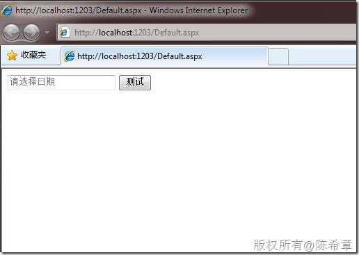

# 自动具有水印和日历选择功能的文本框 
> 原文发表于 2010-01-16, 地址: http://www.cnblogs.com/chenxizhang/archive/2010/01/16/1649028.html 


这是我在项目中做的一个自定义控件.

 [](http://images.cnblogs.com/cnblogs_com/chenxizhang/WindowsLiveWriter/a42e81d21364_96AA/clip_image002_2.jpg)

 [![clip_image002[7]](./images/1649028-clip_image002%5B7%5D_thumb.jpg "clip_image002[7]")](http://images.cnblogs.com/cnblogs_com/chenxizhang/WindowsLiveWriter/a42e81d21364_96AA/clip_image002%5B7%5D.jpg)

  


```
using System;

using System.Web.UI;
using System.Web.UI.WebControls;


namespace WorkflowCenter.Abstraction
{
///这个文本框自动具有水印功能和日历选择功能
///作者：陈希章
///要求：需要AJAXToolkit支持

    public class DataTimeTextBox : Control, IPostBackDataHandler
    {

        protected override void OnInit(EventArgs e)
        {
            base.OnInit(e);

            Page.RegisterRequiresControlState(this);
            Page.RegisterRequiresPostBack(this);
        }


        protected override object SaveControlState()
        {
            return Date;
        }

        protected override void LoadControlState(object savedState)
        {
            if (savedState == null) return;
            Date = (DateTime)savedState;

        }


        protected TextBox tx;
        protected AjaxControlToolkit.CalendarExtender ex;
        protected AjaxControlToolkit.TextBoxWatermarkExtender WatermarkTextBox;

        protected RequiredFieldValidator rv;
        protected CompareValidator cv;

        protected override void CreateChildControls()
        {
            Controls.Clear();

            //添加四个控件
            tx = new TextBox();
            string id = this.ID + "\_DateTextBox";
            tx.ID = id;

            ex = new AjaxControlToolkit.CalendarExtender();
            ex.ID = this.ID + "\_CalendarExtender";
            ex.TargetControlID = tx.ID;
            ex.Format = "yyyy-MM-dd";


            WatermarkTextBox = new AjaxControlToolkit.TextBoxWatermarkExtender();
            WatermarkTextBox.ID = this.ID + "\_WaterMark";
            WatermarkTextBox.TargetControlID = tx.ID;
            WatermarkTextBox.WatermarkText = "请选择日期";
            WatermarkTextBox.WatermarkCssClass = "Watermark";


            rv = new RequiredFieldValidator();
            rv.ID = this.ID + "\_RequiredValidator";
            rv.ControlToValidate = tx.ID;
            rv.ErrorMessage = "请输入日期";
            rv.Text = "*";
            rv.Display = ValidatorDisplay.Dynamic;

            cv = new CompareValidator();
            cv.ID = this.ID + "\_CompareValidator";
            cv.ErrorMessage = "请输入一个合法的日期";
            cv.Text = "*";
            cv.Display = ValidatorDisplay.Dynamic;
            cv.ControlToValidate = tx.ID;
            cv.Operator = ValidationCompareOperator.DataTypeCheck;
            cv.Type = ValidationDataType.Date;


            this.Controls.Add(tx);
            this.Controls.Add(ex);
            this.Controls.Add(WatermarkTextBox);
            this.Controls.Add(rv);
            this.Controls.Add(cv);

            ClearChildViewState();

        }

        public DateTime Date { get; set; }


        #region IPostBackDataHandler 成员

        public bool LoadPostData(string postDataKey, System.Collections.Specialized.NameValueCollection postCollection)
        {
            EnsureChildControls();

            DateTime temp;
            if (DateTime.TryParse(postCollection[tx.UniqueID], out temp))
                Date = temp;

            return true;
        }

        public void RaisePostDataChangedEvent()
        {
        }

        #endregion
    }
}

```

.csharpcode, .csharpcode pre
{
 font-size: small;
 color: black;
 font-family: consolas, "Courier New", courier, monospace;
 background-color: #ffffff;
 /*white-space: pre;*/
}
.csharpcode pre { margin: 0em; }
.csharpcode .rem { color: #008000; }
.csharpcode .kwrd { color: #0000ff; }
.csharpcode .str { color: #006080; }
.csharpcode .op { color: #0000c0; }
.csharpcode .preproc { color: #cc6633; }
.csharpcode .asp { background-color: #ffff00; }
.csharpcode .html { color: #800000; }
.csharpcode .attr { color: #ff0000; }
.csharpcode .alt 
{
 background-color: #f4f4f4;
 width: 100%;
 margin: 0em;
}
.csharpcode .lnum { color: #606060; }


 


页面中使用的代码


```
<%@ Page Language="C#" AutoEventWireup="true" CodeBehind="Default.aspx.cs" Inherits="WebApplication3.\_Default" %>

<!DOCTYPE html PUBLIC "-//W3C//DTD XHTML 1.0 Transitional//EN" "http://www.w3.org/TR/xhtml1/DTD/xhtml1-transitional.dtd">
<%@ Register Assembly="WorkflowCenter.Abstraction" Namespace="WorkflowCenter.Abstraction" TagPrefix="workflow" %>
<html xmlns="http://www.w3.org/1999/xhtml">
<head runat="server">
    <title></title>
    <style type="text/css">
        .Watermark
        {
            color: Gray;
        }
    </style>
</head>
<body>
    <form id="form1" runat="server">
    <div>
        <asp:ScriptManager ID="s" runat="server">
        </asp:ScriptManager>
        <asp:ValidationSummary ID="sum" runat="server" />
        <workflow:DataTimeTextBox ID="date" runat="server"></workflow:DataTimeTextBox>
        <asp:Button ID="b" runat="server" Text="测试" OnClick="b\_Click" />
    </div>
    </form>
</body>
</html>

```

.csharpcode, .csharpcode pre
{
 font-size: small;
 color: black;
 font-family: consolas, "Courier New", courier, monospace;
 background-color: #ffffff;
 /*white-space: pre;*/
}
.csharpcode pre { margin: 0em; }
.csharpcode .rem { color: #008000; }
.csharpcode .kwrd { color: #0000ff; }
.csharpcode .str { color: #006080; }
.csharpcode .op { color: #0000c0; }
.csharpcode .preproc { color: #cc6633; }
.csharpcode .asp { background-color: #ffff00; }
.csharpcode .html { color: #800000; }
.csharpcode .attr { color: #ff0000; }
.csharpcode .alt 
{
 background-color: #f4f4f4;
 width: 100%;
 margin: 0em;
}
.csharpcode .lnum { color: #606060; }
