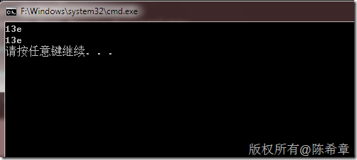

# 批量替换多个字符 
> 原文发表于 2010-01-16, 地址: http://www.cnblogs.com/chenxizhang/archive/2010/01/16/1649101.html 


在字符处理过程中，我们可能需要对某些字符进行替换，而且可能会有多个字符，请比较下面两种写法：一个是用标准的replace函数，另外一个则是用正则表达式


```
            string input = "1,;3^e";
            Console.WriteLine(input.Replace(",","").Replace(";","").Replace("^",""));
            Console.WriteLine(Regex.Replace(input,@",|;|\^",""));
```


.csharpcode, .csharpcode pre
{
 font-size: small;
 color: black;
 font-family: consolas, "Courier New", courier, monospace;
 background-color: #ffffff;
 /*white-space: pre;*/
}
.csharpcode pre { margin: 0em; }
.csharpcode .rem { color: #008000; }
.csharpcode .kwrd { color: #0000ff; }
.csharpcode .str { color: #006080; }
.csharpcode .op { color: #0000c0; }
.csharpcode .preproc { color: #cc6633; }
.csharpcode .asp { background-color: #ffff00; }
.csharpcode .html { color: #800000; }
.csharpcode .attr { color: #ff0000; }
.csharpcode .alt 
{
 background-color: #f4f4f4;
 width: 100%;
 margin: 0em;
}
.csharpcode .lnum { color: #606060; }


[](http://images.cnblogs.com/cnblogs_com/chenxizhang/WindowsLiveWriter/a59d96f20a44_AEBA/image_2.png)

