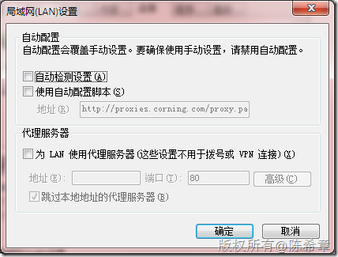
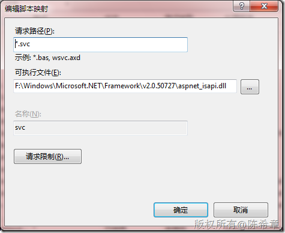
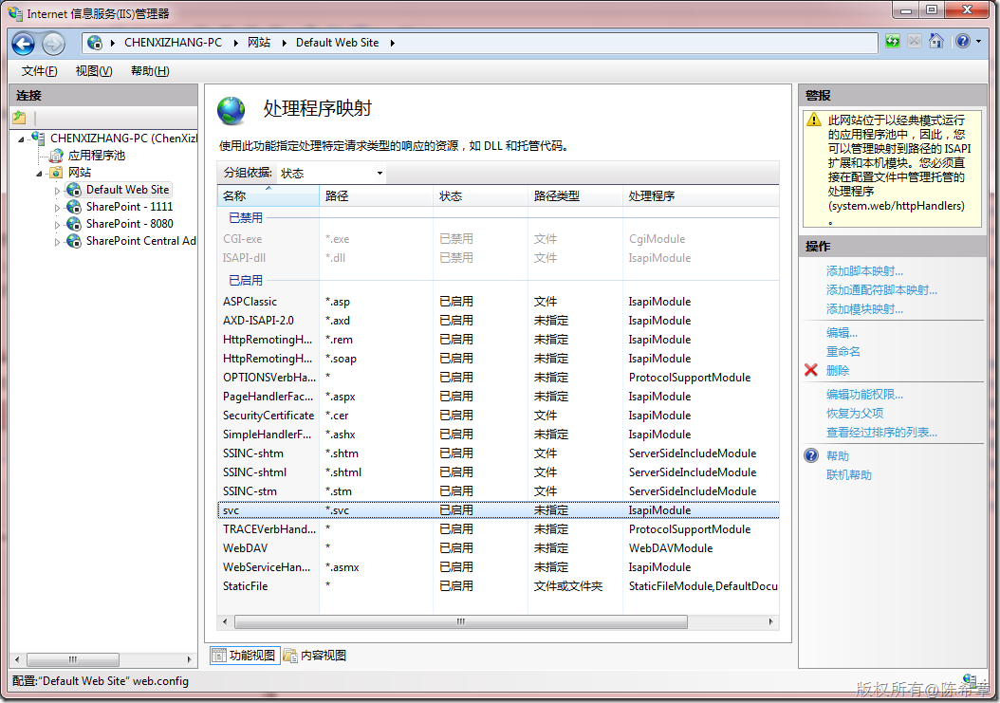

# WCF：在开发期间应该注意的问题 
> 原文发表于 2010-01-19, 地址: http://www.cnblogs.com/chenxizhang/archive/2010/01/19/1651735.html 

这两天仍然讲了有关WCF开发方面的东西。有两个常见问题，摘录如下

 1. 本机调试的时候，如果使用httpBinding，那么要注意，IE中不要设置代理，即便设置的话，也应该跳过本地地址的代理服务器

  

 2.如果部署到IIS，那么需要添加处理程序映射,因为IIS不认识svc这种文件格式

  

  

