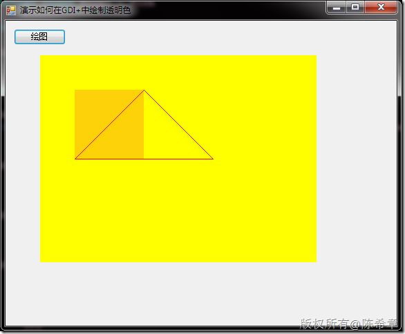
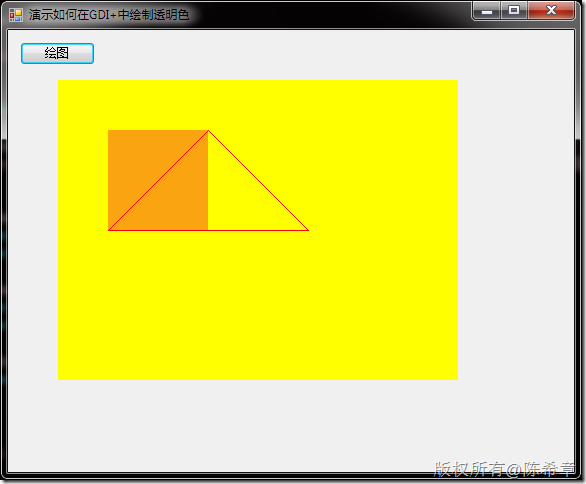
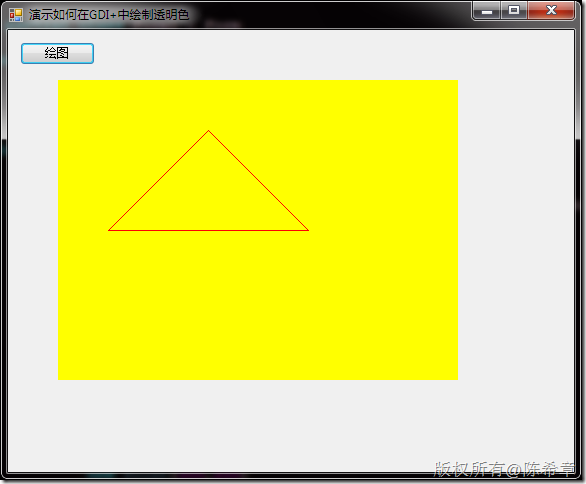

# GDI+：如何绘制透明色 
> 原文发表于 2010-01-23, 地址: http://www.cnblogs.com/chenxizhang/archive/2010/01/23/1654586.html 


```
在利用GDI+绘制图形的时候，有时我们需要绘制透明的颜色。那么应该如何来实现这样的需求呢
```

```
下面我写了一个简单的例子
```

```
        private void bt\_Click(object sender, EventArgs e)
        {
            Graphics g = this.CreateGraphics();
            Color c = Color.FromArgb(50, 244, 23, 45);//第一个参数是设置alpha通道值，也就是不透明度。100为完全不透明，0为完全透明

            g.FillRectangle(
                new SolidBrush(Color.Yellow),
                new Rectangle(50, 50, 400, 300));

            g.FillRectangle(
                new SolidBrush(c),
                new Rectangle(100, 100, 100, 100));

            g.DrawPolygon(new Pen(Color.Red),
                new[]{
                    new Point(200,100),
                    new Point(100,200),
                    new Point(300,200)
                });

        }
```

这是不透明度为50的时候的效果
.csharpcode, .csharpcode pre
{
 font-size: small;
 color: black;
 font-family: consolas, "Courier New", courier, monospace;
 background-color: #ffffff;
 /*white-space: pre;*/
}
.csharpcode pre { margin: 0em; }
.csharpcode .rem { color: #008000; }
.csharpcode .kwrd { color: #0000ff; }
.csharpcode .str { color: #006080; }
.csharpcode .op { color: #0000c0; }
.csharpcode .preproc { color: #cc6633; }
.csharpcode .asp { background-color: #ffff00; }
.csharpcode .html { color: #800000; }
.csharpcode .attr { color: #ff0000; }
.csharpcode .alt 
{
 background-color: #f4f4f4;
 width: 100%;
 margin: 0em;
}
.csharpcode .lnum { color: #606060; }


[](http://images.cnblogs.com/cnblogs_com/chenxizhang/WindowsLiveWriter/GDI_8541/image_2.png) 


这是不透明度为100时的效果


[](http://images.cnblogs.com/cnblogs_com/chenxizhang/WindowsLiveWriter/GDI_8541/image_4.png) 


这是不透明度为0时的效果


[](http://images.cnblogs.com/cnblogs_com/chenxizhang/WindowsLiveWriter/GDI_8541/image_6.png)

