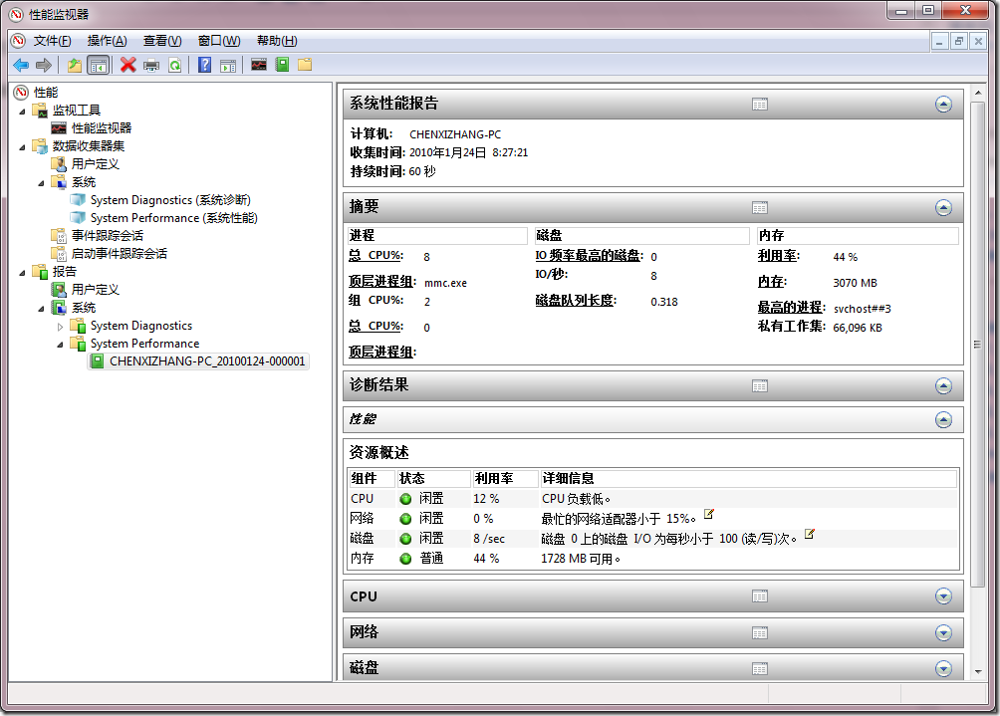
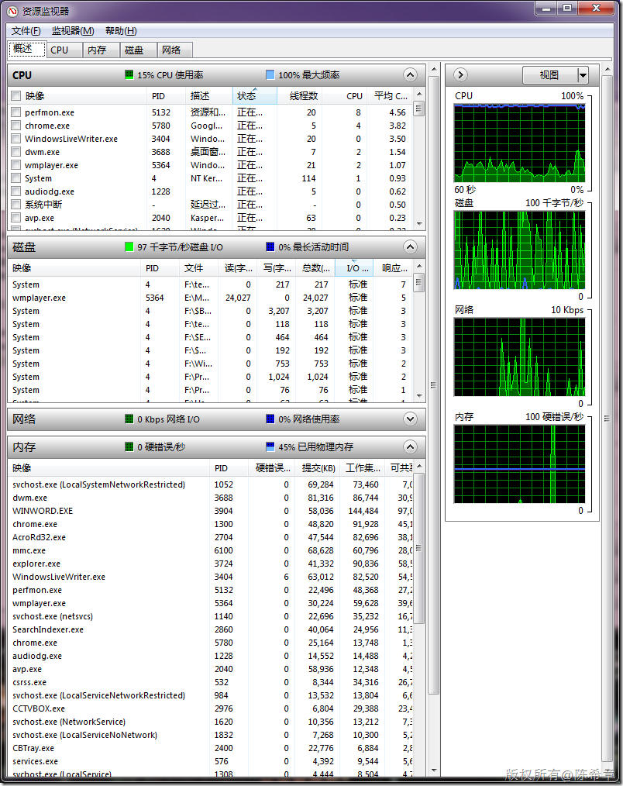
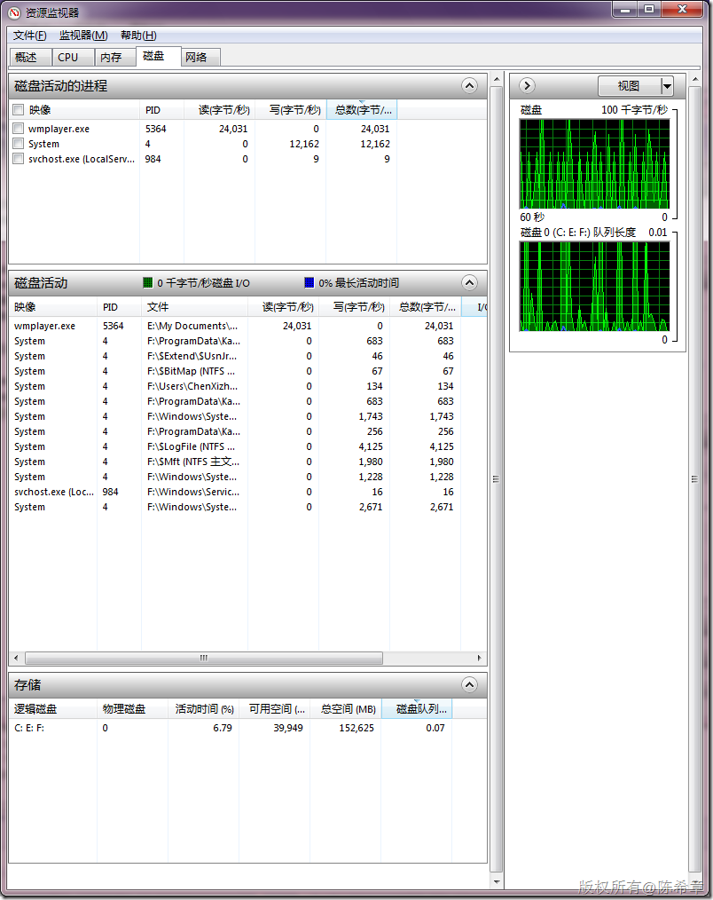

# Windows性能调优: Perfomn.exe 和Perfmon /res 
> 原文发表于 2010-01-24, 地址: http://www.cnblogs.com/chenxizhang/archive/2010/01/24/1655068.html 

Perfmon是打开系统监视器，对于性能调优尤其有用

  而Perfmon /res则是打开资源管理器，可以快速看到当前计算机的资源分配情况。像我这一台笔记本，磁盘就不是足够好，如果换成10000转，则会更加流畅。同时，可以发现，在播放视频的时候（wmplayer)，对磁盘的读取会很频繁。  

