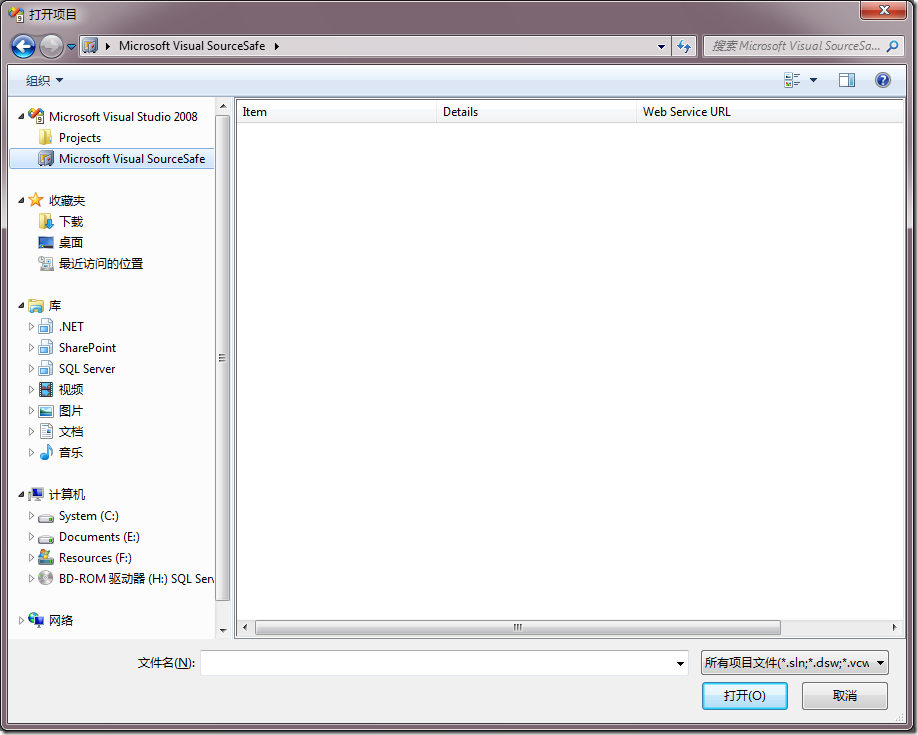
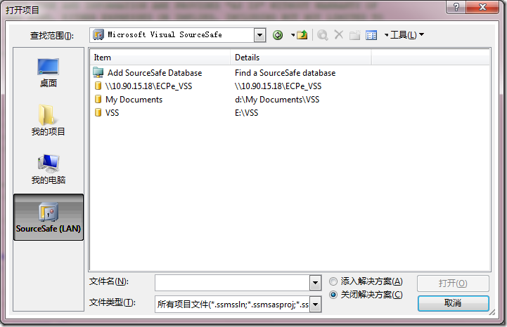

# Windows 7 : 无法直接在VS 2008中打开VSS项目 
> 原文发表于 2010-01-26, 地址: http://www.cnblogs.com/chenxizhang/archive/2010/01/26/1656496.html 

今天发现这样一个问题，在我的机器上，在打开项目这个对话框中，Microsoft Visual SourceSafe这个节点是空白的，无法查看到内部的项目（我的VSS是安装在本地的）

  

 但是奇怪的是，在SSMS中却可以

  

 暂时没有搞明白什么原因造成的

