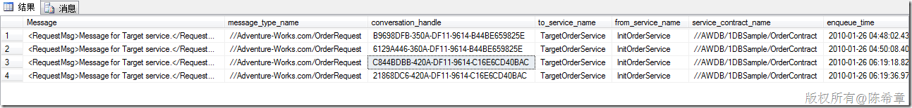

# SQL Server：如何在Service Broker发送消息验证失败后获取源消息 
> 原文发表于 2010-01-26, 地址: http://www.cnblogs.com/chenxizhang/archive/2010/01/26/1656622.html 


<http://social.msdn.microsoft.com/Forums/en/sqlservicebroker/thread/a5003a06-c4ea-49c2-84ce-334eacc76f0c>

 这里有一个帖子讨论了这个话题，解决方案是

 Turn RETENTION = ON on the sender's queue. This will keep every message sent as a row in the queue (cannot be RECEIVEd, but it can be SELECTed). At least for purposes of debugging until you identify the problem. Reteined messages are deleted when the conversation is ended.  

 但其实这种方案并不推荐。设置为RETENTION会影响性能。我的一些解释如下

  


```
    --但是，这种错误应该怎么通知用户呢？因为之前发送消息的时候其实是不知道出错了的. 要说这个也不是特别合理,不过也说明了Service Broker是异步的这个道理
    
    --其实没有发出去的消息会放在下面的地方
    SELECT * FROM SYS.TRANSMISSION\_QUEUE;
    --我们可以进一步地查看具体的消息
    SELECT CONVERT(NVARCHAR(200),message\_body) AS Message,message\_type\_name,conversation\_handle,to\_service\_name,from\_service\_name,service\_contract\_name,enqueue\_time,transmission\_status FROM SYS.TRANSMISSION\_QUEUE;
    --这些消息将一直保留,知道相应的会话被终止了    
    
    --下面就演示了如何手工地终止某些会话
    end conversation '9E197E0F-350A-DF11-9614-B44BE659825E'
    --实际上,更好的一个策略是,每个用户在发送消息的时候,就应该考虑到可能发送不成功,那么相应地记录好,哪个用户开启了哪些会话.这样就可以通知用户了.
```

```
 
```

.csharpcode, .csharpcode pre
{
 font-size: small;
 color: black;
 font-family: consolas, "Courier New", courier, monospace;
 background-color: #ffffff;
 /*white-space: pre;*/
}
.csharpcode pre { margin: 0em; }
.csharpcode .rem { color: #008000; }
.csharpcode .kwrd { color: #0000ff; }
.csharpcode .str { color: #006080; }
.csharpcode .op { color: #0000c0; }
.csharpcode .preproc { color: #cc6633; }
.csharpcode .asp { background-color: #ffff00; }
.csharpcode .html { color: #800000; }
.csharpcode .attr { color: #ff0000; }
.csharpcode .alt 
{
 background-color: #f4f4f4;
 width: 100%;
 margin: 0em;
}
.csharpcode .lnum { color: #606060; }

.csharpcode, .csharpcode pre
{
 font-size: small;
 color: black;
 font-family: consolas, "Courier New", courier, monospace;
 background-color: #ffffff;
 /*white-space: pre;*/
}
.csharpcode pre { margin: 0em; }
.csharpcode .rem { color: #008000; }
.csharpcode .kwrd { color: #0000ff; }
.csharpcode .str { color: #006080; }
.csharpcode .op { color: #0000c0; }
.csharpcode .preproc { color: #cc6633; }
.csharpcode .asp { background-color: #ffff00; }
.csharpcode .html { color: #800000; }
.csharpcode .attr { color: #ff0000; }
.csharpcode .alt 
{
 background-color: #f4f4f4;
 width: 100%;
 margin: 0em;
}
.csharpcode .lnum { color: #606060; }


[](http://images.cnblogs.com/cnblogs_com/chenxizhang/WindowsLiveWriter/SQLServerServiceBroker_B85B/image_2.png)


