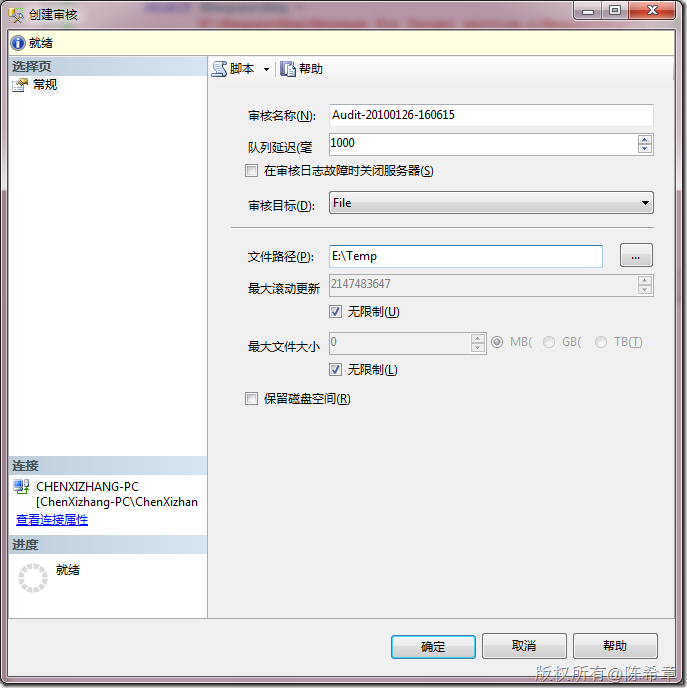
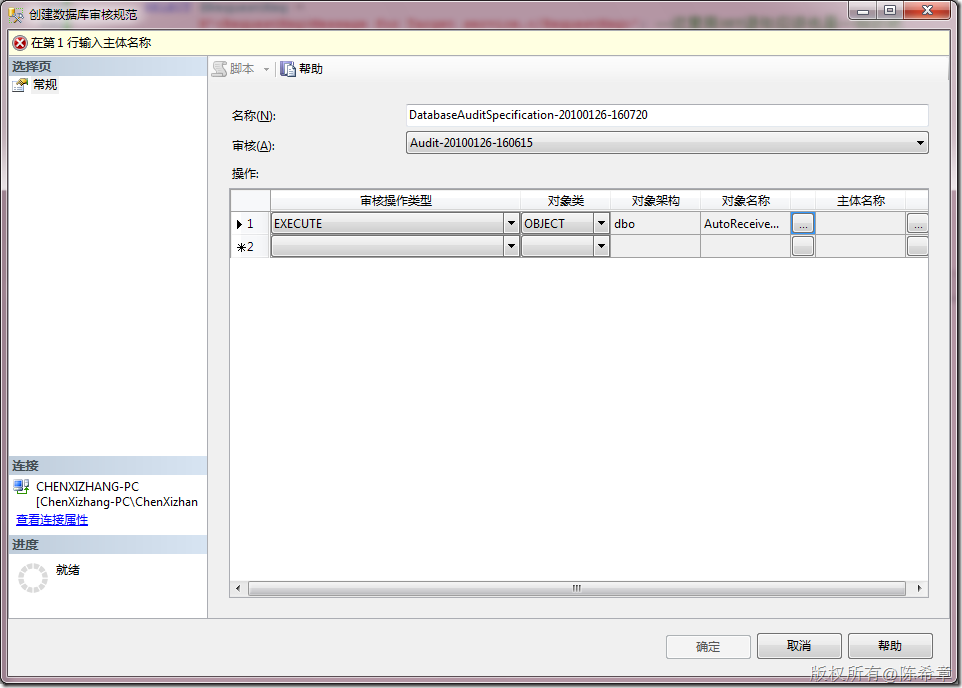
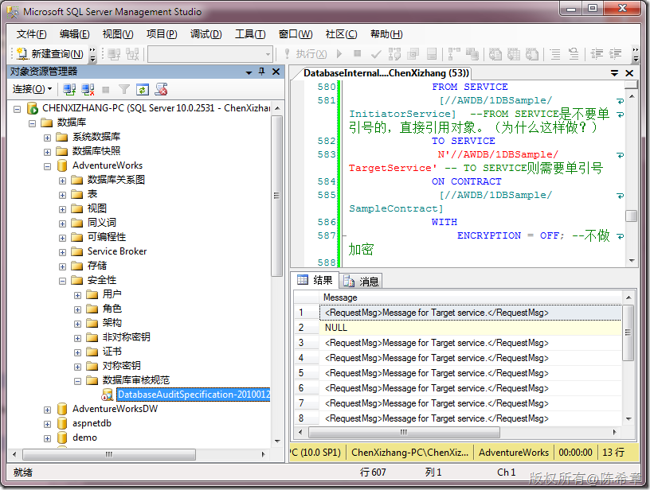
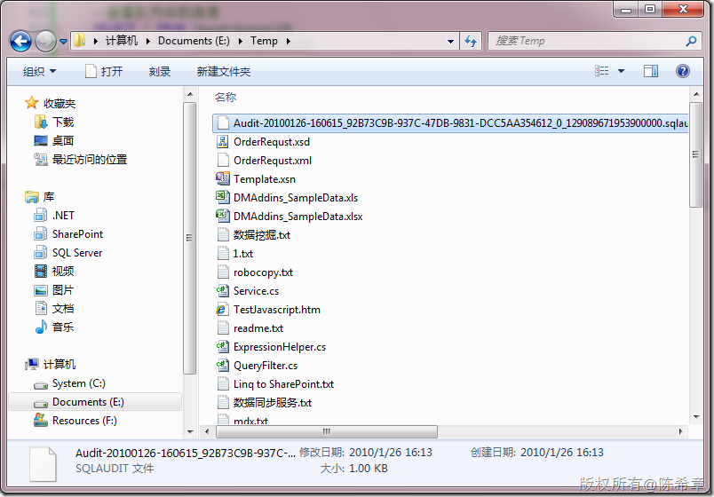
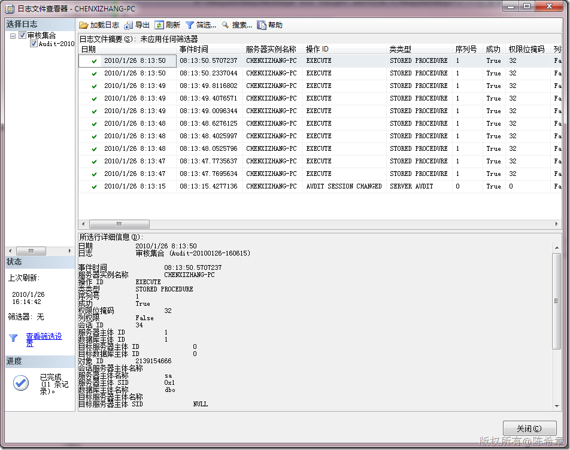

# SQL Server:如何查看某个存储过程的执行历史 
> 原文发表于 2010-01-26, 地址: http://www.cnblogs.com/chenxizhang/archive/2010/01/26/1656826.html 

在SQL Server 2008中，提供了审核的功能，让这个以前看似很难的工作变得容易多了。下面是一个简单的范例

 1. 创建一个服务器审核

  

 选中它，启动它

  

  

 2. 创建一个数据库审核规范

  

  

 选中它，启用它

  

  

 3. 查看效果（多次执行某个存储过程）

  

 

