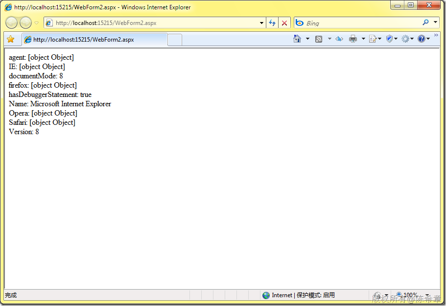
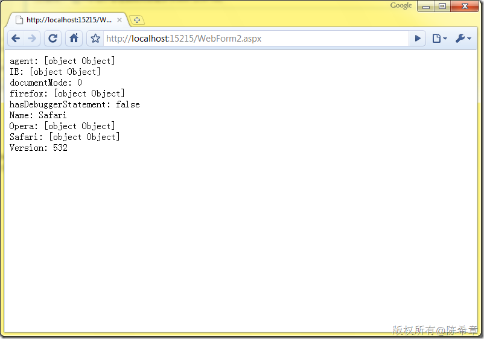
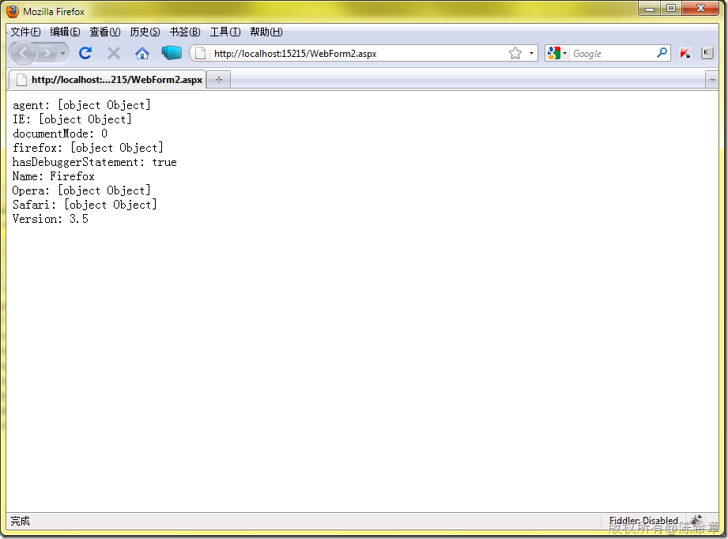

# 在javascript中检索浏览器信息 
> 原文发表于 2010-01-30, 地址: http://www.cnblogs.com/chenxizhang/archive/2010/01/30/1659664.html 


```
在网页编程中，我们经常需要检测浏览器的一些信息。下面我写了一个简单的例子，使用了MicrosoftAjax客户端脚本库和jquery脚本库来检测这些信息
```

```
 
```

```
<%@ Page Language="C#" AutoEventWireup="true" CodeBehind="WebForm2.aspx.cs" Inherits="WebApplication1.WebForm2" %>
<!DOCTYPE html PUBLIC "-//W3C//DTD XHTML 1.0 Transitional//EN" "http://www.w3.org/TR/xhtml1/DTD/xhtml1-transitional.dtd">
<html xmlns="http://www.w3.org/1999/xhtml">
<head runat="server">
    <title></title>
    <script src="jquery-1.3.2-vsdoc.js" type="text/javascript"></script>
    <script type="text/javascript">
        $(function() {
            var div = $("#info");
            var b = Sys.Browser;
            div.append("agent: " + b.agent);
            div.append("<br />");
            div.append("IE: " + b.InternetExplorer);
            div.append("<br />");

            div.append("documentMode: " + b.documentMode);
            div.append("<br />");

            div.append("firefox: " + b.Firefox);
            div.append("<br />");

            div.append("hasDebuggerStatement: " + b.hasDebuggerStatement);
            div.append("<br />");

            div.append("Name: " + b.name);
            div.append("<br />");

            div.append("Opera: " + b.Opera);
            div.append("<br />");

            div.append("Safari: " + b.Safari);
            div.append("<br />");

            div.append("Version: " + b.version);
            div.append("<br />");


        });
       
    </script>

</head>
<body>
    <form id="form1" runat="server">
    <div>
        <asp:ScriptManager ID="ScriptManager1" runat="server">
        </asp:ScriptManager>
        <div id="info">
        </div>
    </div>
    </form>
</body>
</html>

```

.csharpcode, .csharpcode pre
{
 font-size: small;
 color: black;
 font-family: consolas, "Courier New", courier, monospace;
 background-color: #ffffff;
 /*white-space: pre;*/
}
.csharpcode pre { margin: 0em; }
.csharpcode .rem { color: #008000; }
.csharpcode .kwrd { color: #0000ff; }
.csharpcode .str { color: #006080; }
.csharpcode .op { color: #0000c0; }
.csharpcode .preproc { color: #cc6633; }
.csharpcode .asp { background-color: #ffff00; }
.csharpcode .html { color: #800000; }
.csharpcode .attr { color: #ff0000; }
.csharpcode .alt 
{
 background-color: #f4f4f4;
 width: 100%;
 margin: 0em;
}
.csharpcode .lnum { color: #606060; }

[](http://images.cnblogs.com/cnblogs_com/chenxizhang/WindowsLiveWriter/javascript_96AE/image_2.png) 


[](http://images.cnblogs.com/cnblogs_com/chenxizhang/WindowsLiveWriter/javascript_96AE/image_4.png) 


[注意] Google的Chrome会被识别为Safari


 


 


[](http://images.cnblogs.com/cnblogs_com/chenxizhang/WindowsLiveWriter/javascript_96AE/image_6.png)

