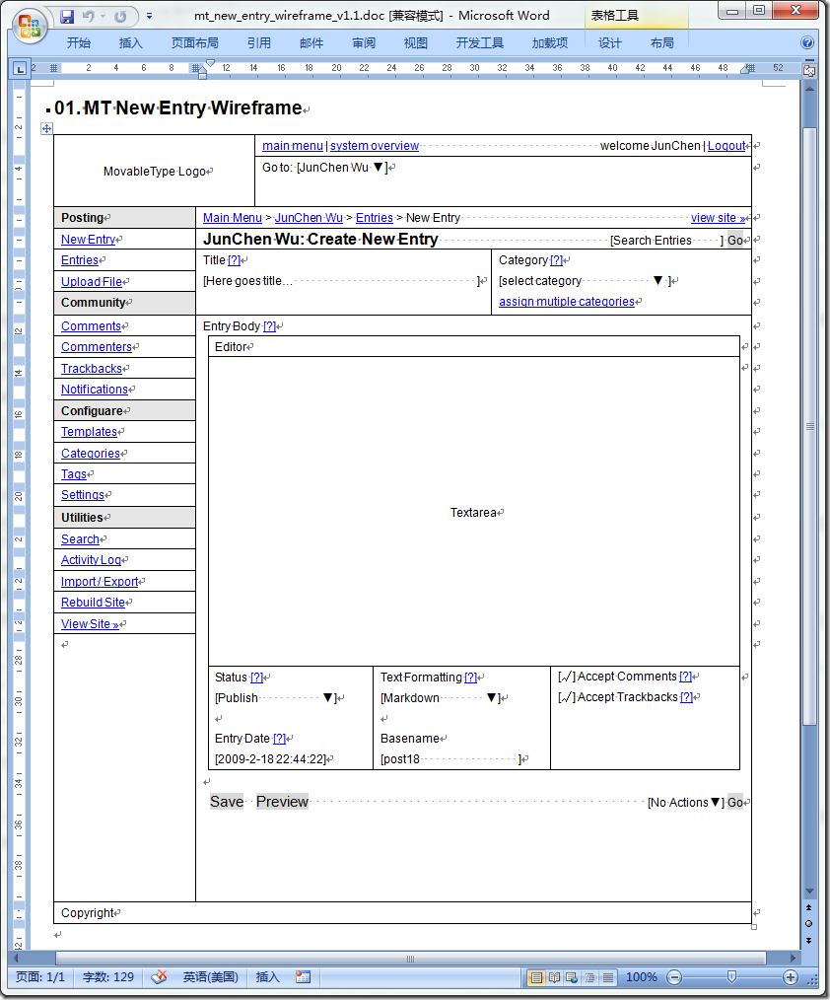

# 用Word画原型{转载} 
> 原文发表于 2010-02-01, 地址: http://www.cnblogs.com/chenxizhang/archive/2010/02/01/1661336.html 

全文转载自：<http://www.junchenwu.com/2009/02/prototyping_with_word.html> 关于原型，有太多故事了。说起快速的原型制作（区别于软件工程的快速原型法），应该以文本文档/富文本文档（如Word）为主。因为，白板、草图虽然快但不易保存，HTML虽然丰富但制作慢，一些原型工具，如Axure，则效率也低，使用也复杂。 最初设计的时候，我是以Word为主的，就是打表格（顺带一句，[白鸦](http://uicom.net)是PPT，便于演示和简单的效果）。Word 画表格十分方便，而且在沟通中也比较高效（批注）。渐渐的也有了一些习惯（很山寨）。 **布局** 打表格（要用绘制功能）。默认的 A4 页面浏览基本足够。有时在处理 100% 表格时，会用 Web 版式，但用 Web 版式阅读时总觉得不那么自然，比较少用。 表格也常用于模拟真实的数据表格（应用上各种样式）。 常用的：单元格居中（水平和垂直）、单元格背景色（突出重点）。 **文字内容** 直接打字，针对链接，用蓝色（#00F）加下划线，基本实现。字的大小，用小五表示12px，用10表示13px，用五号（默认）表示14px。字体根据具体情况，一般通用 Arial。加粗就是 Ctrl+B。 常用的：对齐、加粗、字号、颜色和下划线、Tab和中文空格（用来占位，和初步排版）。 **图片内容** 一般结合单元格居中，写上图片的内容作为占位。表示这里放个图片。有时候也会结合截图软件，截图软件的好处是可以保存到剪贴板，然后再 Ctrl+V 粘帖到文档中，这样不会生成额外的图片文件（HTML就这点不好）。 有时候针对复杂的细节，还可以用Photoshop画好，再粘帖进去。不过因为慢，非常少用。 **表单内容** 这是所有网页、交互的重要组成部分。有一些自己瞎定义的符号（还好比较一目了然），后来有位同事入职后也自创了一套。目前我在用的主要如下： * 输入框：[　　　　]、[请输入搜索关键词...]，类似这样的。 * 下拉框：[abc ▼]、[abc v]，类似这样的，用 charmap 呼唤出字符映射表拷贝。有时候为了真实一点，还会把向下的三角改为灰色。 * 复选框：[ ]表示未选中，[√]表示选中。有时也会用[·]，来表示选中，简单，但不那么明显。 * 单选框：( )表示未选中，(·)表示选中。 * 按钮：文字加灰色的背景色（字符底纹），这在Word中只要按一下。 * 其他：发挥你的创意（比如 disable 可以加灰色背景）。

 其实可以利用Word的控件，但是控件的文案要在另外一个小窗体中输入，总嫌麻烦。 **其他** 还有一些小交互，比如收拢、展开（用[+]和[-]），关闭按钮（用 × 字符，或字母X），最小化（就是一个下划线）之类。还有，有时候不用表格，用一行“-”来表示分割线。 这个其实可以形成规范，关键是要能够真正的在保证有效传达的情况下，提高画原型的效率。 附上一个刚才花了10分钟画的MT 后台写日志的线框图（[doc下载，V1.1](http://www.junchenwu.com/sample/200902/mt_new_entry_wireframe_v1.1.doc)），共勉。   

